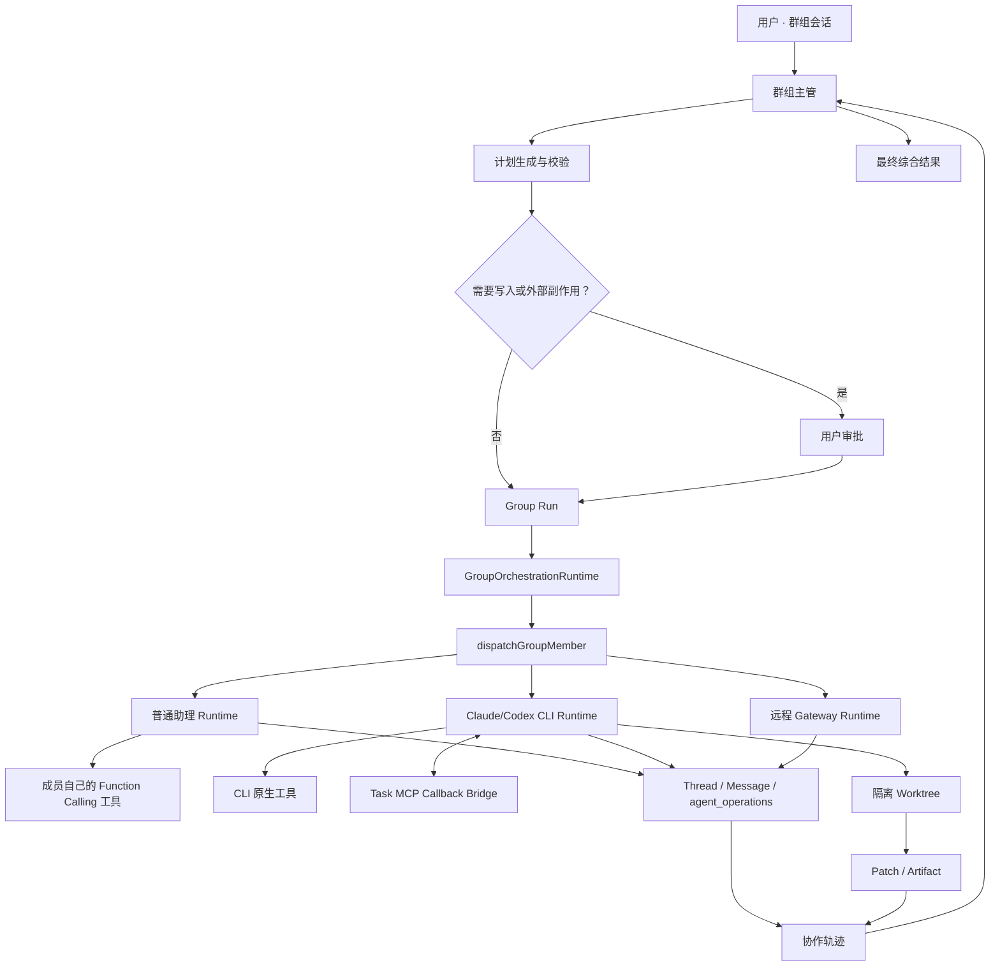

# Agent Group 多助理协作总体实施计划

> 状态：待评审
> 更新时间：2026-07-18
> 目标产品入口：`/group/:gid`
> 实施原则：在现有 Agent Group 上持续演进，不建立独立的“V2 产品”，不修改 ModelNet Router 的模型串并联语义。

## 1. 执行摘要

本计划的目标是将现有 Agent Group 建设为统一的多助理协作系统，使普通模型助理、拥有 Function Calling 工具的助理、Claude Code、Codex CLI 和远程助理能够在同一群组中协作。

最终用户应当能够配置一次群组，然后完成以下类型的任务：

- 主管把不同子任务分配给拥有不同提示词和工具的普通助理。
- GPT 主管与 Claude Code、Codex 共同完成代码分析、实现和审查。
- 多个成员并行研究或分别执行互不依赖的任务。
- 多个成员围绕方案进行辩论、质疑和裁决。
- 按“研究 → 实现 → 审查 → 汇总”的线性流水线执行。
- 主管根据任务自动选择单成员、并行、流水线或辩论协议。

成员不是模型 ID，而是完整助理。每个成员必须保留自己的提示词、模型或 Runtime、工具、设备、工作目录和权限边界。

总体实施建议拆为 **12 个执行阶段、5 个发布里程碑和约 18–25 个可独立回滚的小 PR**。

## 2. 当前基础与主要缺口

### 2.1 已有基础

当前代码已经具备一部分可复用能力：

- Agent Group 路由、群组资料页、主管和成员关系。
- `call_agent`、`delegate`、并行调用和异步任务等群组编排入口。
- 普通助理的 Function Calling、插件、MCP、知识库和搜索工具链。
- Claude Code、Codex 等异构助理的 Electron IPC 和 CLI JSONL 执行能力。
- Thread、Message 和 `agent_operations` 等任务持久化基础。
- Claude AskUser MCP 原型。
- 群组任务的基础消息展示组件。

主要代码位置：

- 群组类型：[`packages/types/src/agentGroup/index.ts`](../modelnet-app/packages/types/src/agentGroup/index.ts)
- 群组数据库结构：[`packages/database/src/schemas/chatGroup.ts`](../modelnet-app/packages/database/src/schemas/chatGroup.ts)
- 当前群组执行器：[`createGroupOrchestrationExecutors.ts`](../modelnet-app/src/store/chat/agents/GroupOrchestration/createGroupOrchestrationExecutors.ts)
- Runtime Dispatcher：[`agentDispatcher.ts`](../modelnet-app/src/store/chat/slices/agentRun/actions/dispatch/agentDispatcher.ts)
- 异构执行器：[`heterogeneousAgentExecutor.ts`](../modelnet-app/src/store/chat/slices/agentRun/actions/transports/hetero/heterogeneousAgentExecutor.ts)
- Agent Operation：[`agentOperations.ts`](../modelnet-app/packages/database/src/schemas/agentOperations.ts)
- AskUser MCP：[`AskUserMcpServer.ts`](../modelnet-app/packages/heterogeneous-agents/src/askUser/AskUserMcpServer.ts)

### 2.2 当前缺口

当前系统距离目标还有以下关键差距：

1. 群组执行器的部分路径直接调用 `executeClientAgent`，没有根据目标成员选择真实 Runtime。
2. Claude Code 或 Codex 加入群组后，可能被当作普通模型助理执行。
3. 普通助理自己的工具能力与群组任务权限尚未形成统一策略。
4. 群组运行、成员任务、Thread、CLI session 和 UI 状态还没有完整统一的持久状态机。
5. MCP 目前只覆盖局部 AskUser 场景，缺少任务级鉴权、进度、审批和产物回调。
6. 当前没有群组专用的安全写工作区，多个代码成员可能影响同一个工作树。
7. 并行、流水线、辩论和自动调度尚未形成稳定、可校验的执行协议。
8. 用户无法在一个统一界面中配置协作模式、查看实际 Runner、审批写计划和检查产物。
9. 当前独立 CLI 执行的危险默认参数不能直接用于群组代码任务。

## 3. 目标与边界

### 3.1 最终目标

- 一个群组包含一个主管和多个完整助理成员。
- 普通助理可以继续调用自己配置的工具。
- Claude Code 和 Codex 必须真正进入对应 CLI。
- 主管负责计划、委派、依赖、预算、失败处理和最终综合。
- 每次执行都可以查看计划、实际 Runtime、状态、工具摘要、tokens、耗时、错误和产物。
- 群组任务可以取消、超时、重试，并在刷新或桌面重启后恢复轨迹。
- 写代码的成员只能写入受控的隔离 Worktree。
- Auto 只能从已经实现并通过验证的显式协议中选择。

### 3.2 当前总体计划不包含

- 修改 ModelNet Router 的 `auto.network`、`response.parallel` 或 `response.serial`。
- 将群组协作参数放进 `LLMParams`。
- 使用 `modelnet-*` 模型 ID 判断群组协作模式。
- 多个成员共享同一个可写工作树。
- 未经审批自动 commit、merge、push、部署或发布。
- 不受控的成员递归委派。
- 任意 DAG、无限循环返工或无限辩论。
- 将隐藏思维过程展示给用户。

### 3.3 后续演进但不阻塞首版

- Claude Code 或 Codex 作为群组主管。
- 有审计的成员间直接消息通道。
- 有界循环返工和更通用的 DAG。
- 多仓库、多设备工作区。
- 经审批的自动 PR、合并和部署。
- 按历史质量、成本和时延自动选择成员。

## 4. 产品概念

### 4.1 群组主管

主管负责：

- 理解用户任务。
- 选择协作协议。
- 生成并冻结执行计划。
- 将任务分配给成员。
- 处理成员问题和审批请求。
- 汇总公开结果和产物。
- 控制预算、超时、失败和取消。

首版主管限定为支持 Function Calling 的普通助理。主管额外拥有群组编排工具，但成员默认不继承这些工具。

### 4.2 群组成员

成员继续复用完整助理配置：

- `systemRole`
- model/provider
- plugins、MCP、知识库和搜索
- `agencyConfig.heterogeneousProvider`
- `executionTarget`
- `workingDirByDevice`

群组只增加：

- 群组角色。
- 群组补充指令。
- 是否参与自动调度。
- 工具限制。
- 工作区访问级别。

### 4.3 Run、Task 与 Attempt

- Run：用户一次群组请求产生的一次协作运行。
- Task：Run 中分配给某个成员的一个执行节点。
- Attempt：Task 的一次具体尝试，重试必须创建新 Attempt。
- Artifact：Task 产生的 patch、报告、文件、测试结果或其他交付物。

## 5. 协作模式

| 模式 | 固定语义 | 主要约束 |
|---|---|---|
| 单成员委派 | 主管将任务交给一个成员 | 一个 Task，完成后回到主管 |
| Broadcast | 快速征求多个观点 | 默认不执行复杂工具，不等同于工作任务 |
| 并行子任务 | 多成员执行独立子任务，Barrier 后综合 | 2–8 个 Task，默认并发 2，最大 4 |
| 串行流水线 | 上游结构化结果或产物传给下游 | 2–8 个阶段，首版仅线性链 |
| 辩论评审 | 立论、质疑、反驳、裁判 | 2–6 个参与者，1–3 轮，默认只读 |
| 自动调度 | 主管选择已经支持的显式协议 | 计划验证并冻结后执行，写任务先审批 |

代码开发场景应使用并行子任务或流水线，不应使用 Broadcast 替代真实任务执行。

## 6. 目标架构



职责边界：

- `GroupOrchestrationRuntime`：计划、依赖、并发、预算、失败策略和综合。
- `dispatchGroupMember`：读取目标成员配置并选择真实 Runtime。
- 普通助理 Runtime：执行现有 Agent 和 Function Calling 工具循环。
- Electron IPC/CLI：启动进程、流式输出、取消、退出和 CLI session。
- Task MCP：询问、审批、进度和产物回调。
- Worktree Service：代码写入隔离、锁、租约和产物保留。
- 持久化层：Run、Task、Attempt 和 Thread 状态事实源。
- UI：配置和展示，不在 React 组件中实现调度逻辑。

## 7. Runtime 与工具模型

### 7.1 Runtime 选择

`dispatchGroupMember` 必须读取目标成员自己的配置：

- 普通助理 → `executeClientAgent`
- 本地 Claude Code/Codex → Electron IPC → CLI
- device、sandbox 或远程成员 → Gateway

禁止继承主管的 `parentRuntime: client` 覆盖成员自身 Runtime。

CLI 缺失、未登录或不可用时明确失败，禁止静默退回普通模型。

### 7.2 工具计算

```text
成员实际可用工具
= 成员自己的工具配置
∩ 群组工具策略
∩ 本轮任务权限
∩ Runtime 能够强制执行的能力
```

工具分为四类：

| 类型 | 示例 | 默认策略 |
|---|---|---|
| `read` | 搜索、知识库、读文件、只读数据库查询 | 可以按成员配置执行 |
| `workspace_write` | 修改文件、生成代码、格式化 | 仅允许隔离 Worktree |
| `external_side_effect` | 发消息、部署、修改远程系统 | 默认拒绝或逐次审批 |
| `delegate` | 调用或创建其他群组任务 | 默认仅主管拥有 |

关键规则：

- 不全局设置 `functionCall: false`。
- 主管的工具不能复制给成员。
- 成员工具不能回流给主管。
- 普通助理继续使用自己的 Function Calling 工具链。
- Claude/Codex 使用 CLI 原生工具，并可挂载任务级 MCP。
- 无法强制执行工具策略的 Runtime 必须 fail closed。

### 7.3 MCP 的定位

MCP 是回调面，不是 CLI 进程生命周期管理器，也不是最终结果的唯一传输通道。

首版 Task MCP 工具：

- `get_task_context`
- `report_progress`
- `request_supervisor_input`
- `request_approval`
- `submit_artifact`
- `report_result`

CLI stdout/JSONL 仍是结果事实源。即使模型不调用 `report_result`，任务也必须可以正常结束。

## 8. 数据契约与持久化

### 8.1 群组配置

继续使用 `chat_groups.config` JSONB，增加 `collaboration`，不新增数据库列。

建议配置结构：

```ts
type AgentGroupCollaborationMode =
  | 'single'
  | 'broadcast'
  | 'parallel_tasks'
  | 'pipeline'
  | 'debate'
  | 'auto';

interface AgentGroupCollaborationConfig {
  schemaVersion: 1;
  defaultMode: AgentGroupCollaborationMode;
  limits: {
    maxConcurrency: number;
    maxRounds: number;
    taskTimeoutMs: number;
    maxTotalTokens?: number;
  };
  workspacePolicy:
    | 'shared_readonly'
    | 'single_writer'
    | 'isolated_worktrees';
  requireWritePlanApproval: boolean;
  toolPolicy: {
    externalSideEffects: 'deny' | 'approval';
    delegation: 'supervisor_only';
  };
}
```

旧群组没有 `collaboration` 时继续当前行为，用户未修改前不得静默写入默认值。

### 8.2 执行计划

`AgentGroupExecutionPlan` 至少包含：

- runId、groupId、topicId、sourceMessageId。
- supervisorAgentId。
- 请求模式和实际模式。
- Task 节点、成员、依赖和角色。
- 预算、超时、失败策略。
- 工具和工作区策略。
- 是否需要审批。
- 配置快照和 configHash。

执行计划必须先校验、再冻结、后执行。执行过程中不能静默增加成员或写节点。

### 8.3 任务信封

`AgentGroupTaskEnvelope` 至少包含：

- runId、taskId、attempt、idempotencyKey。
- group、topic、source message 和 agent。
- title、instruction、role 和依赖。
- 上游结果摘要和 artifact 引用。
- expectedOutput。
- toolPolicy。
- workspacePolicy。
- timeout 和预算。

禁止将 Provider token、环境变量或认证信息放入任务信封、消息或日志。

### 8.4 任务结果

`AgentGroupTaskResult` 至少包含：

- 实际 Runtime 和 Runner。
- status 和 final content。
- Thread、operation、CLI session。
- artifact 引用和 digest。
- tokens、cost 和 timing。
- tool calls 摘要。
- error、cancel、timeout 和 fallback reason。

### 8.5 持久化映射

- 一次群组 Run 对应 root `agent_operation`。
- 每个 Task Attempt 对应 child `agent_operation`。
- Thread metadata 保存 runId、taskId、attempt、runtime、CLI session 和 workspaceRef。
- Message metadata 保存执行计划快照和 UI 展示信息。
- Zustand 等内存状态只作为实时 UI 投影，不作为事实源。

## 9. 执行状态机

```text
queued
  → running
  → waiting_input
  → waiting_approval
  → succeeded
  → failed
  → cancelled
  → timed_out
  → interrupted
```

要求：

- 成功、失败、取消、超时和异常必须进入终态。
- 父 Run 取消级联到 child operation、Thread、CLI 和 MCP listener。
- 重试创建新的 Attempt，不复用旧写操作。
- 桌面重启后，无活进程的本地 `running` 任务标记为 `interrupted`。
- 写任务不得自动重放。
- 幂等键防止重复创建 Thread 或重复启动 CLI。

## 10. 工作区与产物

### 10.1 只读阶段

在 Worktree Service 完成前：

- 普通助理只允许安全的只读工具。
- Claude/Codex 群组任务强制只读。
- Debate 全程只读。
- 不能依赖危险 bypass 参数实现“权限控制”。

### 10.2 写任务

Electron Main 增加 `GroupWorktreeService`：

- 应用托管目录下每个写 Task 建立独立 Worktree。
- 每个 Task 独立 branch、锁和租约。
- CLI `cwd` 强制指向目标 Worktree。
- 所有路径经过 realpath、符号链接和越界检查。
- 写计划执行前需要审批。
- 原仓库 dirty 时首版阻止写任务。
- 非 Git 目录首版只读。

禁止：

- 自动 stash 或 reset。
- 自动 merge、push、部署。
- 删除 dirty Worktree。
- 两个写成员共享同一 Worktree。

### 10.3 产物

任务可返回：

- message
- report
- patch
- diff
- file artifact
- test report
- commit reference

产物必须包含来源 task、attempt、digest、路径范围和生成时间。

## 11. 产品界面

### 11.1 群组资料页

```text
群组设置 | 协作 | 主管 | 成员 1 | 成员 2
```

“协作”页包含：

1. 默认模式。
2. 成员角色和自动参与设置。
3. Runtime、CLI 安装/登录、设备和工作目录状态。
4. 成员有效工具摘要。
5. 并行、流水线和辩论编辑器。
6. 工具、预算、审批和工作区策略。
7. 执行计划预览与校验错误。

Claude/Codex 成员不显示误导性的普通 ModelSelect，而显示真实 CLI Runtime。

### 11.2 输入框

增加本轮覆盖：

```text
本轮：跟随群组默认 ▾
```

选择结果写入用户消息 metadata，发送后恢复默认。显式配置非法时阻止发送。

### 11.3 协作运行卡片

`CollaborationRunCard` 显示：

- 请求模式和实际计划。
- Task、依赖、成员和角色。
- 实际 Runtime、Runner 和 CLI session。
- 等待、执行、审批和终态。
- 工具调用次数和公开进度。
- tokens、cost 和阶段耗时。
- Thread、Worktree、patch 和 artifact。
- 错误、取消、超时和降级原因。

不展示隐藏思维过程，只展示计划、公开进度、证据、结果和产物。

## 12. 总体实施阶段

### 阶段 1：现状梳理与回归基线

工作：

- 盘点现有群组所有执行入口。
- 固定旧群组、旧消息、复制和导出的行为。
- 建立 Claude/Codex 错误进入普通执行器的失败用例。
- 建立能力级功能开关。

退出条件：

- 开关关闭时现有群组行为零变化。
- 失败用例可以稳定复现当前问题。

### 阶段 2：统一契约与配置

工作：

- 定义配置、计划、任务、结果、产物和工具策略。
- 增加 Zod 校验、深合并和历史兼容。
- 固定成员、依赖、预算和工作区验证规则。

退出条件：

- 新旧配置稳定读取和保存。
- 无数据库迁移。
- 非法配置在执行前被拒绝。

### 阶段 3：持久化执行内核

工作：

- root/child operation。
- Thread 和 assistant placeholder。
- 状态机、Attempt、幂等、取消、超时和重启恢复。
- 使用 fake executor 验证异常路径。

退出条件：

- 不存在永久 Processing。
- 刷新和重启后轨迹一致。
- Stop 后无遗留执行单元。

### 阶段 4：普通助理完整协作

工作：

- 新增统一 `dispatchGroupMember`。
- 普通成员加载自己的提示词、模型和工具。
- 工具能力按成员配置和任务策略求交集。
- 主管编排工具与成员工具隔离。

退出条件：

- 普通工具助理可以在自己的 Thread 中调用自己的工具。
- 主管和其他成员不能越权调用。

### 阶段 5：Claude Code 与 Codex CLI

子阶段：

- 5A：Claude Code 只读纵切。
- 5B：Codex 只读纵切。

工作：

- Runtime 选择、Electron IPC、CLI Prompt 和标准结果。
- CLI 缺失、未登录、异常和取消处理。
- 群组专用安全参数。

退出条件：

- 实际启动目标 CLI。
- 不静默降级普通模型。
- 工作树零变化。
- 无残留进程。

### 阶段 6：混合 Runtime 只读协作

工作：

- 所有群组委派入口接入 Dispatcher。
- 支持 client、Claude、Codex 和 Gateway 混合并行。
- Barrier、并发限制、部分失败和主管综合。
- 最小运行轨迹 UI。

退出条件：

- 三类成员可以在同一 Run 中协作。
- 每个成员保留自己的提示词和只读工具。
- 部分失败不丢失成功结果。

### 阶段 7：Task MCP 与审批回调

工作：

- 泛化 AskUser MCP。
- 加入任务上下文、进度、询问、审批和产物回调。
- attempt 级 capability token、TTL、白名单和幂等。
- 敏感日志清理。

退出条件：

- 不同 Task 的 MCP 不串线。
- 重放、越权和过期请求被拒绝。
- CLI 不调用 report_result 也能正常结束。

### 阶段 8：隔离 Worktree 与代码产物

子阶段：

- 8A：一个 Writer，其他成员只读。
- 8B：多个 Writer，各自独立 Worktree。

工作：

- GroupWorktreeService。
- branch、锁、租约、路径安全和清理策略。
- 写计划审批。
- patch、diff 和 artifact。

退出条件：

- 原工作树和当前分支零变化。
- 崩溃或取消后 patch 不丢失。
- 未审批不会写入。
- 两个 Writer 无法共享 Worktree。

### 阶段 9：显式协作协议

按顺序实现：

1. `parallel_tasks`
2. 线性 `pipeline`
3. `debate`

工作：

- 纯 GroupTaskScheduler。
- 计划冻结、依赖、并发、预算和失败策略。
- 结构化上游结果和 artifact 传递。

退出条件：

- 显式协议具有确定状态机。
- Debate 默认只读。
- Pipeline 不允许非线性依赖。

### 阶段 10：自动调度与模板

工作：

- 主管从已支持的显式模式中选择。
- 生成、验证、展示并冻结计划。
- 写任务和外部副作用计划先审批。
- 增加常用协作模板。

退出条件：

- Auto 不会生成未实现的模式。
- 显式成员无效时阻止发送。
- 执行中不能静默添加写节点。

### 阶段 11：完整产品 UI 与可观测性

工作：

- 群组“协作”页签。
- 成员 Runtime、工具和工作区状态。
- 模式编辑器、本轮覆盖和计划预览。
- 完整 CollaborationRunCard。
- Worktree、patch、artifact 和审批界面。
- 群组复制或 Fork 的成员 ID 重映射。

退出条件：

- 用户无需修改配置文件即可完成群组配置和执行。
- 刷新、切换会话和桌面重启后配置保持。
- 用户可以明确确认每个节点的实际 Runner 和产物。

### 阶段 12：安全加固、Dev 验收与推广

工作：

- fake Claude/Codex executable 集成测试。
- fixture Git 仓库。
- 路径越界、symlink、token 重放、恶意参数和残留进程测试。
- 少量真实 Claude/Codex 请求。
- 功能开关和回滚验证。

退出条件：

- Run、Task、Thread 和 Operation 状态一致。
- 原工作树未变化。
- 无遗留进程、listener 或 capability token。
- Dev 验收场景全部通过。
- 生产推广获得单独批准。

## 13. 发布里程碑

| 里程碑 | 包含阶段 | 用户能力 |
|---|---:|---|
| 基础协作 | 1–4 | 普通助理携带自己的提示词和工具协作 |
| 异构只读 Alpha | 5–7 | GPT、Claude、Codex 和远程成员混合协作 |
| 代码协作 MVP | 8 | 隔离实现、只读审查、patch 交付 |
| 完整产品候选版 | 9–11 | 并行、流水线、辩论、Auto 和正式 UI |
| 可推广版本 | 12 | 安全、恢复、Dev 验收和灰度发布 |

首个代码协作 MVP 固定为：

```text
GPT Supervisor
→ Claude Code 在隔离 Worktree 中实现
→ Codex 只读审查
→ GPT Supervisor 综合
→ 用户查看 patch 并决定是否采用
```

## 14. 测试计划

### 14.1 单元测试

- 配置解析和旧配置兼容。
- 成员 ID 重映射。
- 计划、节点、依赖和预算校验。
- Runtime 选择。
- 工具策略交集。
- 状态机和终态转换。
- MCP token、TTL、重放和权限。
- Worktree 路径、锁、租约和清理。
- Pipeline 和 Debate 状态机。

### 14.2 集成测试

- fake Claude/Codex JSONL。
- Electron spawn 参数、cwd、env 和取消。
- 普通助理 Function Calling 工具。
- client、hetero 和 Gateway 混合并行。
- assistant placeholder、Thread 和 operation 终态。
- 部分失败、超时、取消和崩溃。
- MCP 询问、审批和 artifact。

### 14.3 E2E

使用一次性 fixture Git 仓库：

1. 普通搜索助理使用自己的工具。
2. Claude Code 只读分析。
3. Codex 只读审查。
4. GPT、普通助理、Claude 和 Codex 混合并行。
5. Claude 单 Writer 实现，Codex 只读审查。
6. 多个 Writer 使用独立 Worktree。
7. Pipeline。
8. Debate。
9. Auto。
10. Stop、超时、刷新和桌面重启。

### 14.4 安全测试

- 路径越界和符号链接逃逸。
- Provider 环境变量和 SSH 凭据泄漏。
- MCP token 伪造、重放和串线。
- 恶意 CLI command/args。
- 无限进程或残留子进程。
- 未审批写入和外部副作用。
- trace、stdout 和 Prompt 敏感信息脱敏。

## 15. Dev 验收与生产推广

所有真实验证仅在 `modelnet-toc-dev`：

- TOC：`127.0.0.1:3181`
- Router：`127.0.0.1:3192`

验收检查：

- run/task/runtime/session ID。
- Thread、Message 和 Operation 状态。
- 工具调用、tokens、cost 和 duration。
- MCP 调用和审批。
- Worktree diff 和 artifact。
- 原工作树未改变。
- 没有遗留 CLI 进程、listener 或 token。

生产 `3081/3092` 在 Dev 验证期间保持不变。验证通过后单独申请推广。

## 16. 功能开关与回滚

建议使用能力级开关，而不是对用户暴露“V2”概念：

- `agentGroupCollaborationRuntime`
- `agentGroupHeterogeneousMembers`
- `agentGroupParallelTasks`
- `agentGroupTaskMcp`
- `agentGroupWorkspaceWrite`
- `agentGroupProtocols`
- `agentGroupAutoPlanning`

回滚规则：

- 开关只影响新 Run，不在运行中途切换 Runtime。
- 协作 Runtime 关闭时明确提示，不得静默走旧执行器。
- 写能力关闭后禁止新写任务，但保留已有 Worktree 和 artifact。
- 回滚不删除 dirty Worktree、patch 或用户产物。
- 本地 processing CLI 在重启后标记 interrupted，不自动重放。

## 17. 主要风险与控制

| 风险 | 控制措施 |
|---|---|
| Claude/Codex 被错误路由为普通模型 | 统一 Dispatcher；禁止静默降级 |
| 普通助理工具被错误关闭或越权 | 工具策略交集；成员 Thread 审计 |
| CLI 进程失控或残留 | 持久状态机、取消级联和进程回收 |
| 多助理破坏同一工作树 | 独立 Worktree、锁和单 Writer 首发 |
| MCP 跨任务串线 | attempt token、TTL、白名单和幂等 |
| Auto 绕过审批 | 计划冻结；写和副作用节点执行前审批 |
| UI 状态与数据库不一致 | 数据库为事实源，内存仅作投影 |
| 敏感信息进入消息或日志 | 信封字段限制、日志脱敏和安全测试 |
| 旧群组被静默改变 | 无配置时保持旧行为，不自动写默认值 |

## 18. 评审决策

正式实施前需要确认：

1. 首版主管是否限定为普通 Function Calling 助理。
2. 普通成员是否默认继承自己的工具，再接受群组和本轮策略过滤。
3. Claude/Codex 不可用时是否固定失败，绝不降级为普通模型。
4. 首个代码版本是否只开放一个 Writer。
5. 写任务是否必须展示计划并获得审批。
6. 是否禁止自动 merge、push、部署。
7. Auto 是否必须等显式并行、流水线和辩论稳定后开放。
8. 原仓库 dirty 时是否阻止首版写任务。
9. 外部副作用工具在首版是否统一默认拒绝。
10. 是否接受先发布只读协作 Alpha，再开放代码写入。

## 19. 总体验收标准

计划全部完成时，系统必须满足：

- 用户可以创建并持久保存包含普通助理、Claude Code 和 Codex 的群组。
- 每个成员使用自己的提示词、模型或 Runtime 和工具。
- 主管可以执行单成员、并行、流水线、辩论和自动调度。
- Claude/Codex 实际进入 CLI，不静默降级。
- 普通助理可以调用自己允许的 Function Calling 工具。
- 每次执行都可以查看计划、Runner、状态、工具、耗时、tokens、错误和产物。
- 运行可以取消、超时、重试，并能在刷新或重启后恢复轨迹。
- 代码写入只发生在受控 Worktree。
- 未审批不会发生写入或外部副作用。
- 生产推广前所有 Dev、安全和回滚验收通过。
