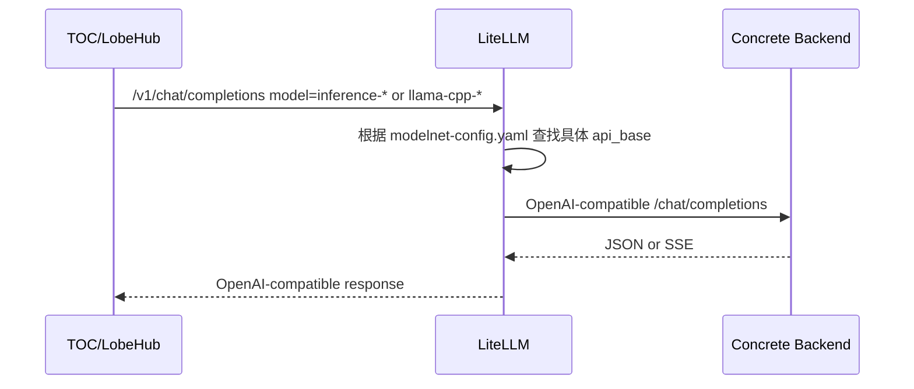
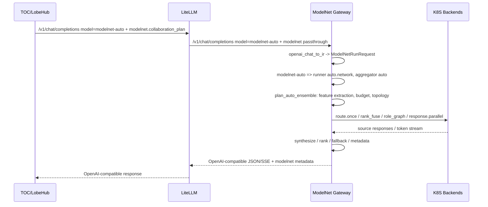
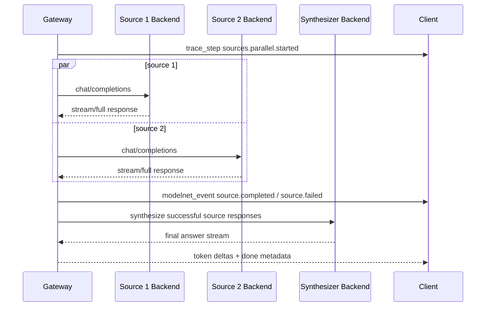
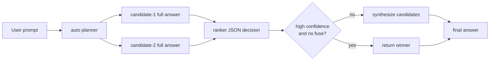

# LiteLLM 与 ModelNet Gateway 架构报告

日期：2026-06-19

工作目录：`/home/duxianghe/ModelNet-toc`

本文档基于当前 4A100 工作树、Docker Compose 配置、LiteLLM 配置、`modelnet-router` 代码和现有设计文档整理。重点描述 TOC/LobeHub 通过 LiteLLM 接入 ModelNet Gateway，再由 Gateway 调度 Kubernetes 上异构模型后端的真实架构、请求链路、能力边界和运维注意事项。

## 1. 执行摘要

当前系统采用三层 LLM 接入架构：

1. **TOC/LobeHub 应用层**
   - 面向用户提供聊天 UI、模型选择、ModelNet 并联/串联/自动组网入口。
   - 通过 OpenAI-compatible 协议访问内部 LiteLLM。
   - 在请求体中注入 `modelnet` 扩展字段，用于告诉 Gateway 使用何种 runner、aggregator、候选模型和 trace 选项。

2. **LiteLLM 兼容代理层**
   - 作为 OpenAI-compatible 统一入口，暴露给 TOC 容器使用。
   - 维护 `modelnet`、`modelnet-auto` 这两个聚合别名，以及具体 backend model ID 的直连映射。
   - 对上保持 OpenAI-compatible API，对下把聚合请求转发到 `modelnet-router:8000/v1`。
   - 镜像内打了 ModelNet 专用补丁，使 `modelnet` 扩展参数可以穿透 chat completions 和 Responses API 参数过滤。

3. **ModelNet Gateway / Router 执行与控制层**
   - FastAPI 服务，即 `modelnet-router`。
   - 对北向提供 `/v1/chat/completions`、`/v1/responses`、`/v1/models`、`/v1/runs/stream`、`/v1/capabilities`、`/v1/topology` 等接口。
   - 内部统一转换为 `ModelNetRunRequest` 和 `EnsembleRequest`。
   - 控制面从 YAML registry、Kubernetes API、Prometheus 和本地 in-flight/failure 状态维护模型池、健康状态、能力矩阵和路由评分。
   - 执行面支持 `route.once`、`response.parallel`、`response.serial`、`token.parallel`、`auto.network`、`auto.role_graph`、`auto.claim_graph`、`auto.rank_fuse` 等不同协作路径。
   - 南向调用 vLLM、llama.cpp、OpenAI-compatible、Ollama 等 backend adapter，其中当前真实主力为 `vllm_chat` 与 `llama_cpp`。

当前推荐的公开自动组网入口是 **`modelnet-auto`**。`modelnet` 作为普通自动路由入口已经退休：在 Gateway 中，如果请求 `model=modelnet` 且没有显式协作 runner，会返回 410，提示改用 `modelnet-auto`。但 TOC 的 ModelNet 并联/串联虚拟模型仍会把底层 `payload.model` 设置为 `modelnet`，同时携带显式 `collaboration_plan`，这类请求不属于退休的普通 `route.once` 场景。

## 2. 当前部署拓扑

### 2.1 生产栈

生产 compose project：`lobehub-toc`

当前关键容器与端口：

| 组件 | 容器名 | 端口/网络 | 当前职责 |
| --- | --- | --- | --- |
| TOC/LobeHub | `lobehub-toc-lobe` | container `3210` | 用户应用、聊天请求构造、ModelNet UI |
| HAProxy | `lobehub-toc-lb` | host `0.0.0.0:3081 -> 80` | TOC HTTP 入口 |
| LiteLLM | `modelnet-litellm` | host `127.0.0.1:3090 -> 8000`，compose 内 `litellm:8000` | OpenAI-compatible 代理 |
| ModelNet Gateway | `modelnet-router` | host `127.0.0.1:3092 -> 8000`，alias `modelnet-gateway` | 自动路由、协作执行、K8S backend 调度 |
| Postgres | `lobehub-toc-postgres` | compose 内 `5432` | LobeHub 数据库 |
| Redis | `lobehub-toc-redis` | compose 内 `6379` | LobeHub 缓存/队列 |
| RustFS | `lobehub-toc-rustfs` | host `9100/9101` | S3-compatible 文件存储 |
| searxng | `lobehub-toc-searxng` | compose 内 `8080` | 搜索服务 |

当前生产状态检查显示：

- `lobehub-toc-lobe` healthy。
- `modelnet-router` healthy。
- LiteLLM 容器运行中。
- Gateway 只绑定本机 `127.0.0.1:3092`，不直接公网暴露。
- LiteLLM 只绑定本机 `127.0.0.1:3090`，不直接公网暴露。
- TOC 通过 `0.0.0.0:3081` 对外，并由 Aliyun Nginx / Tailscale 链路转发公网流量。

生产服务关系：

```mermaid
flowchart LR
    Public["Public user / browser"]
    Aliyun["Aliyun Nginx\n123.56.135.150"]
    Tailscale["Tailscale\nAliyun -> 4A100"]
    Haproxy["lobehub-toc-lb\n:3081 -> lobe:3210"]
    Lobe["lobehub-toc-lobe\nTOC/LobeHub"]
    LiteLLM["modelnet-litellm\nlitellm:8000\nhost 127.0.0.1:3090"]
    Gateway["modelnet-router\nmodelnet-router:8000\nhost 127.0.0.1:3092"]
    Registry["/app/model_net.yaml\nbind from Dify registry"]
    K8S["Kubernetes inference backends\nvLLM / llama.cpp"]
    Dify["Dify docker_default network\noptional serial workflow runtime"]

    Public --> Aliyun --> Tailscale --> Haproxy --> Lobe
    Lobe --> LiteLLM
    LiteLLM -->|modelnet/modelnet-auto| Gateway
    LiteLLM -->|concrete model aliases| K8S
    Gateway --> Registry
    Gateway --> K8S
    Gateway -. response.serial / dify.dsl .-> Dify
```

### 2.2 开发栈

开发 compose project：`lobehub-toc-dev`

当前关键容器与端口：

| 组件 | 容器名 | 端口/网络 | 当前职责 |
| --- | --- | --- | --- |
| Dev TOC/LobeHub | `lobehub-toc-dev-lobe` | container `3210` | 开发版 TOC |
| Dev HAProxy | `lobehub-toc-dev-lb` | host `127.0.0.1:3181 -> 80` | 本机开发入口 |
| Dev LiteLLM | `modelnet-litellm-dev` | host `127.0.0.1:3190 -> 8000` | 开发版 OpenAI proxy |
| Dev Gateway | `modelnet-router-dev` | host `127.0.0.1:3192 -> 8000` | 开发版 Gateway |
| Dev Postgres | `lobehub-toc-dev-postgres` | compose 内 `5432` | 独立开发数据库 |
| Dev Redis | `lobehub-toc-dev-redis` | compose 内 `6379` | 独立开发 Redis |
| Dev RustFS | `lobehub-toc-dev-rustfs` | host `127.0.0.1:9180/9181` | 独立开发对象存储 |

开发栈隔离规则：

- 开发栈网络为 `lobehub-toc-dev_lobe-dev-network`。
- 开发 Gateway 不挂到生产 Dify 的 `docker_default` 网络，也不使用 `modelnet-gateway` 这个生产 alias。
- Dev TOC 应使用：
  - `APP_URL=http://127.0.0.1:3181`
  - `OPENAI_PROXY_URL=http://litellm:8000/v1`
  - `REDIS_PREFIX=lobehub-toc-dev`
  - `S3_ENDPOINT=http://rustfs:9000`
- Dev 数据卷全部 project-scoped，避免污染生产数据。

## 3. LiteLLM 层架构

### 3.1 LiteLLM 的职责

LiteLLM 在当前架构中不是模型智能调度器，而是一个 **OpenAI-compatible 协议网关与模型别名解析层**：

- 对 TOC/LobeHub 提供 OpenAI-compatible endpoint。
- 通过 master key 保护入口。
- 根据 `litellm/modelnet-config.yaml` 将模型名映射到：
  - ModelNet Gateway 聚合入口：`modelnet`、`modelnet-auto`。
  - 具体 Kubernetes backend endpoint：如 `inference-*`、`llama-cpp-*`。
- 处理 OpenAI-compatible 请求参数清理、超时和 provider 适配。
- 通过补丁保留 ModelNet 私有扩展参数 `modelnet`，避免 LiteLLM 在转发前丢弃 Gateway 所需的协作控制字段。

LiteLLM 当前容器命令：

```text
litellm --config /app/config.yaml --port 8000 --num_workers 4
```

关键环境变量：

| 变量 | 用途 |
| --- | --- |
| `MODELNET_LITELLM_API_KEY` | LiteLLM master key，保护北向入口 |
| `MODELNET_BACKEND_API_KEY` | LiteLLM 调用 Gateway 或后端模型时使用的 bearer key |

### 3.2 模型映射

`litellm/modelnet-config.yaml` 的核心映射如下：

| LiteLLM model_name | 下游 model | 下游 api_base | 用途 |
| --- | --- | --- | --- |
| `modelnet` | `openai/modelnet` | `http://modelnet-router:8000/v1` | 旧聚合入口；普通自动路由已退休，但显式 collaboration_plan 仍可使用 |
| `modelnet-auto` | `openai/modelnet-auto` | `http://modelnet-router:8000/v1` | 当前推荐自动组网入口 |
| `inference-*` | `openai/<backend model>` | `https://inference.cluster.aimodelnetwork.cn/.../v1` | 具体 vLLM backend 直连 |
| `llama-cpp-*` | `openai/<gguf model>` | `http://219.222.20.79:<nodeport>/v1` | 具体 llama.cpp backend 直连 |

两个聚合入口都声明：

```yaml
allowed_openai_params:
  - modelnet
```

含义是：LiteLLM 应允许请求体中出现非标准 OpenAI 参数 `modelnet`，并继续传给下游 Gateway。

全局设置：

```yaml
general_settings:
  master_key: os.environ/MODELNET_LITELLM_API_KEY

litellm_settings:
  drop_params: true
  request_timeout: 180
```

`drop_params: true` 可以让 LiteLLM 丢弃它认为不支持的普通参数，降低 provider 参数不兼容风险；但 ModelNet 自定义字段必须通过 `allowed_openai_params` 和补丁显式保留。

### 3.3 ModelNet LiteLLM 补丁

镜像构建文件 `litellm/Dockerfile` 基于 upstream LiteLLM 镜像，并执行：

```text
python /tmp/modelnet_responses_passthrough.py
```

补丁做两类事情：

1. **Responses API 参数透传**
   - 修改 LiteLLM `responses/utils.py` 的 optional param 过滤逻辑。
   - 当请求中存在 `modelnet` 或 `kwargs.modelnet` 时，将 `modelnet` 加入允许参数集合。
   - 确保 Responses API 转发时 `modelnet` 会进入 `non_default_params`。

2. **Chat Completions 参数透传**
   - 修改 LiteLLM OpenAI chat provider。
   - 增加 `_move_modelnet_to_extra_body(data)`。
   - 在 sync/async、stream/non-stream chat 请求前，把顶层 `modelnet` 移入 `extra_body["modelnet"]`。
   - 避免 OpenAI SDK 对未知顶层字段报错或吞掉字段。

这层补丁是当前架构中非常关键的兼容桥。没有它，TOC 发出的：

```json
{
  "model": "modelnet-auto",
  "modelnet": {
    "collaboration_plan": {
      "runner": "auto.network"
    }
  }
}
```

可能在 LiteLLM/OpenAI SDK 层就被过滤，Gateway 将收不到协作计划。

### 3.4 LiteLLM 的边界

LiteLLM 当前不负责：

- 自动选择多个模型组成网络。
- 读取 Kubernetes 状态或 Prometheus 指标。
- 维护 ModelNet runner / aggregator 能力矩阵。
- 生成 `auto_plan`、call ledger 或 ModelNet trace。
- 判断 `modelnet` 是否退休。

这些都在 ModelNet Gateway 中完成。LiteLLM 的核心价值是 **兼容协议、别名映射、入口鉴权和参数透传**。

## 4. ModelNet Gateway 总体架构

ModelNet Gateway 的实现主体是 `modelnet_router/app.py`，复用模块在 `modelnet_router/modelnet_gateway/` 下。

```mermaid
flowchart TB
    subgraph North["北向接口层"]
        Chat["/v1/chat/completions"]
        Responses["/v1/responses"]
        Native["/v1/runs/stream"]
        Admin["/v1/models\n/v1/capabilities\n/v1/topology\n/v1/registry/*\n/metrics"]
    end

    subgraph IR["协议适配与内部 IR"]
        OpenAIAdapter["openai_chat_to_ir"]
        ResponsesAdapter["openai_responses_to_chat_body"]
        NativeAdapter["native_to_ir"]
        RunReq["ModelNetRunRequest"]
        EnsReq["EnsembleRequest"]
    end

    subgraph Control["控制面"]
        Auth["GatewayTenant\nAPI key / model / runner / aggregator policy"]
        Registry["YAML registry -> Candidate"]
        Capability["Runner / Aggregator / Backend capability matrix"]
        K8S["K8S pod + metrics.k8s.io snapshot"]
        Prom["Prometheus node/GPU metrics"]
        Score["candidate_score / pick_candidate"]
    end

    subgraph Execution["执行面"]
        Contract["execution_contract_error"]
        Auto["auto planner\nplan_auto_ensemble"]
        Route["route.once"]
        Token["token.parallel"]
        Parallel["response.parallel"]
        Serial["response.serial\ngateway / Dify"]
        Claim["claim_graph / claim_memory"]
        Stream["SSE / OpenAI stream bridge"]
    end

    subgraph South["南向后端"]
        VLLM["vLLM chat"]
        Llama["llama.cpp"]
        OpenAICompat["OpenAI-compatible"]
        Ollama["Ollama"]
        Dify["Dify Workflow Runtime"]
    end

    Chat --> OpenAIAdapter --> RunReq
    Responses --> ResponsesAdapter --> OpenAIAdapter
    Native --> NativeAdapter --> RunReq
    RunReq --> EnsReq
    Admin --> Control
    EnsReq --> Auth --> Contract
    Registry --> Score
    Capability --> Contract
    K8S --> Score
    Prom --> Score
    Contract --> Auto
    Contract --> Route
    Contract --> Token
    Contract --> Parallel
    Contract --> Serial
    Auto --> Route
    Auto --> Parallel
    Auto --> Claim
    Route --> VLLM
    Route --> Llama
    Token --> VLLM
    Token --> Llama
    Parallel --> VLLM
    Parallel --> Llama
    Serial --> VLLM
    Serial --> Llama
    Serial -. dify.dsl .-> Dify
    VLLM --> Stream
    Llama --> Stream
    OpenAICompat --> Stream
    Ollama --> Stream
```

### 4.1 北向接口

Gateway 当前主要 endpoint：

| Endpoint | 协议/用途 |
| --- | --- |
| `GET /healthz` | 健康检查，返回 candidate 数、ready 数、K8S/Prometheus 错误、backend 分布 |
| `GET /v1/models` | OpenAI-compatible 模型列表，包含 `modelnet-auto` 和租户可见 backend models |
| `POST /v1/chat/completions` | OpenAI-compatible chat 主入口 |
| `POST /v1/responses` | OpenAI Responses API 兼容入口，内部转成 chat body 再走 ensemble |
| `GET /v1/capabilities` | 返回 northbound protocol、runner、aggregator、backend adapter 和模型能力矩阵 |
| `GET /v1/topology` / `/v1/topology/snapshot` | 返回模型、ready pods、node metrics、错误状态 |
| `POST /v1/routing/route` | 只做路由选择，不执行模型调用 |
| `POST /v1/ensemble/stream` | 旧 EnsembleRequest SSE 入口 |
| `POST /v1/runs/stream` | ModelNet Native `ModelNetRunRequest` SSE 入口 |
| `GET /v1/registry/status` | 查看当前 registry 路径、mtime、可见模型 |
| `POST /v1/registry/refresh` | 清空 registry/K8S/Prometheus 缓存并重新加载 |
| `GET /metrics` | Prometheus 文本指标 |

### 4.2 内部 IR

Gateway 使用两级内部结构：

1. `ModelNetRunRequest`
   - 统一北向协议。
   - 包含 `messages`、`tools`、`files`、`constraints`、`required_capabilities`、`policy`、`collaboration_plan`、`sampling_params`、`stream_options`、`metadata`。
   - Native schema version：`modelnet.run.v1`。

2. `EnsembleRequest`
   - 执行面输入。
   - 包含 `sources`、`runner`、`runner_config`、`aggregator`、`aggregator_config`、`diagnostics`、`request_id`。
   - 兼容历史 runner 名称，例如 `response.parallel` 会降级为 legacy `response_aggregate`。

事件输出也有两层：

- OpenAI-compatible chat stream：`data: {...chat.completion.chunk...}`。
- ModelNet Native stream：`ModelNetEvent` / SSE，schema version 为 `modelnet.event.v1`。

`ModelNetEvent` 的事件类型包括：

- `run_started`
- `model_selected`
- `token_delta`
- `source_response`
- `aggregation_step`
- `trace`
- `usage`
- `error`
- `done`

在 OpenAI-compatible streaming 中，Gateway 会把内部 `modelnet_event` 转换成特殊 chunk：

- `choices[].delta.modelnet_event`
- 同时可选择把 compact event marker 混入 content/reasoning flow，用于前端展示并联/串联/自动组网进度。

## 5. 请求链路

### 5.1 普通具体模型请求

当用户选择一个具体 backend 模型，例如 `inference-*` 或 `llama-cpp-*`：



这个路径可以绕过 ModelNet Gateway，直接由 LiteLLM 调具体 backend endpoint。它适合：

- 固定模型 baseline。
- 模型直连调试。
- 不需要 ModelNet 自动组网、路由评分、trace 或 call ledger 的场景。

### 5.2 `modelnet-auto` 自动组网请求

当用户选择 `modelnet-auto`：



关键逻辑：

- `openai_chat_to_ir()` 看到 `model == "modelnet-auto"` 且没有显式 runner 时，会设置：
  - `collaboration_plan.runner = "auto.network"`
  - `collaboration_plan.aggregator = "auto"`
- `is_openai_ensemble_request()` 对 `modelnet-auto` 返回 true，因此走 ensemble 路径。
- `run_auto_ensemble()` 先调用 `plan_auto_ensemble()`，再按规划后的 runner 执行。
- 如果规划出的复杂 runner 失败，`run_auto_ensemble()` 会构造 fallback plan，并回退到 `route.once`。

### 5.3 `modelnet` 退休语义

Gateway 顶部定义：

```text
PUBLIC_MODEL_NAME = modelnet
PUBLIC_AUTO_MODEL_NAME = modelnet-auto
```

`/v1/chat/completions` 中有明确判断：

- 如果 `model == modelnet`
- 且 `requested_runner == route.once`
- 则返回 410：

```json
{
  "error": "model_retired",
  "message": "Model 'modelnet' is retired; use 'modelnet-auto' for ModelNet automatic networking.",
  "replacement": "modelnet-auto"
}
```

因此：

- 普通自动组网入口应使用 `modelnet-auto`。
- 不应把 `modelnet` 当作默认单模型路由入口。
- 但如果 `modelnet` 请求携带显式 `collaboration_plan.runner`，例如 `response.parallel` 或 `response.serial`，就会走 ensemble，不触发普通退休路径。

### 5.4 TOC 并联虚拟模型请求

TOC 前端定义了虚拟模型：

- `modelnet-parallel`：显示名 `ModelNet 并联`。
- `modelnet-serial`：显示名 `ModelNet 串联`。
- `modelnet-auto`：自动组网正式入口。

当用户选择 `modelnet-parallel`：

```json
{
  "model": "modelnet",
  "modelnet": {
    "stream_options": {
      "include_trace": true
    },
    "collaboration_plan": {
      "runner": "response.parallel",
      "aggregator": "synthesize",
      "models": ["backend-a", "backend-b"],
      "runner_config": {
        "allow_degraded": false,
        "show_parallel_flow": true
      }
    }
  }
}
```

Gateway 会：

1. 将 `models` 转成多个 `EnsembleSource`。
2. 使用 `response.parallel` / legacy `response_aggregate`。
3. 并行调用每个 source。
4. 收集完整回答。
5. 选择 synthesizer backend。
6. 输出综合答案，并在 stream 中暴露 source started / delta / completed / failed 等 `modelnet_event`。

### 5.5 TOC 串联虚拟模型请求

当用户选择 `modelnet-serial`：

```json
{
  "model": "modelnet",
  "modelnet": {
    "stream_options": {
      "include_trace": true
    },
    "collaboration_plan": {
      "runner": "response.serial",
      "aggregator": "judge_refine",
      "runner_config": {
        "allow_degraded": false,
        "serial_topology": {
          "version": "modelnet.serial.v1",
          "nodes": [
            {"id": "step-1", "modelId": "backend-a"},
            {"id": "step-2", "modelId": "backend-b"}
          ],
          "edges": [
            {"source": "step-1", "target": "step-2"}
          ]
        },
        "show_serial_flow": true
      }
    }
  }
}
```

Gateway 串联执行有两条路径：

1. **Gateway-local serial**
   - `run_gateway_serial_ensemble()`
   - 逐节点执行。
   - 每一步用前一步答案构造下一步 prompt。
   - 支持上下文预算、长上下文摘要、隐藏 reasoning 清理、可见答案恢复。

2. **Dify Workflow serial**
   - `run_dify_serial_ensemble()`
   - 将 `serial_topology` 编译成 Dify Workflow DSL。
   - 通过 Dify inner API provision workflow。
   - 再通过 Dify service API `/workflows/run` 执行。
   - 当前生产 compose 中 Gateway 接入 `dify-default` 外部网络并设置 alias `modelnet-gateway`，可支持这条链路。

Dev 栈为了隔离，不挂到生产 Dify 网络，因此不应假设 dev 串联 Dify fallback 与生产完全一致。

### 5.6 Responses API 请求

`/v1/responses` 的 Gateway 处理方式：

1. `openai_responses_to_chat_body()` 将 Responses API 输入转换为 chat body：
   - `input` / `messages` -> `messages`
   - `instructions` -> system message
   - `max_output_tokens` -> `max_tokens`
   - `modelnet` 保留
2. `openai_chat_to_ir()` 转成内部 IR。
3. 如果不是 ensemble request，会强制设置：
   - `runner = auto.network`
   - `aggregator = auto`
4. `openai_ensemble_responses_response()` 执行并输出 Responses API 风格的：
   - `response.created`
   - `response.output_text.delta`
   - `response.output_item.done`
   - `response.completed`
   - 或 `response.failed`

这也是 LiteLLM 补丁必须覆盖 Responses API 的原因。

## 6. Gateway 控制面

### 6.1 模型注册表

Gateway 从 `MODELNET_REGISTRY_PATH` 读取 YAML registry。生产和 dev compose 都将宿主机：

```text
/home/duxianghe/dify/api/configs/model_net.yaml
```

挂载到容器内：

```text
/app/model_net.yaml
```

`load_candidates()` 将 registry 中的模型过滤并转换为 `Candidate`：

| Candidate 字段 | 来源/意义 |
| --- | --- |
| `model_id` | registry `id` |
| `backend_type` | registry `backend`，当前主要为 `vllm_chat`、`llama_cpp` |
| `backend_model` | registry `model_name` |
| `root_url` | 由 `model_url` 规范化 |
| `api_base` | 由 `model_url` 规范化，通常指向 `/v1` |
| `service_names` | registry / model id / backend model 推导出的 K8S service 候选名 |
| `api_key` | registry model 级 key 或全局 backend key |
| `eos` | EOS token |
| `expose_raw_logits` | 是否暴露 raw logits |
| `metadata` | registry 其他字段 |

过滤规则：

- 只保留 `CHAT_BACKENDS` 中的 backend：
  - `vllm_chat`
  - `llama_cpp`
  - `openai_compatible`
  - `ollama`
- 过滤 embedding、reranker 或显式非 chat 模型。
- 缺少 `id`、`model_name`、`model_url` 的条目会被跳过。

### 6.2 租户鉴权

Gateway 通过环境变量加载租户：

| 变量 | 形式 | 说明 |
| --- | --- | --- |
| `MODELNET_API_KEYS_JSON` | JSON list | 支持细粒度 tenant、key、allowed models/runners/aggregators、trace 权限 |
| `MODELNET_API_KEYS` | `tenant:key,tenant2:key2` | 简单多租户 |
| `MODELNET_ROUTER_API_KEY` | 单 key | legacy allow-all 模式 |

如果没有配置任何 key，则 Gateway 进入 anonymous 模式；否则所有受保护 endpoint 都要求：

```text
Authorization: Bearer <key>
```

租户策略可以限制：

- 可用模型：`allowed_models`
- 可用 runner：`allowed_runners`
- 可用 aggregator：`allowed_aggregators`
- 是否允许 trace：`trace_allowed`

### 6.3 能力矩阵

`modelnet_gateway/plugins.py` 是 runner、aggregator 和 backend adapter contract 的来源。

当前 runner：

| Runner | Legacy 名 | 状态 | 职责 |
| --- | --- | --- | --- |
| `auto.network` | `auto` | implemented | 根据请求、负载、预算自动规划模型网络 |
| `auto.role_graph` | `role_graph` | implemented | 角色化专家、可选 critic、synthesizer |
| `auto.claim_graph` | `claim_graph` | implemented | claim 提取、验证、保守组装 |
| `route.once` | `route` | implemented | 选择一个后端执行普通 chat |
| `token.parallel` | `token_step` | implemented | 多模型逐 token 聚合 |
| `token.serial` | `token_step` | reserved | 预留，未实现独立 v1 runner |
| `response.parallel` | `response_aggregate` | implemented | 多模型完整回答并行生成后合成 |
| `response.serial` | `dynamic_collab_route` | implemented/degraded path | gateway-local 或 Dify 串联 |
| `hybrid.graph` | `dynamic_collab_route` | reserved | DAG scheduler 预留 |

当前 aggregator：

| Aggregator | 状态 | 职责 |
| --- | --- | --- |
| `auto` | implemented | planner 自动选择 |
| `sum_score` | implemented | token probability 加权求和 |
| `max_score` | implemented | token probability 最大值 |
| `synthesize` | implemented | 用合成模型合并多源完整回答 |
| `dify.dsl` | implemented path | 编译 serial topology 到 Dify Workflow |
| `judge_refine` | implemented path | 串联 judge/refine |
| `load_aware` | implemented | 按健康与负载路由 |
| `capability_aware` | implemented | 按能力过滤路由 |
| `duet_net`、`learned_router`、`select_best`、`rank_vote`、`cost_aware`、`latency_aware` | reserved | 合约预留 |

Backend adapter 能力：

| Backend type | Chat | Completion | Token step | Raw logits | Tools | Structured output |
| --- | --- | --- | --- | --- | --- | --- |
| `vllm_chat` | yes | no | yes | no | no | yes |
| `llama_cpp` | yes | yes | yes | yes | no | yes |
| `openai_compatible` | yes | no | no | no | yes | yes |
| `anthropic` | yes | no | no | no | yes | yes |
| `ollama` | yes | yes | no | no | yes | yes |
| `dify_provider` | yes | no | no | no | yes | no |
| `custom_http` | yes | yes | no | no | no | no |

### 6.4 K8S 与 Prometheus 状态

Gateway 不把模型后端视为本地 Docker Compose 服务。后端模型主要在 Kubernetes 中部署。

控制面会读取：

- K8S namespace：
  - `MODELNET_K8S_NAMESPACE=inference`
  - `MODELNET_LLAMA_CPP_NAMESPACE=llama-cpp`
- Pod 列表：
  - `/api/v1/namespaces/{namespace}/pods`
- Pod metrics：
  - `/apis/metrics.k8s.io/v1beta1/namespaces/{namespace}/pods`
- Prometheus：
  - 通过 K8S service proxy 访问 `kuboard/prometheus-k8s:9090`

Prometheus 查询包括：

- `instance:node_cpu_utilisation:rate5m`
- `instance:node_memory_utilisation:ratio`
- `node_memory_MemAvailable_bytes`
- `node_memory_MemTotal_bytes`
- `DCGM_FI_DEV_GPU_UTIL`
- `DCGM_FI_DEV_FB_FREE`
- `DCGM_FI_DEV_FB_USED`
- `gpuram_kB{nvidia_gpu="mem"}` for Jetson

这些指标被聚合进：

- `K8sSnapshot`
- `PrometheusSnapshot`
- `NodeMetrics`
- `EndpointHealth`

并用于路由评分和 `/metrics` 输出。

### 6.5 路由评分

核心函数：

- `candidate_score()`
- `pick_candidate()`
- `release_candidate()`

评分规则概览：

1. 如果 candidate 在 cooldown 中，分数为 `inf`，不可选。
2. 如果没有 ready pod：
   - 对 `llama_cpp`、`openai_compatible`、`ollama` 等支持 endpoint health 的 backend，会尝试 `/health` 或 `/models`。
   - endpoint ready 时给一个较高但可用的 fallback score。
   - endpoint unhealthy 或无 ready pod 时不可选。
3. 对 `llama_cpp`：
   - 优先使用节点 GPU/显存/设备指标计算 `device_metric_score`。
   - 没有 device metrics 时使用 endpoint/K8S ready fallback，并加 `NO_DEVICE_METRICS_PENALTY`。
4. 对其他 backend：
   - 使用 pod CPU milli + memory MiB * 0.02 作为基础负载。
5. 所有 backend 都叠加：
   - `state.in_flight * 1000`
   - `state.failure_count * 100`
6. 最低分 wins。
7. 执行前 `in_flight += 1`，结束后 `release_candidate()` 减回。
8. 如果执行出错，会增加 failure count 并进入 `MODELNET_FAIL_COOLDOWN_SECONDS` cooldown。

这个策略的目标不是精确预测质量，而是在当前指标可用性下实现 **可用性优先、负载均衡、失败避让**。

## 7. Gateway 执行面

### 7.1 `route.once`

适用场景：

- 简单请求。
- 具体模型请求。
- 自动组网 fallback。
- 高负载 shed。

流程：

1. 取第一个 source。
2. `pick_source_candidate()` 选择后端。
3. `generate_text()` 调用 backend。
4. 输出：
   - `source_selected`
   - `token`
   - `done`
5. `done.metadata` 中写入：
   - runner / aggregator
   - backend usage
   - call ledger metadata
   - latency
   - internal tokens

### 7.2 `response.parallel`

适用场景：

- TOC `ModelNet 并联`。
- `parallel_consensus` baseline。
- 自动组网选择并行完整回答后合成。

流程：



关键约束：

- source 数不能超过 `MODELNET_ENSEMBLE_MAX_SOURCES`，默认 16。
- 至少需要 2 个成功且有可见文本的 source response，否则返回 error。
- 如果合成 prompt 超出上下文预算，会先对 source responses 做摘要，再合成。
- 如果合成失败，有 fallback synthesis text。
- 输出中维护 source-level `call_ledger` 和 summary。

### 7.3 `token.parallel`

适用场景：

- 实验型 token-level collaboration。
- 需要后端支持 `token_step` 与 `top_probs`。

流程：

1. 为每个 source 选择支持 token step 的 candidate。
2. 对支持思考/hidden reasoning 的模型执行 think prepass 和 warmup。
3. 每一步并行请求各 source 的候选 token/top probabilities。
4. 用 `sum_score` 或 `max_score` 聚合 token。
5. 逐 token 输出 `token` SSE。
6. 遇到 `<end>`、空白循环 guard 或 max_len 终止。

风险与限制：

- 对 backend 的 logprob/top_probs 兼容性要求高。
- 逐 token 调用开销高。
- 更适合实验和特定 backend，不是默认推荐路径。

### 7.4 `response.serial`

适用场景：

- TOC `ModelNet 串联`。
- 多模型 sequential refinement。
- 希望每一步基于上一模型答案继续改写或审阅。

Gateway-local serial：

- 解析 `serial_topology`。
- 每个 node 选一个 candidate。
- 用上一阶段答案构造 step prompt。
- 支持上下文摘要和 visible answer recovery。
- 每步输出 `full_response`。
- 最后输出完整 answer 和 `serial_steps` metadata。

Dify serial：

- 将 serial topology 编译为 Dify Workflow DSL。
- 调用 Dify inner API provision workflow。
- 调用 Dify service API `/workflows/run` 执行。
- 适合需要 Dify Runtime/Workflow 管理的串联编排。

### 7.5 `auto.network`

`auto.network` 是 `modelnet-auto` 的核心。

Planner 输入：

- prompt/messages。
- 租户可见 candidate pool。
- required capabilities。
- 显式 alias pool。
- K8S/Prometheus/in-flight/failure 状态。
- runner_config 中的策略参数。
- Claim Memory 上下文。

特征提取：

| 特征 | 含义 |
| --- | --- |
| `chars` / `prompt_chars` | prompt 长度 |
| `question_count` | 问号数量 |
| `history_turns` / `user_turns` | 对话轮数 |
| `has_cjk` | 是否包含中文/CJK |
| `has_code` | 是否像代码任务 |
| `has_security` | 是否像安全任务 |
| `has_design` | 是否像架构/设计任务 |
| `has_reasoning` | 是否像数学/逻辑推理 |
| `concise_hits` | 是否要求简短 |
| `keyword_hits` / `strong_complexity_hits` | 复杂度关键词 |
| `complexity` | 综合复杂度分数 |
| `task_type` | general/code/security/design/reasoning/multilingual |

候选调分：

- 高复杂任务偏向更大模型。
- 简单任务对大模型加成本惩罚。
- 中文任务偏向 Qwen/Hunyuan/GLM。
- 代码任务偏向 Qwen/Llama/GPT-OSS。
- specialist、critic、synthesizer 等不同角色有不同 family/size 偏好。

Runtime budget：

| 字段 | 含义 |
| --- | --- |
| `requested_max_sources` | 请求或默认允许最大 source 数 |
| `max_sources` | 当前负载下实际允许 source 数 |
| `max_extra_calls` | 额外调用预算 |
| `load_state` | `normal` / `shed` / `limited` |
| `best_route_score` | 最佳候选当前 route score |
| `best_route_reason` | 最佳候选选择原因 |
| `ready_candidates` | 可用候选数量 |

拓扑选择：

| 条件 | 选择 |
| --- | --- |
| 显式 `single_best` | `route.once` |
| 显式 `parallel_consensus` | `response.parallel` |
| 显式 `role_graph` | `auto.role_graph` |
| 显式 `claim_graph` | `auto.claim_graph` |
| 显式 `cascade_verify` 且预算足 | `auto.cascade_verify` |
| 高负载 `shed` | `route.once` |
| 简单请求且高置信 | `route.once` |
| 复杂请求且至少 2 个候选 | `auto.rank_fuse` |
| high quality + 高复杂度 + 至少 3 个候选 | 3-source `auto.rank_fuse` |
| 预算不足 | `route.once` |

`auto.rank_fuse` 的简化链路：



Planner 输出会写入 `metadata.auto_plan`，并追加到 router trace。

### 7.6 Claim Memory / Claim Graph

Gateway 已包含 Claim Memory 与 Claim Graph 模块：

- `ClaimMemoryStore`
- `claim_graph.py`
- `auto.claim_graph`

当前设计目标：

- 对强证据 claim 做 read-only 检索和上下文注入。
- 对 contested claims 提高复杂度，促使自动组网选择更保守的多步验证路径。
- `claim_graph` runner 可执行 claim proposer / extractor / verifier / assembler。

注意：当前记忆中明确要求 P1 首片保持 read-only Claim Memory，不做模型自动 promotion。

## 8. 南向后端适配

### 8.1 通用 OpenAI-compatible / vLLM

对 `vllm_chat` 和 `openai_compatible`：

- chat URL：`candidate.api_base + /chat/completions`
- 请求体：
  - `model` 替换为 `candidate.backend_model`
  - 透传 messages、stream、sampling params
- 支持：
  - non-stream JSON
  - stream SSE
  - `/models` 上下文长度发现
  - context length overflow 时自动缩小 `max_tokens` 重试

### 8.2 llama.cpp

对 `llama_cpp`：

- chat URL：`candidate.api_base + /chat/completions`
- 会过滤请求体，只保留 llama.cpp 支持的 key：
  - `messages`
  - `model`
  - `stream`
  - `temperature`
  - `top_p`
  - `top_k`
  - `max_tokens`
  - `stop`
  - `seed`
  - `response_format`
  - `logit_bias`
  - `grammar`
  - `cache_prompt`
  - `mirostat*`
  - 等
- completion fallback：`candidate.root_url + /completion`
- 支持 raw logits / top_probs 的 token-step 实验路径。

### 8.3 Ollama

虽然当前不是主力，但代码有 Ollama adapter：

- OpenAI chat messages 转 Ollama `/api/chat`。
- `temperature`、`top_p`、`top_k`、`seed`、`stop`、`max_tokens` 转成 Ollama `options`。
- 支持 image data URL 转 base64 image。
- Ollama response 转回 OpenAI chat completion 形状。
- Ollama stream 转 OpenAI SSE chunk。

## 9. 观测、metadata 与指标

### 9.1 Health

`GET /healthz` 返回：

- `status`: `ok` 或 `degraded`
- `candidate_count`
- `ready_candidate_count`
- `backends`: 按 backend type 聚合 candidate/ready/metrics_ready
- `k8s_error`
- `prometheus_error`

这是判断 Gateway 是否能路由到模型的首要接口。

### 9.2 Capabilities

`GET /v1/capabilities` 返回：

- schema version
- tenant id
- northbound protocols
- runners
- aggregators
- backend adapters
- models capability list

这个接口适合前端或调试工具动态发现当前系统能力，而不是硬编码 runner/aggregator 状态。

### 9.3 Topology

`GET /v1/topology` 返回：

- candidate backend info
- ready pod 列表
- node metrics
- K8S/Prometheus 错误

适合诊断“为什么某个模型没有被选中”。

### 9.4 Prometheus `/metrics`

Gateway 暴露文本指标：

- `modelnet_router_candidate_score`
- `modelnet_router_in_flight`
- `modelnet_router_ready_pods`
- `modelnet_router_endpoint_ready`
- `modelnet_router_node_cpu_ratio`
- `modelnet_router_node_memory_ratio`
- `modelnet_router_node_gpu_util_ratio`
- `modelnet_router_node_gpu_memory_ratio`
- `modelnet_router_k8s_error`
- `modelnet_router_prometheus_error`

### 9.5 Call ledger 与内部 usage

执行面会构造 call ledger：

- 每个内部模型调用的 stage。
- source id。
- backend info。
- prompt/completion token 估算或后端 usage。
- latency。
- status。

汇总 metadata 包括：

- `internal_total_tokens`
- `internal_usage`
- `call_ledger_summary`

P0-B smoke 要求这些字段同时出现在 `answers.jsonl` 和 `summary.json`。

## 10. 开发与发布流程

当前项目偏好是先走 dev stack，再推广生产。

推荐流程：

1. 修改代码或配置。
2. 在 `/home/duxianghe/ModelNet-toc` 使用 dev compose 构建/启动。
3. 验证：
   - Dev TOC：`http://127.0.0.1:3181/signin`
   - Dev LiteLLM：`http://127.0.0.1:3190`
   - Dev Gateway：`http://127.0.0.1:3192/healthz`
4. 运行小规模 smoke，真实 API 请求控制在 1-2 个 runner。
5. 确认 production `3081/3090/3092` 仍 healthy。
6. 再推广到生产 compose。

常用 dev 命令：

```bash
docker compose --env-file .env --env-file .env.dev -f docker-compose.dev.yml ps
docker compose --env-file .env --env-file .env.dev -f docker-compose.dev.yml up -d --no-build --pull never
docker compose --env-file .env --env-file .env.dev -f docker-compose.dev.yml down
```

注意：

- 网络访问如需外部下载，应使用本地代理 `127.0.0.1:7890` / `localhost:7890`。
- 后端模型在 Kubernetes，不要把它们当作本地 compose 服务排查。
- Dev Gateway 不应挂到生产 Dify `docker_default` 网络。

## 11. 关键风险与已知边界

### 11.1 Responses API 与 backend 兼容性

历史上出现过类似：

```text
litellm.MidStreamFallbackError ... Received Model Group=modelnet
```

并伴随下游 backend `/v1/responses` 返回 404 的问题。根因方向不是公网转发，而是：

- LiteLLM / Responses API 兼容层。
- 聚合 alias 选择。
- llama.cpp 等后端不支持 `/v1/responses`。
- 应由 Gateway 将 Responses API 转 chat/ensemble，或限制 Responses API 只走兼容后端。

当前 Gateway 已有 `/v1/responses` -> chat body -> ensemble 的转换逻辑；LiteLLM 镜像也有 ModelNet Responses passthrough 补丁。但仍需在真实路径中确认 LiteLLM 没有把聚合请求错误 fallback 到具体不支持 Responses API 的 backend。

### 11.2 `modelnet` 与 `modelnet-auto` 混淆

`modelnet-auto` 是正式自动组网入口。

`modelnet` 已退休为普通自动路由入口，但仍在以下情况出现：

- LiteLLM config 中仍保留 `modelnet` alias。
- TOC 并联/串联虚拟模型会设置 `payload.model = "modelnet"`，同时携带显式 `collaboration_plan`。
- 部分 legacy benchmark 或 UI 可能还发送 `modelnet`。

排障时必须看请求是否有显式 `modelnet.collaboration_plan.runner`，不能只看 model 字段。

### 11.3 指标不完整时的路由偏差

vLLM 如果缺少 device metrics，Gateway 会更多依赖 K8S ready、endpoint health、pod CPU/memory 和 in-flight。llama.cpp 当前 device metrics 更完整，因此在某些场景下路由评分可能对 llama.cpp 更敏感。

这不是错误，而是当前观测条件下的保守策略。

### 11.4 LiteLLM 补丁与 upstream 版本耦合

`modelnet_responses_passthrough.py` 通过文本 anchor patch LiteLLM 内部文件：

- `litellm/responses/utils.py`
- `litellm/llms/openai/openai.py`

如果 upstream LiteLLM 改动对应代码块，镜像构建可能失败，或更糟糕的是补丁没有覆盖新路径。升级 LiteLLM base image 时必须重新验证：

- chat completions 中 `modelnet` 能否到达 Gateway。
- stream chat 中 `modelnet` 能否到达 Gateway。
- Responses API 中 `modelnet` 能否到达 Gateway。
- `allowed_openai_params` 是否仍生效。

### 11.5 自动组网仍是启发式

当前 planner 不使用在线学习或历史 judge 训练模型。它依赖：

- prompt 特征启发式。
- backend family / size 解析。
- route score。
- runtime budget。
- 显式 runner_config。

因此它适合工程上可解释、可控的稀疏协作，但不是学习型最优策略。

## 12. 推荐排障路径

### 12.1 TOC 报 ModelNet 请求失败

1. 看 TOC 是否能访问 LiteLLM。
2. 看 LiteLLM 日志，确认请求 model 是：
   - `modelnet-auto`
   - `modelnet` + explicit `collaboration_plan`
   - concrete backend model
3. 看 Gateway `/healthz`：
   - 是否 `status=ok`
   - ready candidate 是否大于 0
   - K8S/Prometheus 是否报错
4. 看 Gateway 日志：
   - request_id
   - runner
   - selected backend
   - route reason
5. 如果是 Responses API：
   - 确认请求是否进入 Gateway `/v1/responses`。
   - 确认没有被 LiteLLM fallback 到具体 llama.cpp `/v1/responses`。

### 12.2 某个模型没有被选中

检查顺序：

1. `/v1/registry/status` 是否能看到该 model id。
2. `/v1/capabilities` 中该模型能力是否满足请求 required capabilities。
3. `/v1/topology` 中该模型是否有 ready pod 或 endpoint ready。
4. `/metrics` 中 candidate score 是否过高。
5. 是否处于 cooldown。
6. 租户 `allowed_models` 是否限制了该模型。
7. 请求是否显式 `candidate_aliases` 排除了该模型。

### 12.3 自动组网退化成单模型

可能原因：

- prompt 被判定为简单且 route confidence 高。
- 当前 `load_state=shed`。
- 可用 candidate 不足两个。
- `max_auto_sources` 或 `max_extra_calls` 限制。
- 显式 strategy 为 `single_best`。
- 复杂 runner 执行失败后 fallback 到 `route.once`。

应查看 response metadata 中的：

- `auto_plan.strategy`
- `auto_plan.runner`
- `auto_plan.escalation_reason`
- `auto_plan.call_budget`
- `auto_plan.selected_sources`
- `fallback_from`

## 13. 架构结论

当前 LiteLLM + ModelNet Gateway 架构的核心分工是清晰的：

- **LiteLLM** 是轻量、通用、OpenAI-compatible 的代理和模型别名层。它负责让 TOC 能用统一协议访问聚合入口和具体模型，并通过补丁保证 ModelNet 扩展参数不会丢失。
- **ModelNet Gateway** 是 ModelNet 的智能控制与执行核心。它负责理解 `modelnet` 扩展语义、维护后端拓扑、做租户/能力/健康/负载约束、选择模型、执行多模型协作、合成结果、输出 trace 和 usage metadata。
- **Kubernetes 后端池** 是真实推理能力来源。Gateway 通过 registry、K8S API 和 Prometheus 把后端运行状态纳入路由决策。
- **TOC/LobeHub** 是用户体验和请求编排入口。它把“自动组网 / 并联 / 串联”等产品概念转换成 Gateway 可执行的 `collaboration_plan`。

最重要的操作原则是：**不要把 LiteLLM 暴露公网来解决 ModelNet 错误，也不要把 backend 404 简单归因于公网链路。** 当前公开错误更常见的根因在请求是否正确进入 Gateway、LiteLLM 是否保留 `modelnet` 参数、Responses API 是否被错误转发到不兼容后端，以及 `modelnet` / `modelnet-auto` alias 是否选对。
