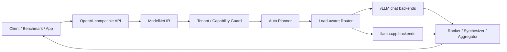
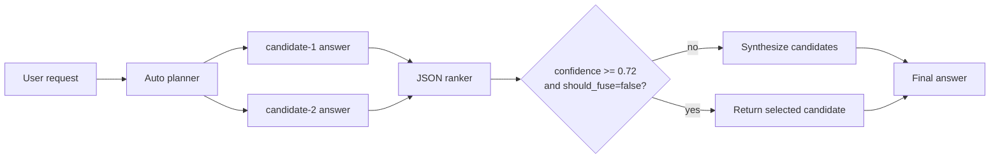

# ModelNet 自动组网当前方法与部署环境说明

本文档说明当前 ModelNet 自动路由/自动组网系统的真实部署状态、关键配置、baseline 定义和当前 `adaptive_sparse_graph` 方法。它的目标是让新的方法设计者不读代码也能理解系统现在如何工作，从而设计更好的自动组网策略。

本文档不包含实验结果、win rate、latency 对比或结论性 benchmark 解读。benchmark 脚本只作为后续验证工具出现。

## 1. 系统定位

ModelNet 当前是一个部署在远端 `4A100` 机器上的 multi-model gateway/router。它对外提供 OpenAI-compatible API，对内管理多个异构 LLM 后端服务，并根据请求复杂度、模型可用性、负载状态和多模型候选答案质量，决定使用单模型回答还是多模型稀疏协作回答。

当前最重要的公开入口是：

- `modelnet-auto`: OpenAI-compatible 正式自动组网入口，对应 `auto.network`。
- `adaptive_sparse_graph`: 当前重点方法，复杂请求默认走 `rank_fuse_v2`。

`modelnet` 作为普通公开入口已退休；北向客户端应改用 `modelnet-auto`。

当前方法的核心思想是：

> 简单请求用低成本单模型路由；复杂请求并行生成少量候选答案，再用 ranker 选择或触发融合。

## 2. 当前部署环境

### 2.1 代码与服务位置

| Item | Value |
| --- | --- |
| Remote host alias | `4A100` |
| Repo path | `/home/duxianghe/ModelNet-toc` |
| Router service | `modelnet-router` |
| Deployment method | `docker compose` |
| Router container status | `healthy` |
| Host binding | `127.0.0.1:3092` |
| Container port | `8000` |

当前 router 通过 Docker Compose 单独 build/restart；通常不需要重启 LiteLLM、LobeHub、数据库或模型后端服务。

### 2.2 Router endpoints

| Endpoint | Purpose |
| --- | --- |
| `GET /healthz` | 查看 router 和 backend ready 状态 |
| `GET /v1/models` | OpenAI-compatible model list |
| `POST /v1/chat/completions` | OpenAI-compatible chat completion |
| `POST /v1/runs/stream` | ModelNet native stream runner |
| `GET /v1/capabilities` | 查看 runner、backend、aggregator 能力 |
| `GET /v1/topology` | 查看 topology 和 backend 可见性 |
| `POST /v1/registry/refresh` | 刷新 registry |

OpenAI-compatible 自动组网请求应通过 `modelnet-auto` 进入。`modelnet` 作为普通公开入口已退休；Native API 主要用于显式 runner、trace 和更细粒度协作控制。

### 2.3 当前 backend pool

最近一次 health check 中，router 看到 18 个 ready backend。

| Backend type | Candidate count | Ready count | Metrics ready |
| --- | ---: | ---: | ---: |
| `vllm_chat` | 10 | 10 | 0 |
| `llama_cpp` | 8 | 8 | 8 |
| Total | 18 | 18 | 8 |

含义：

- `vllm_chat` 后端主要提供 OpenAI-compatible chat completion。
- `llama_cpp` 后端提供 chat，并支持部分 token-step / top-probs 能力。
- 当前 vLLM 的 device metrics 不完整，所以 vLLM 的调度评分更多依赖 endpoint health、K8s ready 状态和 in-flight 状态。
- llama.cpp 有较完整 metrics，可用于更细的负载评分。

### 2.4 控制面默认配置

| Config | Current default | Meaning |
| --- | --- | --- |
| `MODELNET_REGISTRY_PATH` | `/app/model_net.yaml` | 模型注册表路径 |
| `KUBECONFIG` | `/app/kubeconfig` | K8s 访问配置 |
| `MODELNET_K8S_NAMESPACE` | `inference` | 默认推理 namespace |
| `MODELNET_LLAMA_CPP_NAMESPACE` | `llama-cpp` | llama.cpp namespace |
| `MODELNET_PROMETHEUS_NAMESPACE` | `kuboard` | Prometheus namespace |
| `MODELNET_PROMETHEUS_SERVICE` | `prometheus-k8s` | Prometheus service |
| `MODELNET_PROMETHEUS_PORT` | `9090` | Prometheus service port |
| `MODELNET_ROUTER_TRACE_PATH` | `/tmp/router_trace.jsonl` | 自动组网 trace 输出路径 |

如果 router 在容器内运行，`/tmp/router_trace.jsonl` 默认在容器文件系统内，而不是宿主机 `/tmp`。

## 3. Router 架构



主要模块：

- **API Adapter**: 把 OpenAI-compatible 请求转换成内部 `ModelNetRunRequest`。
- **Candidate Registry**: 从 YAML registry 读取模型、backend、service、能力信息。
- **Health / Metrics Layer**: 合并 K8s pod ready、endpoint health、Prometheus metrics、in-flight、failure/cooldown 状态。
- **Planner**: 根据 prompt 特征和 runtime budget 选择 runner。
- **Runner Engine**: 执行 `route.once`、`response.parallel`、`auto.rank_fuse`、`auto.role_graph`、`auto.cascade_verify` 等策略。
- **Metadata / Trace**: 把 `auto_plan` 写回 response metadata，并把执行摘要追加到 router trace。

## 4. 当前系统与 baseline

当前 benchmark 和手动调用中主要使用以下系统名称。

| System | Model | Strategy / Runner | Purpose |
| --- | --- | --- | --- |
| `adaptive_sparse_graph` | `modelnet-auto` | 当前复杂任务默认 `auto.rank_fuse` | 当前主方法 |
| `single_best` | `modelnet-auto` | `route.once` | 单模型路由 baseline |
| `parallel_consensus` | `modelnet-auto` | `response.parallel` + synthesis | 高成本多模型融合 baseline |
| `modelnet_auto` | `modelnet-auto` | 显式 `role_graph` | legacy role graph 对照 |
| `fixed_qwen35b` | 固定 Qwen 35B backend | fixed direct | 固定强模型 baseline |

这些名字容易混淆，需要特别注意：

- `adaptive_sparse_graph` 是当前要改进的主方法。
- `single_best` 是最低成本 baseline，只选一个 backend 回答。
- `parallel_consensus` 是高成本参照，多个模型并行回答后融合。
- `modelnet_auto` 在 benchmark 中保留为 legacy `role_graph` 对照，不等于当前推荐方法。
- `fixed_qwen35b` 是固定强模型参照，不代表自动组网。

## 5. 当前自动组网方法

当前 `adaptive_sparse_graph` 的复杂任务默认实现叫：

> Rank-Fuse Adaptive Sparse Graph

在 metadata 中对应：

- `auto_plan.strategy = adaptive_sparse_graph`
- `auto_plan.runner = auto.rank_fuse`
- `auto_plan.plan_version = rank_fuse_v2`

### 5.1 输入

Planner 选择方法时会使用以下信息：

- 用户 `messages` / prompt。
- tenant 可见模型池。
- candidate backend health。
- in-flight 请求数。
- failure count 和 cooldown 状态。
- K8s pod ready 状态。
- Prometheus metrics。
- `runner_config` 中的策略参数。

### 5.2 Prompt feature extraction

当前 prompt 特征是启发式提取的，不是学习模型。

主要特征包括：

| Feature | Meaning |
| --- | --- |
| `chars` / `prompt_chars` | prompt 字符数 |
| `question_count` | 问号数量 |
| `history_turns` | 上下文历史轮数 |
| `user_turns` | 用户消息轮数 |
| `has_cjk` | 是否包含中文等 CJK 字符 |
| `has_code` | 是否像代码/工程问题 |
| `has_design` | 是否像设计/架构问题 |
| `has_security` | 是否像安全/风险问题 |
| `has_reasoning` | 是否像数学/逻辑推理问题 |
| `concise_hits` | 是否要求简短回答 |
| `keyword_hits` | 命中的复杂度关键词 |
| `task_type` | 推断出的任务类型 |
| `complexity` | 综合复杂度分数 |

复杂度分数主要由 prompt 长度、历史轮数、问题数量、复杂关键词、代码/安全/设计/推理信号共同决定。

### 5.3 Candidate scoring

候选 backend 会先按负载和健康状态打分，再按任务特征做调整。

基础评分考虑：

- backend 是否 ready。
- endpoint health。
- K8s pod CPU / memory。
- node GPU utilization / memory。
- candidate 当前 in-flight 数。
- failure count。
- cooldown 状态。

任务相关调整考虑：

- 模型 family，例如 `qwen`、`llama`、`granite`、`gemma`、`hunyuan`。
- 模型 size。
- prompt 是否中文。
- prompt 是否代码、设计、安全或推理类。
- 高复杂任务更偏向较强模型。
- 简单任务会对大模型加成本惩罚，避免过度使用。

当前 candidate scoring 仍是启发式规则，不使用历史 judge 数据或在线学习。

### 5.4 Runtime budget

Planner 会为每个请求估计 runtime budget。

| Field | Meaning |
| --- | --- |
| `requested_max_sources` | 请求或默认允许的最大 source 数 |
| `max_sources` | 当前负载下实际允许 source 数 |
| `max_extra_calls` | 额外调用预算 |
| `load_state` | `normal` / `shed` / `limited` |
| `load_shed_threshold` | 负载保护阈值 |
| `best_route_score` | 当前最佳 backend 的负载评分 |
| `best_route_reason` | 最佳 backend 的选择原因 |
| `ready_candidates` | 可用候选数量 |

`load_state` 的含义：

- `normal`: 正常调度。
- `shed`: 当前最佳 route score 已超过负载保护阈值，应减少多模型调用。
- `limited`: 可用候选不足，无法组成多模型策略。

### 5.5 Topology selection

当前 topology 选择规则如下。

| Condition | Selected runner |
| --- | --- |
| 显式 `single_best` | `route.once` |
| 显式 `parallel_consensus` | `response.parallel` |
| 显式 `role_graph` | `auto.role_graph` |
| 显式 `cascade_verify` | `auto.cascade_verify` |
| 高负载 shed | `route.once` |
| 简单请求且高置信 | `route.once` |
| 复杂请求且至少 2 个候选 | `auto.rank_fuse` |
| high quality + 高复杂度 + 至少 3 个候选 | 3-source `auto.rank_fuse` |

因此，当前 `adaptive_sparse_graph` 并不是所有请求都多模型协作。简单请求会保持低成本 `route.once`，复杂请求才触发 rank-fuse。

### 5.6 Rank-fuse execution

复杂任务默认执行路径如下。



执行步骤：

1. Planner 选择 2 个候选源，high-quality 高复杂场景最多 3 个。
2. 候选源并行生成完整答案。
3. Ranker 读取原始用户请求和所有候选答案。
4. Ranker 返回 compact JSON：

```json
{
  "winner_source_id": "candidate-2",
  "confidence": 0.8,
  "should_fuse": false,
  "reason": "candidate-2 is more complete and follows the request better"
}
```

5. 如果 `confidence >= 0.72` 且 `should_fuse=false`，直接返回获胜候选。
6. 如果 ranker 低置信、要求融合、JSON 无效或没有明确 winner，则调用 synthesizer 融合候选答案。
7. 最终把执行 metadata 合并回 `auto_plan`。

Ranker 当前有几个稳定性设置：

- 优先选择 `vllm_chat` backend。
- 设置 `temperature=0`。
- 设置 `chat_template_kwargs.enable_thinking=false`。
- 设置 `response_format={"type":"json_object"}`。
- prompt 中要求不要输出 hidden reasoning、markdown、prose 或 `<think>` tags。

### 5.7 Cascade verify compatibility

`cascade_verify` 仍保留为显式策略，但不再是当前复杂任务的默认路径。

它的流程是：

1. primary source 先回答。
2. verifier 检查 primary answer 是否满足请求。
3. verifier 通过则早停。
4. verifier 失败且预算允许时，调用 escalation source。

这个策略适合“先低成本尝试，再失败升级”的场景；但它依赖单个 primary answer 的质量，因此当前主方法改成了更主动的 rank-fuse。

### 5.8 Role graph compatibility

`role_graph` 仍保留为 legacy 自动组网对照。

它的流程是：

1. 选择多个 expert role，例如 primary solver、specialist、skeptic。
2. expert 并行回答。
3. 可选 critic 审查。
4. synthesizer 生成最终答案。

当前实现中 critic 是否启用是自适应的：低置信、专家冲突较高或显式开启时才启用。

## 6. 当前自动组网配置

| Config | Default | Meaning |
| --- | ---: | --- |
| `MODELNET_AUTO_NETWORK_MAX_SOURCES` | `2` | 默认最多 2 个候选源 |
| `MODELNET_AUTO_NETWORK_HIGH_QUALITY_MAX_SOURCES` | `3` | high-quality 模式最多 3 源 |
| `MODELNET_AUTO_NETWORK_MAX_EXTRA_CALLS` | `1` | 额外调用预算 |
| `MODELNET_AUTO_NETWORK_MEDIUM_COMPLEXITY_THRESHOLD` | `2` | 中复杂度阈值 |
| `MODELNET_AUTO_NETWORK_HIGH_COMPLEXITY_THRESHOLD` | `4` | 高复杂度阈值 |
| `MODELNET_AUTO_NETWORK_LOAD_SHED_SCORE` | `900` | 负载保护阈值 |
| `MODELNET_AUTO_NETWORK_CONFIDENCE_THRESHOLD` | `0.68` | route.once 高置信阈值 |
| `MODELNET_AUTO_RANK_FUSE_CONFIDENCE_THRESHOLD` | `0.72` | ranker 直接选择阈值 |
| `MODELNET_AUTO_RANK_FUSE_RANKER_MAX_TOKENS` | `192` | ranker 最大 token |
| `MODELNET_AUTO_CASCADE_VERIFIER_MAX_TOKENS` | `160` | cascade verifier 最大 token |
| `MODELNET_AUTO_ROLE_GRAPH_EXPERT_MAX_TOKENS` | `160` | role graph expert token |
| `MODELNET_AUTO_ROLE_GRAPH_CRITIC_MAX_TOKENS` | `180` | role graph critic token |
| `MODELNET_AUTO_ROLE_GRAPH_SYNTHESIS_MAX_TOKENS` | `256` | role graph synthesis token |
| `MODELNET_AUTO_CONTRIBUTION_MAX_CHARS` | `1200` | trace 中贡献文本压缩长度 |

这些默认值可以通过环境变量覆盖，也可以通过请求中的 `runner_config` 对部分参数进行覆盖。

常见 `runner_config`：

```json
{
  "strategy": "adaptive_sparse_graph",
  "max_auto_sources": 2
}
```

```json
{
  "strategy": "adaptive_sparse_graph",
  "max_auto_sources": 3,
  "high_quality": true
}
```

## 7. Metadata 与 trace

调用 `modelnet-auto` 时，如果开启 trace，response metadata 中会包含 `auto_plan`。

重点字段：

| Field | Meaning |
| --- | --- |
| `auto_plan.strategy` | 用户请求或 planner 选择的策略 |
| `auto_plan.runner` | 实际 runner，例如 `route.once` 或 `auto.rank_fuse` |
| `auto_plan.plan_version` | 当前 rank-fuse 为 `rank_fuse_v2` |
| `auto_plan.features` | prompt 特征 |
| `auto_plan.call_budget` | runtime budget |
| `auto_plan.load_state` | 当前负载状态 |
| `auto_plan.selected_sources` | 被选中的候选模型 |
| `auto_plan.ranker` | ranker 模型选择 |
| `auto_plan.ranker_decision` | ranker JSON 决策 |
| `auto_plan.selected_source_id` | 最终被 ranker 选择的候选 |
| `auto_plan.compressed_contributions` | 候选答案压缩文本 |
| `auto_plan.response_aggregator` | synthesis 使用的聚合模型 |
| `auto_plan.trace_summary` | 执行摘要 |

Trace JSONL 默认写入：

```text
/tmp/router_trace.jsonl
```

每行记录一个自动组网请求，包含：

- `request_id`
- `strategy`
- `runner`
- `aggregator`
- `load_state`
- `call_budget`
- `selected_sources`
- `ranker_decision`
- `selected_source_id`
- `trace_summary`

如果 router 运行在容器里，需要进入 `modelnet-router` 容器查看该路径。

## 8. 示例请求

### 8.1 当前主方法

```json
{
  "model": "modelnet-auto",
  "messages": [
    {
      "role": "user",
      "content": "Analyze two implementation strategies for a multi-model router and recommend one."
    }
  ],
  "max_tokens": 384,
  "temperature": 0.2,
  "modelnet": {
    "stream_options": {
      "include_trace": true
    },
    "collaboration_plan": {
      "runner_config": {
        "strategy": "adaptive_sparse_graph",
        "max_auto_sources": 2
      }
    }
  }
}
```

### 8.2 显式 single best

```json
{
  "strategy": "single_best"
}
```

### 8.3 显式 parallel consensus

```json
{
  "strategy": "parallel_consensus",
  "max_auto_sources": 2
}
```

### 8.4 显式 role graph

```json
{
  "strategy": "role_graph",
  "max_auto_sources": 3
}
```

### 8.5 显式 cascade verify

```json
{
  "strategy": "cascade_verify",
  "max_auto_sources": 2
}
```

## 9. 当前方法的设计限制

这一节是给后续方法设计者看的。下面这些限制不是 bug，而是当前方法仍有改进空间的地方。

### 9.1 Planner 是启发式的

当前 prompt complexity、task type、candidate preference 都来自规则：

- 没有训练 query router。
- 没有使用历史 judge 数据。
- 没有 per-domain learned policy。
- 没有在线学习或用户反馈闭环。

因此它可能对某些任务类型判断不准，例如创作、数学、代码、中文、多轮上下文混合任务。

### 9.2 Candidate selection 不知道真实质量

当前 candidate 选择主要看：

- backend ready / load。
- 模型 family。
- 模型 size。
- 少量任务类型启发式。

它不知道某个模型在某类问题上的真实胜率，也不知道不同模型组合之间是否互补。

更好的方法可以考虑：

- 建立 query-to-model preference dataset。
- 学习 per-category / per-domain router。
- 学习 model-pair complementarity。
- 用历史 judge 或用户反馈更新 candidate selector。

### 9.3 Ranker 不是校准过的 reward model

当前 ranker 是一次 LLM JSON 判断：

- `confidence` 没有校准。
- `should_fuse` 没有通过训练优化。
- ranker 自身也可能偏向长答案、熟悉风格或特定模型。
- ranker 只看完整答案，不看 token-level uncertainty。

更好的方法可以考虑：

- 使用池外强 ranker。
- 训练 lightweight reward model。
- 对 ranker confidence 做 calibration。
- 多 ranker 投票。
- 使用 pairwise preference 而不是单次 JSON。

### 9.4 Fusion 可能破坏好答案

当 ranker 选择 synthesis 时，synthesizer 会把候选答案融合成最终答案。这可能带来：

- 冗余。
- 幻觉。
- 改写掉原本正确的细节。
- 过度平均两个互相冲突的答案。

更好的方法可以考虑：

- 先抽取候选答案的 structured claims。
- 对 claims 做 fact-level rank。
- 只融合互补部分。
- 对冲突部分要求显式取舍。

### 9.5 成本和延迟没有进入强约束优化

当前策略会考虑 load shed 和 source budget，但还不是严格的 quality-cost Pareto 优化。

目前缺少：

- 每个内部 call 的完整 prompt/completion token 账单。
- 每个 stage 的准确 latency 和失败率聚合。
- 质量提升相对额外成本的在线估计。
- 不同用户/tenant 的预算约束策略。

更好的方法应该显式优化：

```text
expected_quality_gain - lambda_latency * extra_latency - lambda_cost * extra_tokens
```

### 9.6 负载观测还有盲区

当前 vLLM backend 的 device metrics 不完整，所以一部分调度只能依赖 endpoint health 和 in-flight。

这会影响：

- 高并发下的真实负载估计。
- GPU memory pressure 判断。
- backend 间 capacity-aware routing。
- load shed 是否及时。

更好的方法可以补齐 backend-level telemetry，再做 pressure-aware source count。

### 9.7 Fallback 仍偏执行错误恢复

当前 fallback 主要在 runner 出错后退回 `route.once`。它不是主动质量恢复策略。

更好的方法可以考虑：

- ranker 低置信时选择更强模型重答。
- verifier 指向具体错误后定向修复。
- 对高风险任务启用 second-pass checker。
- 对简单任务禁用所有多模型开销。

## 10. 给后续方法设计者的问题清单

可以从这些问题出发设计新方法：

1. 是否应该训练一个 query router，直接预测最优 backend 或最优 backend 组合？
2. 是否应该从历史 judgment 构建 pairwise preference dataset？
3. 是否应该把 ranker 替换成轻量 reward model？
4. 是否应该做 cost-aware routing，让质量收益必须超过额外 latency / token cost？
5. 是否应该显式学习模型之间的互补性，而不是只按 family 去重？
6. 是否应该先把候选答案压缩成 structured claims，再 rank/fuse？
7. 是否应该加入 self-consistency、uncertainty 或 verifier 信号？
8. 是否应该把 `role_graph`、`rank_fuse`、`cascade_verify` 统一成一个 learned policy？
9. 是否应该根据系统压力动态降低 source count 或切换到 `single_best`？
10. 是否应该引入池外 judge 或用户反馈闭环来更新策略？

## 11. Benchmark 脚本位置

本文档不写实验结果，但当前仓库已有验证脚本：

| Script | Purpose |
| --- | --- |
| `benchmarks/run_mtbench_modelnet.py` | MT-Bench 质量评测 |
| `benchmarks/run_pressure_modelnet.py` | 固定并发压力测试 |
| `benchmarks/run_load_balancing_modelnet.py` | open-loop / trace replay / load-balance 诊断 |

如果要评估新方法，建议至少保留以下对照：

- `single_best`
- `adaptive_sparse_graph`
- `parallel_consensus`
- `role_graph`
- 固定强模型 baseline

正式评测还应使用池外 judge，并确保 judge 不和被测 backend pool 重叠。
