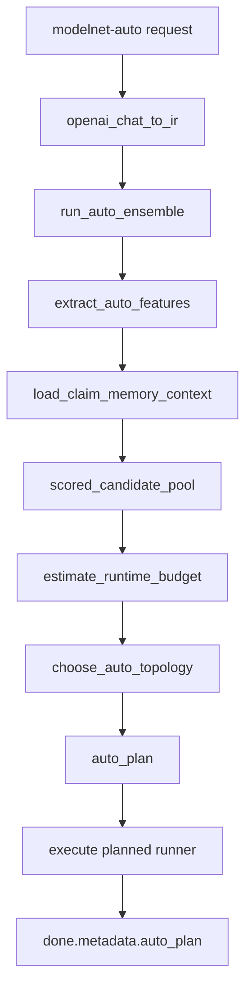
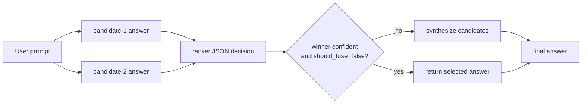
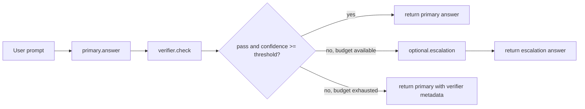

# ModelNet 自动组网几种策略说明

日期：2026-06-19

适用代码：`/home/duxianghe/ModelNet-toc` 当前工作树。

本文说明 `modelnet-auto` / `auto.network` 现在支持的自动组网策略，以及每种策略如何触发、实际会走哪个 runner、适合什么场景、怎么在请求里指定、怎么从返回 metadata 判断真实执行路径。

## 1. 一句话总览

`modelnet-auto` 不是单一算法，而是一个自动规划入口。Gateway 收到请求后先执行 `auto.network`，再根据 `runner_config.strategy`、prompt 特征、模型池、K8S/Prometheus 负载、调用预算和 Claim Memory 状态，规划成下面几类执行路径：

| Strategy | 当前定位 | 可能执行的 runner | 调用成本 |
| --- | --- | --- | --- |
| `role_graph` | 当前默认自动组网策略 | `auto.role_graph` | 中到高 |
| `adaptive_sparse_graph` / `adaptive` | 当前主推稀疏策略，复杂时 rank-fuse，简单时单模型 | `route.once` 或 `auto.rank_fuse` | 低到中 |
| `single_best` | 单模型低成本 baseline | `route.once` | 低 |
| `parallel_consensus` | 多模型并行合成 baseline | `response.parallel` | 高 |
| `claim_graph` | Claim 级提取、验证、保守组装 | `auto.claim_graph` | 低到中 |
| `cascade_verify` | 主模型回答 + verifier 校验 + 可选升级 | `auto.cascade_verify` | 低到中 |

注意：

- `/v1/capabilities` 中注册的公开 runner 包括 `auto.network`、`auto.role_graph`、`auto.claim_graph`、`route.once`、`response.parallel` 等。
- `auto.rank_fuse` 和 `auto.cascade_verify` 是 `auto.network` 内部规划出的执行路径，当前不作为普通外部 runner 插件单独暴露。
- 默认策略由 `MODELNET_AUTO_NETWORK_DEFAULT_STRATEGY` 控制，当前代码默认是 `role_graph`。

## 2. 入口请求形状

所有自动组网策略都通过 `modelnet-auto` 进入 LiteLLM，然后由 LiteLLM 转发到 ModelNet Gateway：

```json
{
  "model": "modelnet-auto",
  "stream": true,
  "messages": [
    {
      "role": "user",
      "content": "请分析这个架构的风险并给出改进建议。"
    }
  ],
  "modelnet": {
    "stream_options": {
      "include_trace": true
    },
    "collaboration_plan": {
      "runner": "auto.network",
      "aggregator": "auto",
      "runner_config": {
        "strategy": "adaptive_sparse_graph",
        "show_auto_flow": true
      }
    }
  }
}
```

关键字段：

| 字段 | 说明 |
| --- | --- |
| `model=modelnet-auto` | 当前正式自动组网入口 |
| `modelnet.collaboration_plan.runner=auto.network` | 进入自动规划器 |
| `modelnet.collaboration_plan.aggregator=auto` | 聚合器由 planner 决定 |
| `runner_config.strategy` | 指定自动组网策略 |
| `runner_config.show_auto_flow=true` | 流式返回中展示自动规划过程 |
| `stream_options.include_trace=true` | 允许 trace stream 和 metadata |

如果不传 `strategy`，Gateway 使用默认策略，当前是 `role_graph`。

## 3. 自动组网决策流水线

`auto.network` 的真实流程如下：



### 3.1 Prompt 特征

Planner 会从 messages 中提取：

| Feature | 含义 |
| --- | --- |
| `chars` / `prompt_chars` | prompt 字符数 |
| `question_count` | 问号数量 |
| `history_turns` | 上下文历史轮数 |
| `user_turns` | 用户轮数 |
| `has_cjk` | 是否包含中文/CJK |
| `has_code` | 是否像代码任务 |
| `has_security` | 是否像安全任务 |
| `has_design` | 是否像设计/架构任务 |
| `has_reasoning` | 是否像数学/推理任务 |
| `concise_hits` | 是否要求简短 |
| `keyword_hits` | 复杂度关键词 |
| `strong_complexity_hits` | 强复杂度关键词 |
| `task_type` | `general` / `code` / `security` / `design` / `reasoning` / `multilingual` |
| `complexity` | 综合复杂度分数 |

复杂度规则大致是：

- prompt 超过 240 字，加复杂度。
- prompt 超过 700 字，再加复杂度。
- 对话轮数多，加复杂度。
- 问题数量多，加复杂度。
- 命中复杂度关键词，加复杂度。
- 代码、安全、设计、推理信号明显，加复杂度。
- 如果 prompt 很短且明确要求简短，会压低复杂度。

### 3.2 候选模型评分

`scored_candidate_pool()` 先按租户权限、显式候选池、required capabilities 过滤模型，再结合运行状态打分。

基础评分来自：

- K8S pod ready 状态。
- metrics.k8s.io pod CPU / memory。
- Prometheus node CPU / memory / GPU / GPU memory。
- endpoint health fallback。
- 当前 in-flight 请求数。
- failure count。
- cooldown 状态。

再根据任务特征调整：

- 高复杂任务更偏向大模型。
- 简单任务会对大模型加成本惩罚。
- 中文任务偏向 `qwen`、`hunyuan`、`glm`。
- 代码任务偏向 `qwen`、`llama`、`gpt-oss`。
- 不同角色会有不同偏好，例如 `critic`、`synthesizer`、`specialist`。

### 3.3 Runtime budget

`estimate_runtime_budget()` 生成调用预算：

| 字段 | 含义 |
| --- | --- |
| `requested_max_sources` | 请求或默认允许的最大 source 数 |
| `max_sources` | 当前负载下实际可用 source 数 |
| `max_extra_calls` | 允许的额外调用数 |
| `load_state` | `normal` / `shed` / `limited` |
| `load_shed_threshold` | 负载保护阈值，当前默认 900 |
| `best_route_score` | 当前最佳 backend 的路由分 |
| `best_route_reason` | 当前最佳 backend 的选择原因 |
| `ready_candidates` | 可用候选数量 |

`load_state` 解释：

- `normal`：正常选择。
- `shed`：当前负载高，减少多模型调用。
- `limited`：候选不足，无法组成多模型策略。

## 4. 策略一：`role_graph`

### 定位

`role_graph` 是当前默认策略。它把问题分给多个角色化专家，再由 synthesizer 合成最终答案，可选 critic 审查。

### 触发方式

不指定 strategy 时默认触发：

```json
{
  "runner_config": {
    "show_auto_flow": true
  }
}
```

显式指定：

```json
{
  "runner_config": {
    "strategy": "role_graph",
    "max_auto_sources": 2,
    "show_auto_flow": true
  }
}
```

### 规划结果

正常情况下：

| auto_plan 字段 | 值 |
| --- | --- |
| `strategy` | `role_graph` |
| `runner` | `auto.role_graph` |
| `plan_version` | `role_graph_v1` |
| `aggregator` | `synthesize` |
| `stages` | `experts.parallel` -> `synthesizer.final` |

如果候选不足 2 个，会 fallback 到 `single_best` / `route.once`。

### 执行方法

Planner 会选角色：

- `primary_solver`
- `specialist`
- 可选 `critic`
- `synthesizer`

然后构造 sources：

```text
expert-1 -> primary_solver candidate
expert-2 -> specialist candidate
critic -> optional review model
synthesizer -> final answer model
```

执行流程：

```text
experts.parallel
  -> critic.review, if enabled
  -> synthesizer.final
```

### 适合场景

- 复杂分析。
- 架构设计。
- 需要不同视角的问答。
- 希望质量优先，不极限压低调用次数。

### 不适合场景

- 短问答。
- 高并发压力下低延迟请求。
- 只需要最低成本 baseline 的实验。

## 5. 策略二：`adaptive_sparse_graph` / `adaptive`

### 定位

`adaptive_sparse_graph` 是当前主推的稀疏自动组网策略。它的目标是：简单请求只走一个模型，复杂请求才触发少量多模型协作。

Benchmark 中的 `adaptive_sparse_graph` 系统就是：

```json
{
  "model": "modelnet-auto",
  "runner_config": {
    "strategy": "adaptive_sparse_graph",
    "max_auto_sources": 2
  }
}
```

### 触发方式

```json
{
  "runner_config": {
    "strategy": "adaptive_sparse_graph",
    "max_auto_sources": 2,
    "show_auto_flow": true
  }
}
```

短别名也可用：

```json
{
  "runner_config": {
    "strategy": "adaptive"
  }
}
```

### 规划规则

`adaptive_sparse_graph` 会走下面的决策：

| 条件 | 实际执行 |
| --- | --- |
| `load_state=shed` | `route.once` |
| 置信度高且复杂度低 | `route.once` |
| `quality=high/best` 且高复杂度且至少 3 个候选 | 3-source `auto.rank_fuse` |
| 至少 2 个候选且 source budget 足够 | 2-source `auto.rank_fuse` |
| 预算不足或候选不足 | `route.once` |

### `auto.rank_fuse` 执行方法

`rank_fuse` 流程：



Ranker 需要返回 JSON：

```json
{
  "winner_source_id": "candidate-1",
  "confidence": 0.82,
  "should_fuse": false,
  "reason": "candidate-1 is complete and more precise"
}
```

如果：

- ranker 置信度低于阈值；
- `should_fuse=true`；
- winner 无效；
- ranker 输出不是合法 JSON；

则进入 synthesizer 合成。

默认阈值：

| 配置 | 默认值 |
| --- | --- |
| `AUTO_NETWORK_CONFIDENCE_THRESHOLD` | `0.68` |
| `AUTO_RANK_FUSE_CONFIDENCE_THRESHOLD` | `0.72` |

### 适合场景

- 大多数线上默认自动策略候选。
- 想降低 `role_graph` 的多模型调用成本。
- 简单问题希望自动省调用。
- 复杂问题希望至少有候选比较和合成兜底。

### 不适合场景

- 必须让多个模型都独立完整表达的场景，这时用 `parallel_consensus`。
- 必须保留角色化专家分工的场景，这时用 `role_graph`。

## 6. 策略三：`single_best`

### 定位

`single_best` 是最低成本 baseline。它只做一次路由，选择当前最合适的一个 backend 回答。

### 触发方式

```json
{
  "runner_config": {
    "strategy": "single_best",
    "show_auto_flow": true
  }
}
```

### 规划结果

| auto_plan 字段 | 值 |
| --- | --- |
| `strategy` | `single_best` |
| `runner` | `route.once` |
| `aggregator` | `load_aware` |
| `source_count` | `1` |
| `stages` | `route.once` |
| `escalation_reason` | `explicit_single_best` |

### 执行方法

```text
pick_candidate()
  -> generate_text()
  -> done
```

路由考虑：

- 模型可见性。
- required capabilities。
- K8S ready。
- endpoint health。
- live load。
- in-flight。
- failure cooldown。

### 适合场景

- 低延迟。
- 低成本。
- load baseline。
- 检查 router 本身是否健康。

### 不适合场景

- 需要多模型交叉验证。
- 需要复杂 synthesis。
- 需要专家角色分工。

## 7. 策略四：`parallel_consensus`

### 定位

`parallel_consensus` 是高成本多模型并行 baseline。它让多个 source 同时回答，再用 synthesizer 生成最终答案。

### 触发方式

```json
{
  "runner_config": {
    "strategy": "parallel_consensus",
    "max_auto_sources": 2,
    "show_auto_flow": true
  }
}
```

### 规划结果

| auto_plan 字段 | 值 |
| --- | --- |
| `strategy` | `parallel_consensus` |
| `runner` | `response.parallel` |
| `aggregator` | `synthesize` |
| `stages` | `sources.parallel` -> `synthesizer.final` |
| `escalation_reason` | `explicit_parallel_consensus` |

如果可用候选少于 2 个，会 fallback 到 `route.once`。

### 执行方法

```text
sources.parallel
  -> source-1 full answer
  -> source-2 full answer
  -> synthesizer.final
```

至少需要 2 个成功且有可见文本的 source response 才能合成。

### 适合场景

- 高质量 baseline。
- 对比 `adaptive_sparse_graph` 的质量上限。
- 需要强制多模型共同参与。

### 不适合场景

- 高并发压力测试中的默认策略。
- 成本敏感场景。
- 可用候选少的场景。

## 8. 策略五：`claim_graph`

### 定位

`claim_graph` 是 claim 级保守验证策略。它先生成草稿，再抽取关键 claim，选择 frontier claim 做验证，最后按验证结果保守组装答案。

### 触发方式

```json
{
  "runner_config": {
    "strategy": "claim_graph",
    "claim_memory_enabled": true,
    "claim_frontier_k": 3,
    "show_auto_flow": true
  }
}
```

如果显式 `strategy=claim_graph` 且没有设置 `claim_memory_enabled`，planner 会默认把 `claim_memory_enabled` 设为 true，用于读取可注入/争议 claim。

### 规划结果

正常预算：

| auto_plan 字段 | 值 |
| --- | --- |
| `strategy` | `claim_graph` |
| `runner` | `auto.claim_graph` |
| `plan_version` | `claim_graph_v1` |
| `aggregator` | `auto` |
| `stages` | `claim.proposer` -> `claim.extract` -> `claim.verify` -> `claim.assemble` |

预算受限或高负载：

| auto_plan 字段 | 值 |
| --- | --- |
| `runner` | `auto.claim_graph` |
| `source_count` | `1` |
| `stages` | `claim.proposer` -> `claim.shortcut` |
| `escalation_reason` | `explicit_claim_graph_budget_limited` |

### 执行方法

```text
claim.proposer
  -> draft answer
claim.extract
  -> extract frontier claims
claim.verify
  -> verify selected claims
claim.assemble
  -> conservative final answer
```

可能 shortcut：

| Shortcut | 含义 |
| --- | --- |
| `high_coverage` | 注入 claim 覆盖足够且没有 contested claims，直接返回草稿 |
| `budget_limited` | 没有额外调用预算，返回草稿 |
| `extraction_failed` | claim 抽取失败，返回草稿 |
| `empty_frontier` | 没有可验证 frontier，返回草稿 |
| `none` | 完整抽取、验证、组装 |

### 适合场景

- 事实性强的问题。
- 已有 Claim Memory 上下文的问题。
- 需要验证 contested claims 的场景。
- 希望输出更保守而不是更发散。

### 不适合场景

- 创意写作。
- 单纯风格改写。
- 不需要事实验证的简单任务。

## 9. 策略六：`cascade_verify`

### 定位

`cascade_verify` 是稀疏校验策略。它先让 primary 模型回答，再让 verifier 判断是否通过；如果没通过且预算允许，再调用 escalation 模型改写/补救。

### 触发方式

```json
{
  "runner_config": {
    "strategy": "cascade_verify",
    "max_auto_sources": 2,
    "max_extra_calls": 1,
    "show_auto_flow": true
  }
}
```

### 规划规则

| 条件 | 实际执行 |
| --- | --- |
| 候选少于 2 个 | fallback `route.once` |
| `max_extra_calls < 1` | fallback `route.once` |
| 候选和预算都足够 | `auto.cascade_verify` |

### 执行方法



Verifier 输出会被解析成：

```json
{
  "pass": true,
  "confidence": 0.91,
  "reason": "complete"
}
```

### 适合场景

- 希望大多数请求只花一次主模型调用，但对风险问题加一道校验。
- 质量/成本折中。
- 需要“失败才升级”的稀疏流程。

### 不适合场景

- 必须多个模型都完整回答的场景。
- 需要合成多个候选答案的场景。
- 候选池不足两个的场景。

## 10. 显式指定候选模型池

自动组网默认从租户可见模型池中选择。如果要限制只在几个模型里自动组网，可以传：

```json
{
  "model": "modelnet-auto",
  "modelnet": {
    "candidate_aliases": [
      "inference-qwen-qwen3-14b-awq",
      "llama-cpp-deploy-pc-3090-qwen3-8b-bf16"
    ],
    "collaboration_plan": {
      "runner": "auto.network",
      "aggregator": "auto",
      "runner_config": {
        "strategy": "adaptive_sparse_graph"
      }
    }
  }
}
```

Gateway 会把 `modelnet.candidate_aliases` 合并进 `collaboration_plan.candidate_aliases`，再用于 `scored_candidate_pool()` 过滤候选。

也可以通过 `collaboration_plan.sources` 指定候选：

```json
{
  "collaboration_plan": {
    "runner": "auto.network",
    "aggregator": "auto",
    "sources": [
      {
        "source_id": "qwen",
        "model_alias": "inference-qwen-qwen3-14b-awq"
      },
      {
        "source_id": "llama",
        "model_alias": "llama-cpp-deploy-pc-3090-qwen3-8b-bf16"
      }
    ],
    "runner_config": {
      "strategy": "role_graph"
    }
  }
}
```

注意：`auto.network` 会把这些 source alias 作为可选池，而不是保证每个 source 都一定被调用。最终调用哪些模型要看 strategy、source budget 和 route score。

## 11. 常用请求模板

### 11.1 默认自动组网

```json
{
  "model": "modelnet-auto",
  "messages": [
    {
      "role": "user",
      "content": "请分析这个系统设计。"
    }
  ],
  "modelnet": {
    "stream_options": {
      "include_trace": true
    },
    "collaboration_plan": {
      "runner": "auto.network",
      "aggregator": "auto",
      "runner_config": {
        "show_auto_flow": true
      }
    }
  }
}
```

当前等价于默认 `strategy=role_graph`。

### 11.2 稀疏自动组网

```json
{
  "model": "modelnet-auto",
  "messages": [
    {
      "role": "user",
      "content": "比较两种迁移方案的风险、成本和实施步骤。"
    }
  ],
  "modelnet": {
    "stream_options": {
      "include_trace": true
    },
    "collaboration_plan": {
      "runner": "auto.network",
      "aggregator": "auto",
      "runner_config": {
        "strategy": "adaptive_sparse_graph",
        "max_auto_sources": 2,
        "show_auto_flow": true
      }
    }
  }
}
```

### 11.3 单模型 baseline

```json
{
  "model": "modelnet-auto",
  "messages": [
    {
      "role": "user",
      "content": "用三点解释 LiteLLM 和 Gateway 的分工。"
    }
  ],
  "modelnet": {
    "collaboration_plan": {
      "runner": "auto.network",
      "aggregator": "auto",
      "runner_config": {
        "strategy": "single_best"
      }
    }
  }
}
```

### 11.4 并行共识 baseline

```json
{
  "model": "modelnet-auto",
  "messages": [
    {
      "role": "user",
      "content": "请从性能、可靠性、维护成本三方面评价这个架构。"
    }
  ],
  "modelnet": {
    "stream_options": {
      "include_trace": true
    },
    "collaboration_plan": {
      "runner": "auto.network",
      "aggregator": "auto",
      "runner_config": {
        "strategy": "parallel_consensus",
        "max_auto_sources": 2,
        "show_auto_flow": true
      }
    }
  }
}
```

### 11.5 Claim Graph

```json
{
  "model": "modelnet-auto",
  "messages": [
    {
      "role": "user",
      "content": "核查并回答：这个项目当前生产 LiteLLM 是否公网暴露？"
    }
  ],
  "modelnet": {
    "stream_options": {
      "include_trace": true
    },
    "collaboration_plan": {
      "runner": "auto.network",
      "aggregator": "auto",
      "runner_config": {
        "strategy": "claim_graph",
        "claim_frontier_k": 3,
        "show_auto_flow": true
      }
    }
  }
}
```

### 11.6 Cascade Verify

```json
{
  "model": "modelnet-auto",
  "messages": [
    {
      "role": "user",
      "content": "给出一个数据库迁移计划，并指出最容易出错的步骤。"
    }
  ],
  "modelnet": {
    "stream_options": {
      "include_trace": true
    },
    "collaboration_plan": {
      "runner": "auto.network",
      "aggregator": "auto",
      "runner_config": {
        "strategy": "cascade_verify",
        "max_auto_sources": 2,
        "max_extra_calls": 1,
        "show_auto_flow": true
      }
    }
  }
}
```

## 12. 怎么判断真实执行了什么

最终响应 metadata 中会有：

```json
{
  "modelnet": {
    "request_id": "...",
    "metadata": {
      "auto_plan": {
        "planner": "query-conditioned-template-v3",
        "plan_version": "rank_fuse_v2",
        "entry_runner": "auto.network",
        "strategy": "adaptive_sparse_graph",
        "runner": "auto.rank_fuse",
        "aggregator": "rank_then_fuse",
        "features": {},
        "call_budget": {},
        "load_state": "normal",
        "confidence_score": 0.62,
        "confidence_reasons": [],
        "escalation_reason": "rank_fuse_complex_or_low_confidence",
        "stages": [
          "candidates.parallel",
          "ranker.select",
          "optional.synthesizer.final"
        ],
        "selected_sources": []
      },
      "internal_total_tokens": 939,
      "internal_usage": {},
      "call_ledger_summary": {}
    }
  }
}
```

重点看：

| 字段 | 用途 |
| --- | --- |
| `auto_plan.strategy` | 用户请求或 planner 归一化后的策略 |
| `auto_plan.runner` | 真实执行 runner |
| `auto_plan.plan_version` | 当前计划版本 |
| `auto_plan.escalation_reason` | 为什么选这条路径 |
| `auto_plan.call_budget` | source 和额外调用预算 |
| `auto_plan.load_state` | 是否高负载降级 |
| `auto_plan.selected_sources` | 最终选择的模型 |
| `internal_total_tokens` | 内部总 token |
| `call_ledger_summary` | 内部调用统计 |

常见 `escalation_reason`：

| Reason | 含义 |
| --- | --- |
| `explicit_single_best` | 用户显式指定单模型 |
| `explicit_parallel_consensus` | 用户显式指定并行共识 |
| `explicit_role_graph` | 用户显式指定 role graph |
| `explicit_claim_graph` | 用户显式指定 claim graph |
| `explicit_claim_graph_budget_limited` | claim graph 预算受限，走 shortcut |
| `load_shed_route_once` | 高负载，降级单模型 |
| `high_confidence_low_complexity` | 简单且高置信，单模型足够 |
| `rank_fuse_complex_or_low_confidence` | 复杂或低置信，走 rank-fuse |
| `high_quality_rank_fuse` | high quality + 高复杂度，走 3-source rank-fuse |
| `budget_exhausted_route_once` | 预算不足，只能单模型 |
| `role_graph_planning_fallback` | role graph 没选够专家，fallback |

## 13. 推荐选择

| 目标 | 推荐 strategy |
| --- | --- |
| 当前默认质量优先 | `role_graph` |
| 线上默认候选、想降成本 | `adaptive_sparse_graph` |
| 最低延迟/最低成本 baseline | `single_best` |
| 质量上限对照 | `parallel_consensus` |
| 事实核查/强证据约束 | `claim_graph` |
| 主答 + 校验 + 必要时升级 | `cascade_verify` |

实践建议：

- 产品默认可以用 `modelnet-auto` 不带 strategy，即当前 `role_graph`。
- 如果要控制成本，优先试 `adaptive_sparse_graph`。
- Benchmark 至少同时跑 `adaptive_sparse_graph`、`single_best`、`parallel_consensus`。
- 如果要证明“自动组网比单模型好”，不要只看 win rate，也要看 latency、internal tokens、error rate 和 fallback 率。
- 如果要观察真实路径，不要只看请求里的 strategy，要看响应 metadata 的 `auto_plan.runner`。

## 14. 已知边界

### 14.1 `specialist_synthesis` 不是当前稳定策略

代码里 `target_auto_source_count()` 对 `specialist_synthesis` 有历史处理，但 `choose_auto_topology()` 没有把它作为独立策略分支。当前如果显式传 `specialist_synthesis`，会被当作 unknown strategy，并归一化为 `adaptive_sparse_graph`。

不建议在新实验中使用这个名字。

### 14.2 `auto.rank_fuse` 不等于外部 runner 插件

`auto.rank_fuse` 是 `auto.network` 规划出的内部执行路径。外部请求仍应写：

```json
{
  "runner": "auto.network",
  "runner_config": {
    "strategy": "adaptive_sparse_graph"
  }
}
```

不要直接把 `/v1/runs/stream` 的 runner 写成 `auto.rank_fuse`，除非后续插件表明确注册它。

### 14.3 `auto.cascade_verify` 同样是内部路径

同理，外部应传：

```json
{
  "runner": "auto.network",
  "runner_config": {
    "strategy": "cascade_verify"
  }
}
```

### 14.4 高负载会主动减少多模型调用

如果 `best_route_score >= MODELNET_AUTO_NETWORK_LOAD_SHED_SCORE`，`load_state` 会变成 `shed`。这时即使请求复杂，也可能降级到 `route.once` 或减少 source 数。

### 14.5 默认策略和 benchmark 名称不同

当前默认 `modelnet-auto` 是 `role_graph`。Benchmark 里常见：

| Benchmark system | 实际含义 |
| --- | --- |
| `modelnet_auto` | `strategy=role_graph` |
| `adaptive_sparse_graph` | `strategy=adaptive_sparse_graph` |
| `single_best` | `strategy=single_best` |
| `parallel_consensus` | `strategy=parallel_consensus` |

不要把 `modelnet_auto` 和 `adaptive_sparse_graph` 混成同一个系统。
