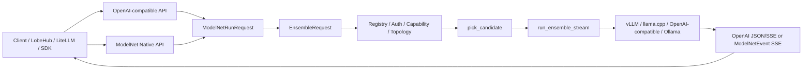

# ModelNet Gateway 代码总览

本文档按当前 `~/ModelNet-toc` 工作树整理 `modelnet-router` 中网关代码的真实结构。重点是让维护者快速理解每个组件负责什么、关键函数如何协作、请求从北向 API 到后端模型的完整路径是什么。

相关代码主要分两层：

- `modelnet_router/app.py`：FastAPI 入口、控制面、执行面、自动组网、SSE 输出和指标。
- `modelnet_router/modelnet_gateway/`：可复用的网关基础模块，包括 IR schema、协议适配、后端适配、插件契约、鉴权、Claim Memory 和 Claim Graph。

## 1. 总体执行模型

ModelNet Gateway 的核心目标是把不同入口协议统一成一套内部 IR，再根据模型注册表、租户权限、能力矩阵、K8s/Prometheus 状态和 runner/aggregator 契约执行。

两条北向路径的区别：

- `/v1/chat/completions` 面向 OpenAI-compatible 客户端。普通请求默认走 `route.once` 自动选一个后端；当请求模型为 `modelnet-auto` 时进入自动组网。
- `/v1/runs/stream` 面向 ModelNet Native 客户端。它直接承载 `ModelNetRunRequest`，支持 runner、aggregator、sources、diagnostics 和统一 `ModelNetEvent` SSE。

## 2. `modelnet_gateway/schemas.py`: 内部数据契约

这个文件定义网关内部和 Native API 的核心 Pydantic schema。

关键常量：

- `MODELNET_RUN_SCHEMA_VERSION = "modelnet.run.v1"`：Native 请求 schema 版本。
- `MODELNET_EVENT_SCHEMA_VERSION = "modelnet.event.v1"`：Native SSE 事件 schema 版本。

关键模型：

- `ModelNetRunRequest`
  - 网关的统一请求 IR。
  - 包含 `messages`、`tools`、`files`、`constraints`、`required_capabilities`、`policy`、`collaboration_plan`、`sampling_params`、`stream_options` 和 `metadata`。
  - `extra="allow"`，用于保留上层协议传入的扩展字段。
- `ModelNetEvent`
  - Native SSE 的统一事件。
  - `event` 限定为 `run_started`、`model_selected`、`token_delta`、`source_response`、`aggregation_step`、`trace`、`usage`、`error`、`done`。
  - 每个事件都带 `request_id`、`schema_version`、`data` 和 `created`。
- `ModelSpec`
  - `/v1/models` 返回的模型描述。
  - 聚合模型 ID、backend 类型、能力、上下文长度、成本、延迟、健康状态和 metadata。
- `BackendCapability`
  - `/v1/capabilities` 中的后端能力条目。
  - 描述 backend 是否支持 chat、completion、token_step、raw logits、vision、tools 和 structured output。
- `EnsembleSource`
  - 执行面每个 source 的结构。
  - 包含 `source_id`、`model_alias`、`prompt`、`messages`、`sampling_params`、`extra` 和 `weight`。
  - `source_id` 会去除空白并禁止空字符串，避免 trace 和权重映射冲突。
- `DiagnosticsConfig`
  - 旧 `/v1/ensemble/stream` 的诊断配置。
  - 控制是否输出 trace stream、candidate、score，以及 trace 存储语义。
- `EnsembleRequest`
  - 执行面 runner 的输入。
  - 由 `ir_to_ensemble_request` 从 `ModelNetRunRequest` 降级而来，包含 sources、runner、aggregator、配置、diagnostics 和 request_id。
- `RouteRequest`
  - `/v1/routing/route` 的输入。
  - 用于只做路由选择，不执行模型调用。

这里的 schema 是“最小公共契约”：OpenAI-compatible 请求、Native 请求、auto planner 和旧 ensemble API 最终都会落到这些对象上。

## 3. `modelnet_gateway/adapters.py`: 北向协议到 IR 的适配

这个模块负责把北向请求转换成统一 IR，避免执行层直接依赖 OpenAI-compatible 或 Native payload 的原始形状。

关键常量：

- `OPENAI_SAMPLING_KEYS`
  - OpenAI-compatible 请求中允许直接转入 `sampling_params` 的字段。
  - 包括 `temperature`、`top_p`、`top_k`、`max_tokens`、`max_completion_tokens`、`stop`、`seed`、`response_format`、`tool_choice`、`top_logprobs` 等。

关键函数：

- `openai_chat_to_ir(body)`
  - 将 `/v1/chat/completions` payload 转成 `ModelNetRunRequest`。
  - 从 `body["modelnet"]` 读取 ModelNet 扩展配置。
  - 如果请求包含 `tools`，自动追加 `required_capabilities=["tools"]`。
  - 如果请求包含 `response_format`，自动追加 `structured_output`。
  - 当 `model == "modelnet-auto"` 时，设置 `collaboration_plan.runner = "auto.network"`，默认 aggregator 为 `auto`。
  - 其他普通模型默认 `runner = "route.once"`。
  - 在 `metadata` 中记录 `northbound_protocol`、原始 model 和去掉 messages/tools 后的原始请求 metadata。
- `native_to_ir(payload)`
  - 直接校验 `ModelNetRunRequest`，并规范化 `collaboration_plan.runner`。
  - 用 `canonical_runner` 处理 `route`、`token_step`、`auto_network` 等别名。
- `ir_to_ensemble_request(ir)`
  - 将 Native IR 降级为旧执行面的 `EnsembleRequest`。
  - 根据 runner 选择 legacy runner 名，例如 `token.parallel -> token_step`、`response.parallel -> response_aggregate`。
  - 把 `required_capabilities`、`policy`、`graph` 注入 `runner_config`。
  - 当 `stream_options.include_trace` 为真时，打开 `diagnostics.enable_trace_stream`。
- `build_sources(ir, plan)`
  - 构建 `EnsembleSource` 列表。
  - 优先使用 `plan.sources`。
  - 其次使用 `candidate_aliases`、`model_aliases` 或 `models`。
  - 最后回退为一个默认 source，model alias 来自 `ir.model`。
- `source_from_payload(index, item, ir)`
  - 将单个 source payload 转成 `EnsembleSource`。
  - 每个 source 的 sampling 参数为全局 `ir.sampling_params` 加 source 级覆盖。
- `default_source(...)`
  - 为普通 route.once 构造单 source。
- `prompt_from_messages(messages)`
  - 从 OpenAI messages 中抽取文本 prompt。
  - 支持 `content` 为字符串，也支持多模态 list 中的 text part。
- `default_aggregator_for(runner)`
  - `auto.network -> auto`
  - `token.* -> sum_score`
  - `response.* -> synthesize`
  - 其他默认 `load_aware`
- `dedupe(values)`
  - 保持顺序去重，主要用于 capability 列表。

## 4. `modelnet_gateway/plugins.py`: Runner / Aggregator / Backend 契约

这个模块是能力矩阵和执行契约的来源。它不执行逻辑，只描述“哪些名字存在、状态如何、能和谁配对”。

数据类：

- `RunnerPlugin`
  - 字段包括 `name`、`legacy_name`、`scope`、`description`、`supported_aggregators`、`required_capabilities`、`status`、`status_reason`。
  - `legacy_name` 用于把 Native runner 映射到当前 `app.py` 中已有执行函数。
- `AggregatorPlugin`
  - 字段包括 `name`、`scope`、`description`、`required_capabilities`、`status`、`status_reason`。

runner 别名：

- `RUNNER_ALIASES` 将历史名字和短名字归一化，例如：
  - `route`、`route_once` -> `route.once`
  - `token_step`、`token_parallel` -> `token.parallel`
  - `response_aggregate`、`response_parallel` -> `response.parallel`
  - `dynamic_collab_route` -> `response.serial`
  - `claim_graph` -> `auto.claim_graph`

当前 runner 插件：

- `auto.network`
  - 状态：implemented。
  - legacy：`auto`。
  - 根据问题、负载、预算和能力自动规划一个模型网络。
- `auto.claim_graph`
  - 状态：implemented。
  - legacy：`claim_graph`。
  - 执行 claim 级 draft、抽取、验证和保守组装。
- `route.once`
  - 状态：implemented。
  - legacy：`route`。
  - 选择一个后端完成普通 chat。
- `token.parallel`
  - 状态：implemented。
  - legacy：`token_step`。
  - 多模型逐 token 并行投票。
  - 要求 `token_step` 和 `top_probs`。
- `response.parallel`
  - 状态：implemented。
  - legacy：`response_aggregate`。
  - 多模型完整回答并行生成，再由模型综合。
- `token.serial`
  - 状态：reserved。
  - 当前没有独立 v1 runner。
- `response.serial`
  - 状态：degraded。
  - 通过旧 serial refinement fallback 执行，不是完整 Native v1。
- `hybrid.graph`
  - 状态：reserved。
  - Native DAG scheduler 未实现。

当前 aggregator 插件：

- implemented：
  - `auto`
  - `sum_score`
  - `max_score`
  - `synthesize`
  - `load_aware`
  - `capability_aware`
- degraded：
  - `judge_refine`
- reserved：
  - `duet_net`
  - `learned_router`
  - `select_best`
  - `rank_vote`
  - `cost_aware`
  - `latency_aware`

backend adapter 能力：

- `vllm_chat`
  - 支持 chat、token_step、structured_output。
  - 不声明 raw logits。
- `llama_cpp`
  - 支持 chat、completion、token_step、logits_raw、structured_output。
- `openai_compatible`
  - 支持 chat、tools、structured_output。
  - 不支持 token_step。
- `anthropic`
  - 作为预留适配器，能力声明包含 vision、tools、structured_output。
- `ollama`
  - 支持 chat、completion、vision、tools、structured_output。
- `dify_provider`、`custom_http`
  - 作为扩展和集成预留。

关键函数：

- `canonical_runner(name)`
  - 把用户传入 runner 归一化为 Native 名称。
- `legacy_runner_name(name)`
  - 把 Native 名称映射为当前执行函数使用的 legacy 名称。
- `runner_payload()`
  - 生成 `/v1/capabilities` 的 runner 列表。
- `aggregator_payload()`
  - 生成 `/v1/capabilities` 的 aggregator 列表。

## 5. `modelnet_gateway/auth.py`: 租户鉴权和权限约束

这个模块负责 API key 到租户的映射，以及租户级能力限制。

关键模型：

- `GatewayTenant`
  - `tenant_id`：租户标识。
  - `api_key`：Bearer token。
  - `allowed_models`：为空表示允许所有模型，否则只允许集合内模型。
  - `allowed_runners`：为空表示允许所有 runner。
  - `allowed_aggregators`：为空表示允许所有 aggregator。
  - `trace_allowed`：控制是否允许输出 trace。

关键方法：

- `allows_model(model_id)`
- `allows_runner(runner)`
- `allows_aggregator(aggregator)`

关键函数：

- `load_gateway_tenants(api_keys_json, api_keys_csv, legacy_api_key)`
  - 支持三种环境变量形式：
    - `MODELNET_API_KEYS_JSON`：JSON list，支持细粒度模型、runner、aggregator 和 trace 权限。
    - `MODELNET_API_KEYS`：`tenant:key,tenant2:key2`。
    - `MODELNET_ROUTER_API_KEY`：旧单 key allow-all 模式。
  - 如果没有任何 tenant，网关进入 anonymous 模式。
- `authenticate_gateway(authorization, tenants)`
  - 如果配置了 tenants，则要求 `Authorization: Bearer <token>`。
  - token 匹配后返回对应 `GatewayTenant`。
  - 缺失或错误返回 401。
- `_string_list(value)`
  - 将字符串或 list 统一为字符串列表。

执行层中的 `assert_authorized` 会调用 `authenticate_gateway`，所有核心 API 都先得到 tenant，再用 tenant 过滤可见模型、runner 和 aggregator。

## 6. `modelnet_gateway/backend_adapters.py`: 南向后端协议适配

这个模块把网关内部的聊天请求转换为具体后端请求，并把 Ollama 等非 OpenAI-native 后端转换回 OpenAI-compatible 输出。

关键常量：

- `LLAMA_CPP_ALLOWED_BODY_KEYS`
  - llama.cpp chat/completion 请求允许透传的字段。
  - 过滤掉不支持的 OpenAI 字段，避免后端报错。
- `OPENAI_CHAT_BACKENDS = {"vllm_chat", "openai_compatible"}`
  - 这些后端使用 `/chat/completions` 风格。
- `CHAT_BACKENDS = {"vllm_chat", "llama_cpp", "openai_compatible", "ollama"}`
  - 当前会进入真实 chat 候选集合的 backend 类型。
- `ENDPOINT_HEALTH_BACKENDS = {"llama_cpp", "openai_compatible", "ollama"}`
  - 没有 K8s ready pod 时可用 endpoint health 兜底探活的 backend。

关键数据类：

- `BackendChatResponse`
  - 统一封装后端普通响应。
  - 包含 `content`、`media_type`、`status_code` 和 `headers`。

关键函数：

- `backend_adapter_info(backend_type)`
  - 从 `BACKEND_ADAPTERS` 返回后端能力描述。
- `endpoint_health_urls(candidate)`
  - 根据 backend 类型给出探活 URL。
  - Ollama 使用 `/api/tags`、`/api/version`。
  - llama.cpp 和 OpenAI-compatible 使用 `/health`、`/v1/models`。
- `prepare_chat_body(candidate, body)`
  - 将北向 body 转成具体 backend body。
  - Ollama 走 `openai_chat_to_ollama`。
  - 其他后端替换 `model` 为 `candidate.backend_model`。
  - llama.cpp 会按允许字段过滤。
- `chat_url(candidate)`
  - Ollama -> `/api/chat`。
  - 其他 -> `<api_base>/chat/completions`。
- `response_should_cooldown(status_code)`
  - 408、409、425、429 或 5xx 会触发候选后端冷却。
- `chat_response(candidate, body, http_client, headers)`
  - 发起非流式 chat。
  - Ollama 成功时转换为 OpenAI chat completion JSON。
  - 其他后端原样返回 bytes 和 content-type。
- `stream_chat(candidate, body, http_client, headers)`
  - 发起流式 chat。
  - Ollama 流转换为 OpenAI SSE chunk。
  - 其他后端原样透传 SSE bytes。
- `generate_text(candidate, source, params, messages, prompt, http_client, headers)`
  - 执行面统一文本生成函数。
  - Ollama、OpenAI chat 后端和 llama.cpp completion 后端分别处理。
  - 返回 `{"text": ..., "metadata": ...}`。
- `openai_chat_to_ollama(candidate, body)`
  - 将 OpenAI messages、temperature、top_p、top_k、seed、stop、max_tokens 和 JSON response_format 转成 Ollama payload。
  - 支持从 image_url data URI 抽取 base64 图片。
- `normalize_ollama_messages(messages)`
  - 规范化 Ollama messages，支持文本和图片。
- `ollama_chat_to_openai(candidate, payload)`
  - 将 Ollama 非流式结果转成 OpenAI chat completion。
- `ollama_usage(payload)`
  - 将 Ollama token 统计映射为 `prompt_tokens`、`completion_tokens`、`total_tokens`。
- `stream_ollama_as_openai(candidate, response)`
  - 将 Ollama JSONL 流转为 OpenAI SSE。
- `openai_stream_chunk(...)`
  - 构造 OpenAI `chat.completion.chunk` SSE bytes。

## 7. `modelnet_gateway/claim_memory.py`: Claim 记忆层

Claim Memory 是一个可选 SQLite 记忆库，用于给自动组网和 Claim Graph 注入已验证事实、识别争议信号，并记录验证投票。

关键常量：

- `STRONG_EVIDENCE_LEVELS`
  - `user_confirmed`、`executable_checked`、`source_grounded`。
  - 只有强证据级别才可作为可注入已验证 claim。
- `INJECTABLE_STATUSES = {"verified"}`
  - 可注入上下文的状态。
- `SIGNAL_STATUSES = {"contested"}`
  - 作为警告信号参与排序，不直接注入为事实。
- `TOKEN_RE`
  - 中英文混合 token 提取规则，用于检索打分。

关键数据类：

- `ClaimRecord`
  - 表示一条 claim。
  - 字段包括 claim_id、scope、text、kind、status、evidence_level、entities、valid_from、valid_to、last_verified、usage_count、score。
  - `to_metadata()` 用于输出给 trace 或 planner。
- `ClaimSearchResult`
  - `verified`：可注入事实。
  - `contested`：争议信号。
  - `elapsed_ms`：检索耗时。

核心类：

- `ClaimMemoryStore`
  - 构造参数为 SQLite 路径和超时时间。
  - 如果路径不是 `:memory:`，会自动创建父目录。

关键方法：

- `ensure_schema()`
  - 创建四张表：
    - `claims`
    - `claim_votes`
    - `claim_events`
    - `claim_spans`
  - 创建 `idx_claims_scope_status` 索引。
- `upsert_claim(...)`
  - 新增或更新 claim。
  - 默认使用 `stable_claim_id(scope, text)` 生成稳定 ID。
  - 当 status 为 `verified` 且未传 `last_verified` 时，写入当前时间。
- `record_vote(...)`
  - 记录某个 source 对 claim 的验证投票。
- `record_event(...)`
  - 记录 claim 生命周期事件。
- `search_context(query_text, scopes, limit)`
  - 在指定 scopes 内检索 verified/contested claims。
  - 会过滤未生效或已过期的 claim。
  - 用 token overlap、entity 命中和 kind bonus 打分。
  - verified 只有在状态和证据级别都满足时才进入注入集合。

辅助函数：

- `stable_claim_id(scope, text)`
  - 用 scope 和 text 的 SHA256 前 16 位生成稳定 ID。
- `tokenize(text)`
  - 按中英文 token 规则分词。
- `record_from_row(row)`
  - 从 SQLite row 转成 `ClaimRecord`。
- `score_claim(record, query_tokens, query_text)`
  - 计算 claim 和请求文本的相关度。

## 8. `modelnet_gateway/claim_graph.py`: Claim Graph 编排辅助

这个模块不直接调用模型，而是提供 Claim Graph runner 所需的 prompt 构造、JSON 解析、frontier 构建和答案保守组装逻辑。

系统 prompt：

- `CLAIM_EXTRACTOR_SYSTEM_PROMPT`
  - 要求模型从 draft answer 中抽取原子、可检查的 claims，只返回 JSON。
- `CLAIM_VERIFIER_SYSTEM_PROMPT`
  - 要求模型验证单个 claim question，只返回 compact JSON。

关键函数：

- `stable_frontier_id(text)`
  - 根据 claim 文本生成稳定 frontier ID。
- `normalize_text(text)`
  - 压缩空白并转成字符串。
- `token_set(text)`
  - 提取中英文 token set。
- `overlap_score(left, right)`
  - 用最小 token 集合作分母计算重叠度。
- `build_extractor_prompt(original_prompt, draft_text, injected_claims, contested_claims, max_claims)`
  - 构造 claim 抽取 prompt。
  - 明确给出原始请求、已注入 verified claims、contested claims、draft answer 和 JSON 输出格式。
- `parse_claim_extraction(raw_text)`
  - 解析抽取模型输出。
  - 支持从文本中截取 JSON object。
  - 统一输出 `frontier_id`、`text`、`question`、`risk`。
- `parse_json_object(raw_text)`
  - 通用 JSON object 解析器。
  - 如果整段不是合法 JSON，会尝试截取第一个 `{` 到最后一个 `}`。
- `build_frontier(extracted_claims, injected_claims, contested_claims, limit)`
  - 将抽取出的 claims 与 memory 中的 verified/contested claims 匹配。
  - 命中 contested 时标记 `status="contested"`。
  - 命中 injected 时标记 `supported_by_memory`，并关闭 blind verification。
  - frontier 排序优先 contested，其次 high risk。
- `best_match(text, claims)`
  - overlap >= 0.55 视为匹配。
- `build_verifier_prompt(original_prompt, frontier_claim)`
  - 构造单条 claim 的验证 prompt。
- `parse_verifier_vote(raw_text)`
  - 解析 verifier 输出。
  - 将 yes/true/correct/support 归一化为 `supported`。
  - 将 no/false/incorrect/refute 归一化为 `refuted`。
  - 其他为 `unknown`。
- `assemble_claim_graph_answer(draft_text, frontier, votes)`
  - 根据 verifier votes 决定最终答案动作。
  - refuted 高置信 claim 触发 `hedge_refuted_claim`。
  - supported 高置信 claim 触发 `keep_supported_claim`。
  - unknown 或解析失败触发 `withhold_unverified_claim`。
  - 如果所有投票都没有足够支持，会返回保守拒答。
  - 如果有未确认细节，会在 draft 后附加谨慎提示。

## 9. `modelnet_router/app.py`: FastAPI 入口、控制面和执行面

`app.py` 是网关的主程序，包含环境配置、状态缓存、路由打分、API endpoint、runner 执行和 Prometheus metrics。

### 9.1 全局配置和状态

主要环境变量：

- 注册表和平台：
  - `MODELNET_REGISTRY_PATH`
  - `KUBECONFIG`
  - `MODELNET_K8S_NAMESPACE`
  - `MODELNET_LLAMA_CPP_NAMESPACE`
  - `MODELNET_PROMETHEUS_NAMESPACE`
  - `MODELNET_PROMETHEUS_SERVICE`
  - `MODELNET_PROMETHEUS_PORT`
- 北向模型名：
  - `MODELNET_ROUTER_MODEL_NAME`，默认 `modelnet`
  - `MODELNET_AUTO_MODEL_NAME`，默认 `modelnet-auto`
- 鉴权：
  - `MODELNET_BACKEND_API_KEY`
  - `MODELNET_ROUTER_API_KEY`
  - `MODELNET_API_KEYS_JSON`
  - `MODELNET_API_KEYS`
- 路由和健康：
  - `MODELNET_METRICS_TTL_SECONDS`
  - `MODELNET_PROMETHEUS_TTL_SECONDS`
  - `MODELNET_FAIL_COOLDOWN_SECONDS`
  - `MODELNET_BACKEND_TIMEOUT_SECONDS`
  - `MODELNET_ENDPOINT_HEALTH_TTL_SECONDS`
- ensemble 和 auto：
  - `MODELNET_ENSEMBLE_DEFAULT_MAX_TOKENS`
  - `MODELNET_ENSEMBLE_MAX_SOURCES`
  - `MODELNET_AUTO_NETWORK_MAX_SOURCES`
  - `MODELNET_AUTO_NETWORK_MAX_EXTRA_CALLS`
  - `MODELNET_AUTO_NETWORK_CONFIDENCE_THRESHOLD`
  - `MODELNET_AUTO_RANK_FUSE_CONFIDENCE_THRESHOLD`
- Claim Memory：
  - `MODELNET_CLAIM_ENABLED`
  - `MODELNET_CLAIM_DB_PATH`
  - `MODELNET_CLAIM_MEMORY_TIMEOUT_MS`
  - `MODELNET_CLAIM_INJECT_LIMIT`
  - `MODELNET_CLAIM_FRONTIER_K`

关键全局状态：

- `app = FastAPI(...)`
- `http_client`
  - 启动时创建的 `httpx.AsyncClient`。
- `registry_cache`
  - 按 registry mtime 缓存 `Candidate` 列表。
- `k8s_cache`
  - K8s pod 和 pod metrics 缓存。
- `prometheus_cache`
  - 节点 CPU、内存、GPU 指标缓存。
- `endpoint_health_cache`
  - 非 K8s ready 场景的 endpoint 探活缓存。
- `states`
  - 每个 candidate 的 in-flight、failure_count、cooldown_until、last_error。
- `state_lock`
  - 控制并发路由状态更新。

### 9.2 控制面数据类

- `Candidate`
  - 从 YAML registry 解析出的可路由模型。
  - 包含 `model_id`、`backend_type`、`k8s_namespace`、`backend_model`、`root_url`、`api_base`、`service_names`、`api_key`、`eos`、`expose_raw_logits` 和 metadata。
- `CandidateState`
  - 运行时状态。
  - `in_flight` 用于负载惩罚。
  - `failure_count` 和 `cooldown_until` 用于失败冷却。
- `K8sPod`
  - 单个 pod 的 ready/running、所在 node、service、CPU 和内存。
- `K8sSnapshot`
  - `pods_by_service`、error、updated_at。
- `NodeMetrics`
  - 节点 CPU、内存、GPU util、GPU 显存等 Prometheus 指标。
- `PrometheusSnapshot`
  - 节点指标字典、error、updated_at。
- `EndpointHealth`
  - endpoint 探活状态。

### 9.3 模型注册表加载

关键函数：

- `parse_scalar(value)`
  - 简单 YAML fallback loader 使用的标量解析器。
- `simple_registry_load(path)`
  - 当 `yaml.safe_load` 失败时，用最小解析逻辑读取 `models:`。
- `load_yaml(path)`
  - 优先 `yaml.safe_load`，失败后回退 `simple_registry_load`。
- `registry_string_set(model, keys)`
  - 从 registry model 的多个字段中抽取能力/任务标签集合。
- `registry_chat_support(model)`
  - 根据显式 capabilities/tasks 判断是否是 chat 模型。
- `is_non_chat_model(model)`
  - 过滤 embedding、reranker、classification 等非 chat 模型。
- `normalize_root_url(model_url)` 和 `normalize_api_base(model_url)`
  - 统一 URL，确保 `api_base` 指向 `/v1`。
- `candidate_namespace(backend_type)`
  - llama.cpp 使用 `MODELNET_LLAMA_CPP_NAMESPACE`，其他使用 `MODELNET_K8S_NAMESPACE`。
- `candidate_service_names(model, model_id, backend_model, backend_type)`
  - 根据 registry 字段、backend_model、model_id 和 slug 推导可能的 K8s service 名。
- `model_api_key(model)`
  - 支持直接 `api_key` 或通过 `api_key_env` 从环境变量读取。
- `load_candidates()`
  - 核心 registry loader。
  - 读取 `REGISTRY_PATH`。
  - 只保留 `CHAT_BACKENDS` 中且不是非 chat 的模型。
  - 要求 `id`、`model_name`、`model_url` 都存在。
  - 构造 `Candidate`，并移除 metadata 中的 `model_url`、`api_key`、`api_key_env`，避免接口泄露。
  - 按 registry mtime 缓存。
  - 为新 candidate 初始化 `CandidateState`。

### 9.4 K8s、Prometheus 和 endpoint health

关键函数：

- `load_kube_config()`
  - 读取 kubeconfig，提取 server、token 和 TLS verify 配置。
- `k8s_get(path)`
  - 通过 Kubernetes API 发起请求。
- `prometheus_query(query)`
  - 通过 K8s service proxy 查询 Prometheus。
- `load_namespace_resources(namespace)`
  - 同时读取 namespace 下 pods 和 pod metrics。
- `load_k8s_snapshot()`
  - 加载推理 namespace 和 llama.cpp namespace。
  - 用 pod label 中的 `k8s.kuboard.cn/name` 或 `app` 映射 service。
  - 缓存 ready/running pod、CPU、memory。
- `load_prometheus_snapshot()`
  - 查询 CPU、内存、DCGM GPU util、显存、Jetson gpuram。
  - 合并为 `NodeMetrics`。
- `ready_pods_for(candidate, snapshot)`
  - 根据 candidate 的 `service_names` 查找 ready pods。
- `endpoint_health(candidate)`
  - 对 llama.cpp、openai_compatible、ollama 做 HTTP 探活兜底。
  - 成功后写入 `endpoint_health_cache`。
- `gpu_memory_ratio(metrics)`
  - 从 DCGM 或 Jetson 指标估算 GPU 显存占用比例。
- `device_metric_score(metrics)`
  - llama.cpp 等设备敏感模型使用的节点负载评分。
- `candidate_score(candidate, snapshot, state, prometheus, endpoint_status)`
  - 路由打分核心。
  - 冷却中返回 `inf`。
  - 没有 ready pod 但 endpoint health ready 时给 endpoint fallback score。
  - llama.cpp 优先使用设备指标；没有设备指标时给固定惩罚。
  - 普通 pod 使用 CPU + memory + in-flight + failure_count 评分。
- `pick_candidate(...)`
  - 核心选择函数。
  - 先按 tenant、candidate_aliases、required_capabilities 过滤。
  - 加载 K8s 和 Prometheus 快照。
  - 对没有 ready pod 的 endpoint backend 做探活。
  - 在 `state_lock` 下按 score 排序，选最小 score。
  - 选中后 `in_flight += 1`。
- `release_candidate(candidate, error=None)`
  - 请求结束时释放 in-flight。
  - 成功会清零 failure_count。
  - 失败会增加 failure_count 并设置 cooldown。

### 9.5 能力、模型和可见性

关键函数：

- `assert_authorized(authorization)`
  - 调用 `authenticate_gateway`。
- `backend_headers(candidate=None)`
  - 构造南向 Authorization header。
  - 优先使用 candidate 自己的 api_key，否则使用全局 `MODELNET_BACKEND_API_KEY`。
- `explicit_candidate_capabilities(candidate)`
  - 如果 registry metadata 明确写了 capabilities，则使用显式能力。
- `candidate_capabilities(candidate)`
  - 合并 backend adapter 能力、raw logits 标记、structured output 等，形成模型能力列表。
- `candidate_backend_info(candidate, score=None, reason=None)`
  - 构造 trace/API 中常用的 backend 信息。
- `candidate_context_length(candidate)`
  - 从 metadata 中推断上下文长度。
- `candidate_model_spec(candidate)`
  - 构造 `/v1/models` 返回的 `ModelSpec`。
- `backend_capability(candidate, health=None)`
  - 构造 `/v1/capabilities` 中模型级能力。
- `visible_candidates(tenant)`
  - 按租户 allowed_models 过滤候选模型。
- `capability_diagnostics(...)`
  - 当没有模型满足 required_capabilities 时，返回诊断字段：
    - required_capabilities
    - available_capabilities
    - matching_models
    - candidate_count

### 9.6 API 路由

生命周期：

- `startup()`
  - 创建 `httpx.AsyncClient`。
  - 设置全局超时。
- `shutdown()`
  - 关闭 http client。

主要 endpoint：

- `GET /healthz`
  - 返回网关基本健康状态、模型数量、registry、K8s/Prometheus 错误和后端统计。
- `GET /v1/models`
  - 返回 tenant 可见模型。
  - 额外包含 public model 名称 `modelnet` 和 auto model 名称 `modelnet-auto`。
- `GET /v1/capabilities`
  - 返回 runner、aggregator、backend_adapters 和模型能力矩阵。
- `POST /v1/chat/completions`
  - OpenAI-compatible 主入口。
  - `openai_chat_to_ir` 转 IR。
  - 如果是 auto 请求，进入 `openai_auto_chat_response`。
  - 普通请求用 `pick_candidate` 选后端。
  - stream 模式用 `stream_backend` 原样透传后端 SSE。
  - 非 stream 模式用 `backend_chat_response` 返回后端 JSON。
  - 响应 header 写入 `X-ModelNet-Backend`、`X-ModelNet-Backend-Type`、`X-ModelNet-Request-ID`。
- `GET /v1/registry/status`
  - 返回 registry 路径、mtime、tenant 和可见模型。
- `POST /v1/registry/refresh`
  - 清空 registry、K8s、Prometheus 缓存并返回候选数量。
- `POST /v1/routing/route`
  - 只执行路由选择，不调用模型。
- `GET /v1/topology/snapshot` 和 `GET /v1/topology`
  - 返回模型 ready pods、节点指标和错误列表。
- `POST /v1/ensemble/stream`
  - 旧执行面入口，接收 `EnsembleRequest` 并直接调用 `run_ensemble_stream`。
- `POST /v1/runs/stream`
  - Native 入口，接收 `ModelNetRunRequest`，输出 `ModelNetEvent` SSE。
- `GET /metrics`
  - Prometheus 文本指标，包括 candidate score、in-flight、ready pods、endpoint ready、节点 CPU/内存/GPU 等。

### 9.7 SSE 和 Native 事件转换

关键函数：

- `sse(event, data)`
  - 输出 legacy SSE bytes。
- `modelnet_sse(event, request_id, data)`
  - 包装成 `ModelNetEvent` 后输出 SSE。
- `parse_sse_chunk(chunk)`
  - 解析内部 legacy runner 产出的 SSE chunk。
- `native_event_data(legacy_event, data, native_runner)`
  - 将 legacy event data 转成 Native event data。
  - `token` 会改成 `{delta, text, runner}`。
  - `done` 会补 `metadata.native_runner`。
- `run_native_stream(ir, tenant)`
  - Native 主执行桥。
  - `native_to_ir` 规范化 runner。
  - `ir_to_ensemble_request` 降级到 `EnsembleRequest`。
  - 调用 `run_ensemble_stream`。
  - 将 legacy event 映射为 Native event：
    - `source_selected -> model_selected`
    - `token -> token_delta`
    - `full_response -> source_response`
    - `trace_step -> aggregation_step`
    - `auto_plan`、`think_phase -> trace`

### 9.8 采样、prompt 和 token-step 后端调用

关键函数：

- `sampling_value(source, key, default)`
- `sampling_top_k(source)`
- `positive_int(value, default)`
- `generation_max_tokens(source, default)`
- `generation_params(source, max_tokens=None)`
  - 从 source sampling_params 构造后端生成参数。
- `stop_values(value)`、`merge_stop_marker(existing, marker)`
  - 规范化 stop 配置。
- `think_stop_marker(candidate)`、`append_think_stop_marker(text, marker)`
  - think 预处理中的停止标记处理。
- `message_list(source)`
  - 优先使用 source.messages，否则从 source.prompt 构造 user message。
- `naive_messages_to_prompt(messages)`
  - 将 messages 粗略拼成 prompt。
- `post_json(url, body, candidate=None)`
  - 统一 POST JSON。
- `llama_apply_template(candidate, messages)`
  - 调 llama.cpp 的 chat template API。
- `parse_vllm_candidates(payload, eos)`、`parse_llama_candidates(payload, eos, raw_logits=False)`
  - 从 vLLM / llama.cpp 响应中提取候选 token、概率和可选 raw logit。
- `step_token(candidate, source, state)`
  - token.parallel 的单步后端调用。
  - llama.cpp 使用 completion 风格 prompt。
  - vLLM chat 使用 messages + generated 状态。
- `aggregate_token(source_candidates, active_sources, aggregator)`
  - 当前支持 `sum_score` 和 `max_score`。
  - 根据 source weight 聚合候选 token。

### 9.9 Think prepass 和响应综合

关键函数：

- `generate_think_suffix(...)`、`generate_think_suffix_once(...)`
  - 对支持/配置 think 的 source 执行思考预生成。
- `run_think_prepass(...)`
  - token.parallel 前置 think 阶段。
  - 收集每个 source 的 think 状态和错误。
- `warmup_after_think(...)`、`warmup_think_sources(...)`
  - think 后对 source prompt/state 做 warmup，降低后续 token 协作出错概率。
- `think_final_answer_instruction(request)`
  - 读取或使用默认 final answer 指令。
- `response_aggregate_instruction(request)`
  - 获取 response synthesis 指令。
- `response_aggregate_max_tokens(request)`
  - 获取综合阶段 token 上限。
- `build_response_synthesis_user_prompt(...)`
  - 将多个 source 完整回答整理成综合模型的 user prompt。
- `prepare_answer_state_after_think(...)`
  - 将 think 输出整理到 final answer 状态。
- `generate_text(candidate, source, prompt_override=None)`
  - `app.py` 层的文本生成封装，调用 `backend_generate_text` 并补充路由 metadata。
- `generate_response_source(tenant, source)`
  - 为 response.parallel 的一个 source 选择 candidate 并生成完整回答。
- `generate_response_synthesis(request, tenant, successful)`
  - 选择综合模型，生成最终答案。

### 9.10 已实现 runner

#### `run_route_ensemble`

用途：

- 实现 `route.once`。
- 选择一个后端并执行一次普通生成。

流程：

1. 取第一个 source。
2. `pick_source_candidate` 按 source alias 和 capability 选后端。
3. `generate_text` 调后端。
4. 输出 `source_selected`、`token`、`done`。
5. `done.metadata` 包含 runner、aggregator 和 call ledger。

#### `run_token_step_ensemble`

用途：

- 实现 `token.parallel`。
- 多 source 同步逐 token 调用后端，聚合器决定每个输出 token。

流程：

1. 校验 source 数量不超过 `ENSEMBLE_MAX_SOURCES`。
2. 为每个 source 选择满足 `token_step` 和 `top_probs` 的 candidate。
3. 初始化每个 source 的生成状态。
4. 执行 think prepass 和 warmup。
5. 逐步调用 `step_token`。
6. 对失败 source 做 disable，不让单个后端失败拖垮整个循环。
7. 用 `aggregate_token` 选择 token。
8. 可选输出 `trace_step`。
9. 输出 `token` delta。
10. 遇到 `<end>`、max_len 或 whitespace loop guard 时停止。
11. 输出 `done`，metadata 中包含 disabled_source_count、error_count、stopped_by、think 统计和 whitespace guard。

关键保护：

- `max_consecutive_whitespace_tokens`
- `max_leading_whitespace_tokens`
- 全部 source 失败时返回 error。
- trace 输出受 `diagnostics.enable_trace_stream` 和 `tenant.trace_allowed` 控制。

#### `run_response_aggregate_ensemble`

用途：

- 实现 `response.parallel`。
- 多个 source 并行生成完整回答，再由综合模型生成最终回答。

流程：

1. 要求 source 数量至少 2 且不超过上限。
2. `asyncio.gather` 并行执行 `generate_response_source`。
3. 输出每个成功 source 的 `source_selected` 和 `full_response`。
4. 成功 source 少于 2 时返回 error。
5. 调用 `generate_response_synthesis` 生成最终答案。
6. 输出综合模型的 `source_selected`、最终 `token` 和 `done`。
7. metadata 中包含 contributions、weights、response_aggregator、trace_summary 和 call ledger。

#### `run_dynamic_collab_ensemble`

用途：

- 当前作为 `response.serial` 的 degraded fallback。
- 不是完整 Native v1 response.serial。

流程：

1. 按 sources 顺序逐个选择 candidate。
2. 第一个 source 直接生成答案。
3. 后续 source 收到当前答案，要求 review/refine。
4. 最终输出 token 和 done。

#### `run_auto_ensemble`

用途：

- 实现 `auto.network` 的 legacy 执行入口。
- 先规划，再按规划选择具体 runner。

相关函数：

- `extract_auto_features`
  - 从请求文本中提取 complexity、代码/推理/事实/安全等特征。
- `scored_candidate_pool`
  - 获取候选后端和打分。
- `estimate_runtime_budget`
  - 根据请求和候选池估计调用预算。
- `choose_auto_topology`
  - 选择 single_best、response_parallel、role_graph、rank_fuse、cascade_verify 或 claim_graph 等策略。
- `plan_auto_ensemble`
  - auto planner 主函数。
  - 支持显式 alias 池、required capabilities、claim memory 注入、budget、topology 和 source 构造。
- `merge_auto_plan_execution`
  - 合并规划和实际执行 metadata。
- `append_router_trace`
  - 将 auto 规划和执行摘要写入 JSONL trace 文件。

自动策略执行入口：

- `run_role_graph_ensemble`
  - 多 expert 并行，必要时 critic，再 synthesizer 综合。
- `run_rank_fuse_ensemble`
  - 多 candidate 回答，ranker 选择或触发综合。
- `run_cascade_verify_ensemble`
  - primary 先答，verifier 判断是否需要 escalation。
- `run_claim_graph_ensemble`
  - claim 级保守验证。

#### `run_claim_graph_ensemble`

用途：

- 实现 `auto.claim_graph`。
- 对事实性回答进行 claim 抽取、frontier 构建、验证和保守组装。

高层流程：

1. 读取或注入 Claim Memory 上下文。
2. 选择 draft source 生成初稿。
3. 调用 claim extractor 抽取原子 claims。
4. 用 memory 中 verified/contested claims 构建 frontier。
5. 对 frontier 中需要验证的 claim 发起 verifier 调用。
6. 记录 votes、events 和可选 writeback。
7. 用 `assemble_claim_graph_answer` 生成最终回答。
8. 输出 trace、token 和 done。

### 9.11 执行契约守卫

关键函数：

- `allow_degraded_execution(request)`
  - 读取 `runner_config.allow_degraded`。
- `execution_contract_error(request, tenant)`
  - 执行前检查：
    - runner 是否存在。
    - runner 是否 reserved。
    - degraded runner 是否被允许。
    - aggregator 是否存在。
    - aggregator 是否 reserved/degraded。
    - aggregator 是否被 runner 支持。
    - tenant 是否允许该 runner / aggregator。
  - 如果不允许，返回结构化 error。
- `run_ensemble_stream(request, tenant)`
  - 所有 legacy runner 的统一入口。
  - 先执行契约检查。
  - 输出 `run_started`。
  - 根据 effective runner 分派：
    - `token_step -> run_token_step_ensemble`
    - `dynamic_collab_route -> run_dynamic_collab_ensemble`
    - `response_aggregate -> run_response_aggregate_ensemble`
    - `auto -> run_auto_ensemble`
    - `claim_graph -> run_claim_graph_ensemble`
    - 其他回退 `run_route_ensemble`

## 10. 典型请求链路

### OpenAI-compatible 普通聊天

1. Client 调 `POST /v1/chat/completions`。
2. `openai_chat_to_ir` 生成 IR。
3. 非 `modelnet-auto`，进入普通 route。
4. 从 IR 中提取目标 model、candidate_aliases 和 required_capabilities。
5. `pick_candidate` 按租户、能力、K8s ready、Prometheus 指标、in-flight、失败冷却打分。
6. stream 请求走 `stream_backend` 透传后端 SSE。
7. 非 stream 请求走 `backend_chat_response`。
8. 结束后 `release_candidate`。

### Native 协作流

1. Client 调 `POST /v1/runs/stream`。
2. `native_to_ir` 校验并规范化 runner。
3. `run_native_stream` 调 `ir_to_ensemble_request`。
4. `run_ensemble_stream` 做 contract guard。
5. 分派到具体 runner。
6. legacy SSE 被 `parse_sse_chunk` 解析。
7. `modelnet_sse` 包装成 `ModelNetEvent`。
8. Client 收到 `modelnet.event.v1` 事件流。

### `modelnet-auto`

1. OpenAI-compatible 请求的 `model` 为 `modelnet-auto`。
2. `openai_chat_to_ir` 设置 `runner=auto.network`。
3. `openai_auto_chat_response` 将 Native/ensemble 输出转换为 OpenAI-compatible response。
4. `plan_auto_ensemble` 根据任务特征、候选模型、预算和 claim memory 选择拓扑。
5. 按拓扑进入 route、response.parallel、role_graph、rank_fuse、cascade_verify 或 claim_graph。
6. 最终输出被包装为 OpenAI 非流式或流式格式。

## 11. 扩展指南

新增后端类型：

1. 在 `plugins.py` 的 `BACKEND_ADAPTERS` 增加能力声明。
2. 如果该 backend 应进入真实 chat 候选，把类型加入 `backend_adapters.py` 的 `CHAT_BACKENDS`。
3. 在 `backend_adapters.py` 中补齐：
   - `prepare_chat_body`
   - `chat_url`
   - `chat_response`
   - `stream_chat`
   - `generate_text`
   - 必要的 health URLs。
4. 在 `app.py` 中确认 `candidate_capabilities`、`pick_candidate` 和 token-step 解析是否需要适配。

新增 runner：

1. 在 `plugins.py` 增加 `RunnerPlugin` 和别名。
2. 决定 Native 名称、legacy 名称、scope、supported_aggregators 和 required_capabilities。
3. 在 `app.py` 实现 `run_xxx_ensemble(request, tenant)`，输出 legacy SSE。
4. 在 `run_ensemble_stream` 增加分派。
5. 如果要被 Native API 使用，确认 `legacy_runner_name` 能正确映射。

新增 aggregator：

1. 在 `plugins.py` 增加 `AggregatorPlugin`。
2. 将 aggregator 加入对应 runner 的 `supported_aggregators`。
3. 在具体 runner 中实现实际聚合逻辑。
4. 如果是 token 聚合，通常需要修改 `aggregate_token`。
5. 如果是 response 聚合，通常需要修改 `generate_response_synthesis` 或新增执行路径。

新增租户限制：

1. 使用 `MODELNET_API_KEYS_JSON` 配置 tenant。
2. 设置 `allowed_models`、`allowed_runners`、`allowed_aggregators` 和 `trace_allowed`。
3. `visible_candidates` 和 `execution_contract_error` 会自动应用限制。

新增 Claim Memory 能力：

1. 打开 `MODELNET_CLAIM_ENABLED`。
2. 配置 `MODELNET_CLAIM_DB_PATH`。
3. 通过 `ClaimMemoryStore.upsert_claim` 写入 verified/contested claims。
4. auto planner 和 claim_graph 会根据 scope 检索并注入上下文。

## 12. 当前边界和注意事项

- `plugins.py` 中 `reserved` 的 runner/aggregator 只是契约声明，不应默认执行。
- `degraded` 能力需要 `runner_config.allow_degraded=true` 才能运行。
- `/v1/chat/completions` 的普通流式路径目前倾向原样透传后端 SSE，不转换成 `ModelNetEvent`。
- `ModelNetEvent` 只在 `/v1/runs/stream` Native 路径上稳定输出。
- registry metadata 会过滤 `model_url`、`api_key`、`api_key_env`，避免北向泄露敏感字段。
- `pick_candidate` 会增加 in-flight，调用方必须在成功或失败后调用 `release_candidate`。
- endpoint health 是 K8s ready pod 缺失时的兜底，不等价于完整设备指标。
- Claim Memory 只会注入 verified 且强证据级别的 claims；contested claims 只作为警告信号。
- token.parallel 对后端 `top_probs` 支持有硬要求；OpenAI-compatible 和 Ollama 默认不能作为 token.parallel source。
