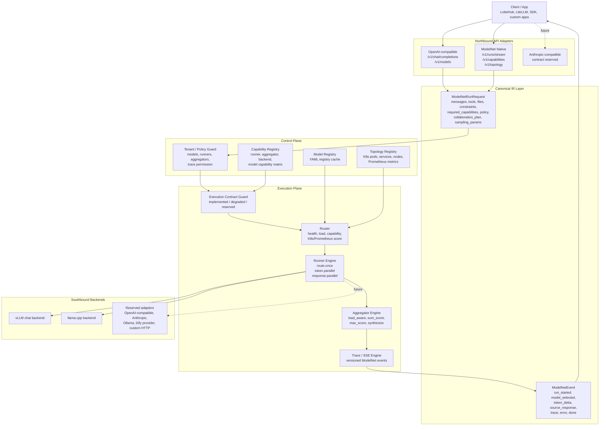
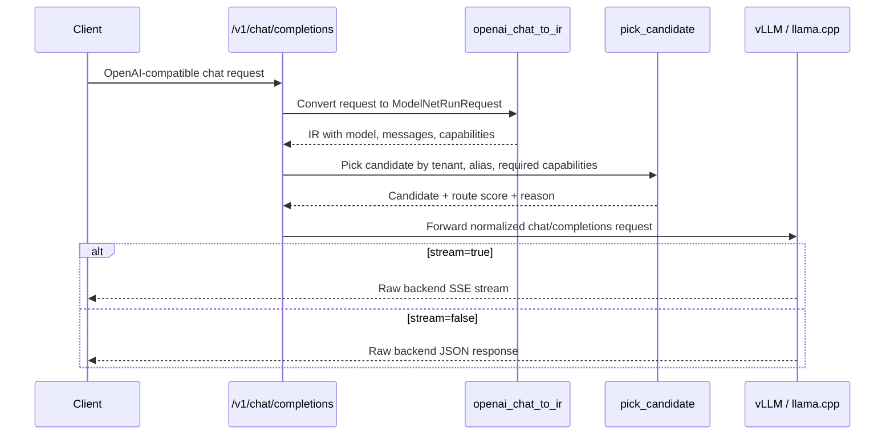
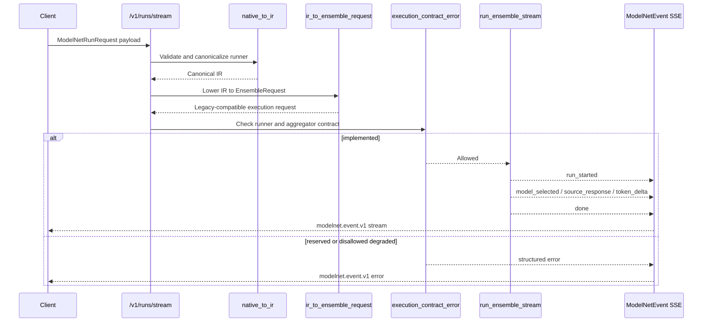
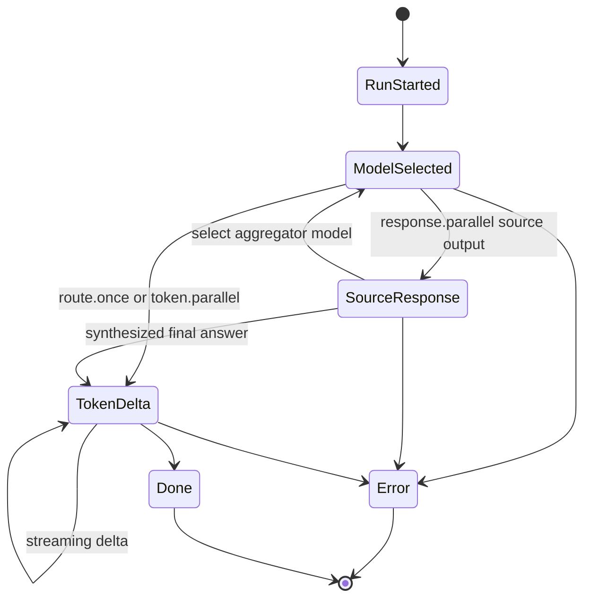
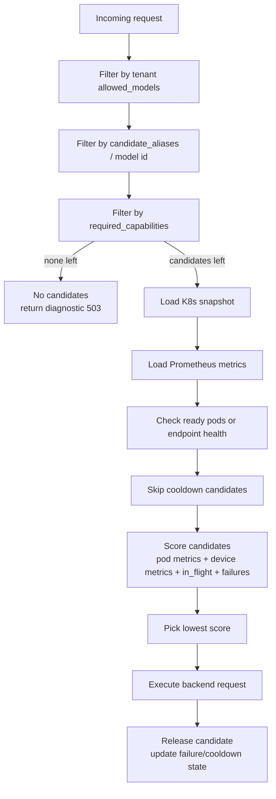
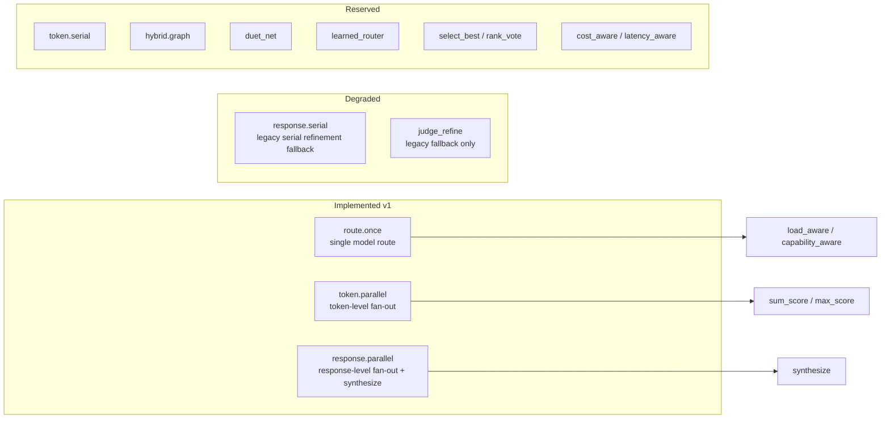
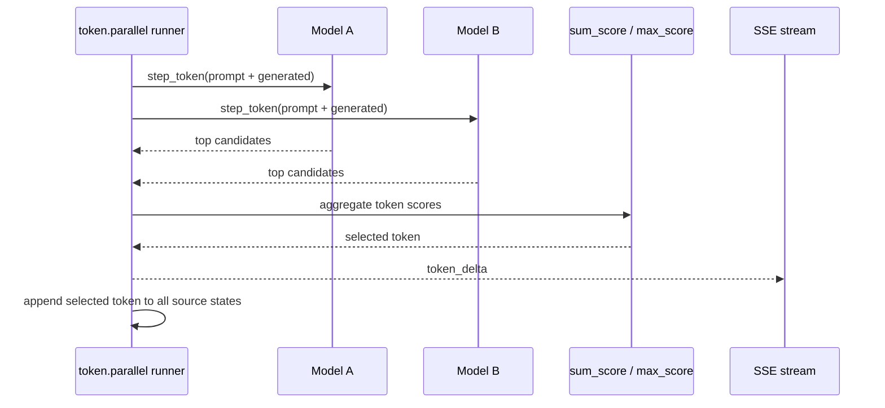
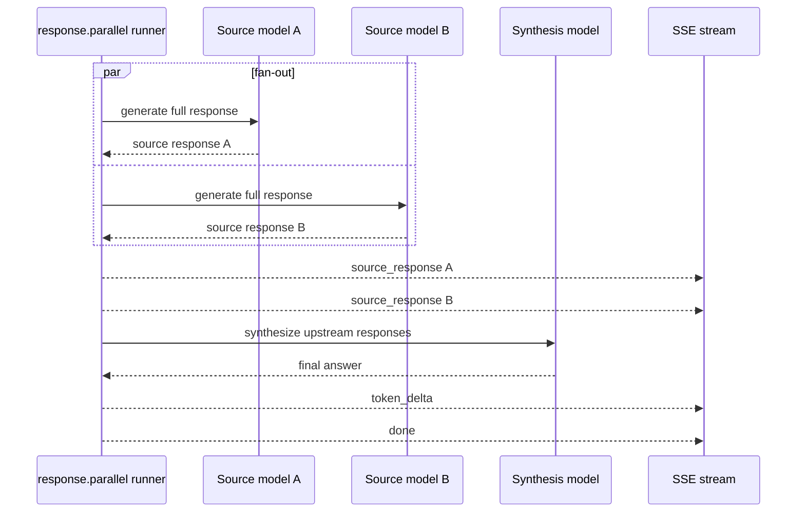

# ModelNet Gateway 设计说明

本文档描述当前 `modelnet-router` 的真实设计和能力边界。它不是最初理想架构的展开稿，而是基于当前代码实现整理出来的 v1 收敛版说明。

当前网关的核心定位是：

- 对北向应用提供 OpenAI-compatible 普通聊天入口和 ModelNet Native 协作入口。
- 在内部把请求统一成 `ModelNetRunRequest`，把输出统一成 `ModelNetEvent`。
- 在控制面维护模型注册、能力矩阵、拓扑、健康状态和路由评分。
- 在执行面真实支持 `route.once`、`token.parallel`、`response.parallel` 三类 runner。
- 对未完整实现的 runner/aggregator 明确标记为 `reserved` 或 `degraded`，避免客户端误判能力。

## 1. 总体架构

## 2. API 分层

### OpenAI-compatible API

OpenAI-compatible 路径用于普通聊天兼容。它可以自动路由，但不承诺暴露高级协作能力。

主要入口：

- `GET /v1/models`
- `POST /v1/chat/completions`

请求流程：

如果请求要求当前没有模型支持的能力，比如 `tools`，网关会返回诊断型 `503`，内容包括：

- `required_capabilities`
- `available_capabilities`
- `matching_models`
- `candidate_count`

这比普通的 “No backend available” 更适合客户端做降级判断。

### ModelNet Native API

Native API 是高级协作入口。它承载 runner、aggregator、trace 和统一事件流。

主要入口：

- `POST /v1/runs/stream`
- `GET /v1/capabilities`
- `GET /v1/topology`
- `POST /v1/registry/refresh`

Native 请求流程：

## 3. Canonical IR

内部 IR 定义在 `modelnet_gateway/schemas.py`。

`ModelNetRunRequest` 是统一请求结构，包含：

- `messages`: 聊天消息。
- `tools`: 工具定义，当前主要用于能力约束判断。
- `files`: 文件输入预留字段，当前还没有真实多模态执行。
- `constraints`: 上下文、预算、延迟等约束预留字段。
- `required_capabilities`: 客户端显式要求的模型能力。
- `policy`: 租户、预算、fallback 等策略预留字段。
- `collaboration_plan`: runner、aggregator、sources、candidate_aliases、runner_config。
- `sampling_params`: temperature、top_p、top_k、max_tokens 等采样参数。
- `stream_options`: 是否包含 usage 和 trace。

`ModelNetEvent` 是统一输出事件，当前事件类型包括：

- `run_started`
- `model_selected`
- `token_delta`
- `source_response`
- `aggregation_step`
- `trace`
- `usage`
- `error`
- `done`

事件生命周期如下：

## 4. Control Plane

控制面负责回答两个问题：

1. 当前有哪些模型、runner、aggregator 和 backend adapter？
2. 某个请求应该被路由到哪个后端？

### Model Registry

模型来自 YAML registry，加载后变成 `Candidate`。

每个候选模型包含：

- `model_id`
- `backend_type`
- `backend_model`
- `root_url`
- `api_base`
- `service_names`
- `eos`
- `expose_raw_logits`
- `metadata`

当前只会把 `vllm_chat` 和 `llama_cpp` backend 加入真实 chat 候选。其他 backend adapter 仍是预留契约。

为了避免错误路由，当前会过滤：

- embedding 模型
- reranker 模型
- 显式标记为非 chat 的模型
- 非当前真实支持 backend 的模型

### Capability Registry

`/v1/capabilities` 返回能力矩阵。

runner 和 aggregator 都有：

- `status`
- `available`
- `status_reason`

状态含义：

- `implemented`: 当前 v1 真实支持，可以默认执行。
- `degraded`: 有旧 fallback，但不是完整 v1 语义，默认不执行。
- `reserved`: 只是预留契约，当前不能执行。

### Topology Registry

`/v1/topology` 结合 K8s 和 Prometheus 暴露：

- 模型
- Pod
- Service
- Node
- CPU / memory
- GPU 使用率和显存
- K8s / Prometheus 错误

## 5. 路由设计

路由核心是 `pick_candidate()`。

评分信号包括：

- Pod 是否 running/ready。
- llama.cpp endpoint health。
- CPU 和 memory 使用情况。
- GPU util 和 GPU memory。
- 当前 `in_flight` 数量。
- 最近失败次数和 cooldown。

这让网关可以根据健康和负载做自动路由，而不是简单轮询。

## 6. Execution Plane

当前真实支持三个 v1 runner。

### route.once

`route.once` 是单模型自动路由：

1. 根据 tenant、alias、required capabilities 找候选。
2. 根据 K8s/Prometheus/health/in-flight/failure 评分。
3. 选择一个后端。
4. 生成完整回答。
5. 通过 Native SSE 映射成 `model_selected`、`token_delta`、`done`。

### token.parallel

`token.parallel` 是逐 token 并联：

1. 为每个 source 选择一个模型。
2. 每一步请求每个模型的 top token probabilities。
3. 使用 `sum_score` 或 `max_score` 聚合 token。
4. 把选出的 token 追加到每个 source 的生成状态。
5. 重复直到 `<end>`、`max_len` 或 whitespace guard 触发。

### response.parallel

`response.parallel` 是完整回复级协作：

1. 多个 source 并行生成完整回答。
2. 每个成功 source 产生 `source_response`。
3. 网关再选择一个聚合模型。
4. 聚合模型读取所有 upstream responses 并 synthesize 最终回答。
5. 输出最终 `token_delta` 和 `done`。

## 7. Contract Guard

执行前会经过 `execution_contract_error()`。

它检查：

- runner 是否存在。
- runner 是否 `implemented`。
- aggregator 是否存在。
- aggregator 是否 `implemented`。
- aggregator 是否属于 runner 支持范围。
- tenant 是否允许 runner 和 aggregator。

默认规则：

- `implemented`: 允许执行。
- `reserved`: 直接返回结构化 error。
- `degraded`: 默认返回 error；只有 `runner_config.allow_degraded=true` 才允许走旧 fallback。

这个 guard 的作用是让 `/v1/capabilities` 成为可信契约，而不是营销式能力列表。

## 8. Backend Adapter 边界

`plugins.py` 中预留了多个 backend adapter：

- `vllm_chat`
- `llama_cpp`
- `openai_compatible`
- `anthropic`
- `ollama`
- `dify_provider`
- `custom_http`

但当前真实执行层只接入：

- `vllm_chat`
- `llama_cpp`

这意味着当前状态是：

- 已经具备通用 gateway 的架构骨架。
- 已经支持两类本地/集群模型 backend。
- 还没有把所有预留 backend adapter 接成真正可执行插件。

## 9. 当前能力边界

当前可以对外承诺：

| 能力 | 状态 | 说明 |
| --- | --- | --- |
| OpenAI-compatible chat | implemented | 普通聊天自动路由 |
| `/v1/models` | implemented | 暴露 `modelnet` 和真实 chat 候选 |
| `/v1/capabilities` | implemented | 返回可信能力矩阵 |
| `/v1/topology` | implemented | 返回 K8s/Prometheus 拓扑 |
| `route.once` | implemented | 单模型自动路由 |
| `token.parallel` | implemented | token 级并联，支持 `sum_score` 和 `max_score` |
| `response.parallel` | implemented | 完整回复并联，支持 `synthesize` |
| `response.serial` | degraded | 旧串行 refinement fallback |
| `token.serial` | reserved | 未实现真实 token 串行 |
| `hybrid.graph` | reserved | 未实现 DAG scheduler |
| Anthropic/Ollama/Dify/custom HTTP backend | reserved | adapter 契约预留，执行层未完整接入 |

## 10. 后续收敛方向

建议下一步按这个顺序推进：

1. 把 backend adapter 做成真正插件接口，先接 `openai_compatible` 和 `ollama`。
2. 给 Native API 加最小 DAG scheduler，实现 `hybrid.graph` 的真实执行语义。
3. 把 `policy` 里的 timeout、max hop、budget、fallback 做成统一执行约束。
4. 给 `tools` 做真实能力桥接，而不是只作为 capability filter。
5. 增加结构化测试：runner contract、reserved guard、router scoring、SSE event schema。
