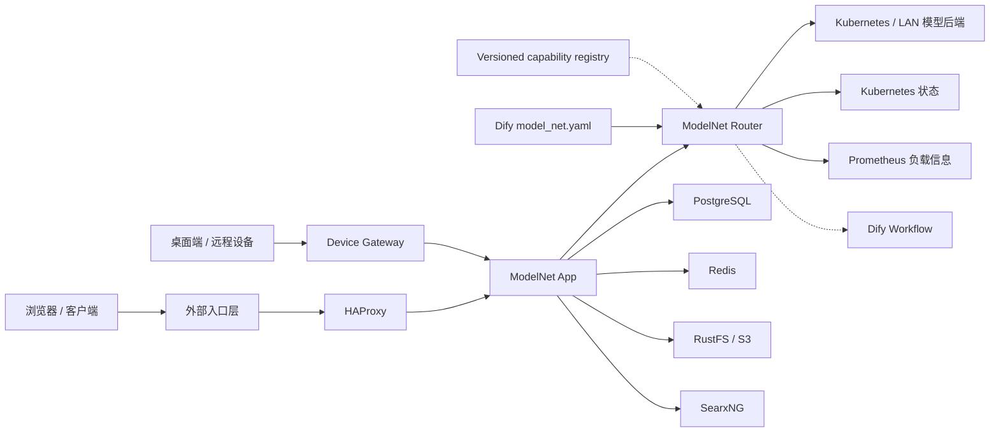
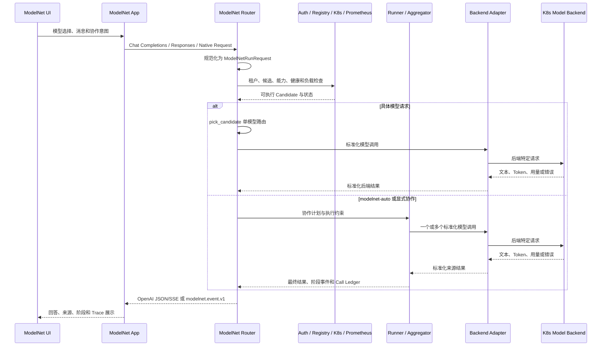

# ModelNet ToC 新人技术手册

> 文档定位：面向第一次接触本项目的全栈研发同事，帮助读者在第一周建立统一的系统认知、代码地图和故障定位框架。
>
> 适用环境：4A100 上的 `/home/duxianghe/ModelNet-toc` 项目。
>
> 最后核验：2026-07-22。
>
> 阅读边界：本文不提供环境启动、构建、测试、发布或生产操作步骤，也不包含任何凭据、真实公网地址或可复制执行的请求示例。

## 1. 先建立正确的项目视角

ModelNet ToC 不是单一的聊天页面，也不是一个只做反向代理的模型网关。它是一套把用户侧 Agent 应用、模型协作策略、模型能力注册、实时路由和局域网推理后端连接起来的系统。

可以先记住一句话：

> ModelNet App 负责用户体验和请求表达，ModelNet Router 负责理解协作意图、选择执行策略和调用模型后端，Kubernetes 上的推理服务负责真正生成答案。

本文希望读者完成阅读后能够：

- 说清浏览器请求从入口到模型后端再回到界面的完整路径。
- 区分当前真实运行链路与仓库中已经存在、但尚未成为默认链路的演进方案。
- 理解 App、Router、注册表、Kubernetes 后端和支撑服务之间的职责边界。
- 解释 `modelnet-auto`、`modelnet`、`modelnet-parallel`、`modelnet-serial` 和具体模型 ID 的区别。
- 按职责找到相关代码，而不是一开始就陷入体量较大的 `modelnet_router/app.py`。
- 面对故障时先对齐证据链，再判断问题属于入口、App、Router、注册表、后端还是 UI 渲染。

### 1.1 事实冲突时以什么为准

项目文档记录了多个演进阶段。相同概念在旧文档、当前配置和运行容器中可能有不同描述。发生冲突时，按以下优先级判断：

| 优先级 | 真相源 | 能回答的问题 |
|---|---|---|
| 1 | 当前运行态 | 实际使用的镜像、挂载、注册表路径、候选状态和错误状态是什么 |
| 2 | 实际生效的 Compose 文件组合 | 当前服务、网络、数据卷和环境覆盖关系是什么 |
| 3 | 当前注册表 bundle 及其版本信息 | 模型清单、能力定义和生成产物来自哪个版本 |
| 4 | 当前源码与对应测试 | 接口、模型名、Runner、Aggregator 和降级行为实际如何工作 |
| 5 | 根级 `AGENTS.md` 与日期化设计文档 | 团队规则、设计背景和历史决策是什么 |

需要同时遵守两条文档优先级规则：

- 根级 `AGENTS.md` 定义本项目的运行、安全和环境边界。
- `modelnet-app/AGENTS.md` 主要描述上游 App 子系统的代码组织、UI 规范和测试习惯；其中的上游分支、部署或在线调试约定不能覆盖根级项目规则。

“文件已经存在”不等于“运行态已经采用”。例如，仓库已经具备版本化 capability registry 的发布与挂载能力，但 2026-07-22 的当前默认 Router 仍读取外部 `model_net.yaml`。

## 2. 当前系统架构与边界

下面的实线表示当前主链路，虚线表示可选兼容路径或演进路径。

### 2.1 核心组件职责

| 组件 | 核心职责 | 不应误解为 |
|---|---|---|
| 外部入口层 | 把用户流量安全地带到 4A100 上的 ToC 服务 | Router 的公开模型 API |
| HAProxy | ModelNet App 的入口转发和服务边界 | 模型选择或协作策略执行器 |
| ModelNet App | 登录、会话、Agent、模型选择、协作配置、流式渲染、Trace 展示和排行榜 | 直接托管局域网模型的推理服务 |
| ModelNet Router | 协议适配、鉴权、能力过滤、负载路由、协作执行、后端适配和可观测事件输出 | 只把请求转发到固定地址的反向代理 |
| Kubernetes 模型后端 | 运行 vLLM、llama.cpp 及其他兼容推理服务 | 本地 Compose 中的普通业务容器 |
| Device Gateway | 桌面端与远程设备的独立接入通道 | Web UI 主链路的一部分 |
| PostgreSQL | App 的持久化业务数据 | Router 的模型注册表 |
| Redis | App 的缓存、协调和运行时辅助状态 | 长期对象存储 |
| RustFS | S3 兼容对象存储及相关运行资产 | 关系型数据库 |
| SearxNG | Web 搜索能力 | 模型推理后端 |
| Dify | 当前注册表来源之一，以及显式 `dify.dsl` 串联模式的可选执行环境 | 所有 ModelNet 请求的默认执行入口 |

### 2.2 当前运行态与演进路径

| 主题 | 当前运行态 | 可选或演进路径 |
|---|---|---|
| App 到模型网关 | App 直接访问 ModelNet Router | 版本化 registry overlay 不改变请求链路 |
| Router 注册表 | 外部 Dify `model_net.yaml` 挂载为 `/app/model_net.yaml` | 版本化 `capability-registry.yaml` bundle overlay |
| 串联协作 | Router 本地执行 `response.serial`，通常配合 `judge_refine` | 显式选择 `dify.dsl` 时进入 Dify Workflow |
| App 北向协议 | ModelNet 系统模型主要使用 Chat Completions 兼容流 | Router 同时提供 Responses 和 ModelNet Native 接口 |
| 推理后端 | Kubernetes/LAN 中的模型服务 | 不是 dev 或 production Compose 内的本地模型容器 |
| 环境隔离 | dev 与 production 使用独立项目、网络、数据卷和服务身份 | dev 不应接入 production Dify 网络别名 |

这里最重要的判断方式是：设计文件描述“具备什么能力”，运行态描述“此刻正在使用什么”。两者都是真实信息，但不能混成同一条默认链路。

## 3. 第一周阅读之一：ModelNet App

ModelNet App 是一个以 Next.js、React 和 TypeScript 为核心的大型应用。它包含 Web、SPA、服务端、桌面端和共享 packages。新人不需要从整个上游代码库开始阅读，应先抓住 ModelNet 自己增加的模型接入和协作展示链路。

### 3.1 App 内部的职责分层

| 层次 | 关注点 | ModelNet 相关入口 |
|---|---|---|
| 模型目录 | 定义 ModelNet provider、系统模型和展示信息 | `modelnet-app/packages/model-bank/src/modelProviders/modelnet.ts`、`modelnet-app/packages/model-bank/src/aiModels/modelnet.ts` |
| Provider Runtime | 把 ModelNet 暴露为 OpenAI-compatible provider，并发现模型列表 | `modelnet-app/packages/model-runtime/src/providers/modelnet/index.ts` |
| 协作模型定义 | 定义自动、并联、串联模型名，候选规则和串联拓扑 | `modelnet-app/src/features/ModelNetParallel/index.ts` |
| 请求组装 | 把 UI 模型选择转换成 Router 能理解的 payload | `modelnet-app/src/services/chat/index.ts` |
| 流解析 | 识别标准内容、ModelNet 事件和协作来源信息 | `modelnet-app/packages/model-runtime/src/core/streams/openai/openai.ts` |
| 会话展示 | 呈现模型选择、协作阶段、思考和 Trace | `modelnet-app/src/features/Conversation/Messages/Assistant/components/` |
| 排行榜 | 聚合 OpenCompass 与本地 Benchmark 数据 | `modelnet-app/src/app/(backend)/api/modelnet/leaderboard/route.ts` |
| 设备接入 | 桌面设备身份、连接和消息通道 | `modelnet-app/apps/device-gateway/` 及相关共享 packages |

### 3.2 四类模型选择实际代表什么

| App 中看到的模型 | 实际语义 | 进入 Router 后的主要行为 |
|---|---|---|
| 具体模型 ID | 用户明确选择一个后端模型 | Router 按模型别名、权限、能力、健康和负载完成单模型路由 |
| `modelnet-auto` | 自动组网公开入口 | 使用 `auto.network` 规划并执行合适的拓扑 |
| `modelnet-parallel` | App 侧并联虚拟模型 | 转换为底层 `modelnet` 加 `response.parallel` 与 `synthesize` |
| `modelnet-serial` | App 侧串联虚拟模型 | 转换为底层 `modelnet` 加 `response.serial`、`judge_refine` 和显式拓扑 |

`modelnet` 这个名字最容易造成误解。它已经不是普通自动路由入口：没有显式协作 Runner 的 `modelnet + route.once` 会被拒绝；但并联和串联仍使用 `modelnet` 作为携带协作计划的底层封装。因此，“`modelnet` 已退休”和“并联/串联仍发送 `modelnet`”并不矛盾。

### 3.3 App 如何形成 ModelNet 请求

App 在发送消息前会区分当前 provider、模型 ID 和用户选择的协作配置：

1. 具体模型保留具体 ID，由 Router 决定满足约束的实际 Candidate。
2. `modelnet-auto` 会附加 `auto.network` 协作计划，并可携带用户选择的候选范围。
3. `modelnet-parallel` 会验证候选集合，再附加 `response.parallel`、`synthesize` 和 Trace 展示意图。
4. `modelnet-serial` 会把模型选择整理成带节点和边的串联拓扑，再附加 `response.serial` 与 `judge_refine`。
5. 用户自定义的 OpenAI-compatible provider 可以作为 request-scoped runtime candidate 传入 Router；这类候选不是静态注册表的一部分，其中的连接与凭据信息属于敏感传输数据。

当前 App 会让 ModelNet 系统入口和具体 ModelNet 后端使用 Chat Completions 兼容流。Router 仍然提供 Responses 接口，供其他兼容客户端或未来链路使用。不能因为 Router 有 Responses 接口，就推断 App 当前所有模型请求都会走 Responses。

### 3.4 返回内容如何变成界面

Router 返回的不只有最终文本。不同执行模式还可能返回模型选择、来源回答、聚合阶段、用量、Trace 和完成状态。App 的流解析层把这些事件规范化为会话可消费的数据，再由消息组件展示：

- 用户最终看到的回答文本。
- 当前选择或参与协作的模型。
- 并联、串联或自动组网的阶段状态。
- 来源回答和聚合过程。
- 可用于解释问题的 Trace 信息。

因此，“Router 已返回内容”和“UI 已正确展示内容”是两个不同的检查层次。后端执行成功并不能自动证明前端流解析和渲染也正确。

## 4. 第一周阅读之二：ModelNet Router

ModelNet Router 是 Python/FastAPI 服务。它既包含对外 API，又包含控制面、路由面、执行面、后端适配和观测逻辑。理解它时应先读小型契约模块，再进入集中编排这些能力的 `app.py`。

### 4.1 Router 代码分层

| 模块 | 主要职责 |
|---|---|
| `modelnet_router/modelnet_gateway/schemas.py` | `ModelNetRunRequest`、`ModelNetEvent`、`EnsembleRequest` 等内部和 Native 契约 |
| `modelnet_router/modelnet_gateway/adapters.py` | OpenAI-compatible 与 ModelNet Native 请求之间的协议转换 |
| `modelnet_router/modelnet_gateway/plugins.py` | Runner、Aggregator、Backend Adapter 的注册、别名和实现状态 |
| `modelnet_router/modelnet_gateway/backend_adapters.py` | 不同推理后端的请求体、URL、流式和错误行为适配 |
| `modelnet_router/modelnet_gateway/auth.py` | Bearer Token、租户和可访问模型/策略范围 |
| `modelnet_router/modelnet_gateway/claim_graph.py` | Claim 抽取、验证和保守组装流程 |
| `modelnet_router/modelnet_gateway/claim_memory.py` | Claim 状态的 SQLite 记忆层 |
| `modelnet_router/modelnet_gateway/serial_dify.py` | 显式 Dify DSL 串联模式的编译与调用边界 |
| `modelnet_router/app.py` | API 入口、候选加载、K8s/Prometheus 状态、路由、Runner 执行、SSE 和指标总编排 |

### 4.2 请求生命周期

这条链路中有五个关键抽象：

- **IR**：`ModelNetRunRequest`，把不同入口协议收敛成统一内部表达。
- **Candidate**：从注册表或请求级 runtime candidates 得到的可选模型后端。
- **Runner**：决定一次请求如何执行，例如单模型、并联、串联或自动组网。
- **Aggregator**：决定多个来源如何选择、投票、融合或综合。
- **Backend Adapter**：把统一执行请求转换成具体后端能够理解的协议。

### 4.3 对外接口族

| 接口族 | 当前职责 | 边界说明 |
|---|---|---|
| `/v1/chat/completions` | OpenAI Chat Completions 兼容入口，支持具体模型和显式 ModelNet 协作计划 | 当前 App 的主要模型调用入口 |
| `/v1/responses` | OpenAI Responses 兼容入口，并在没有显式协作计划时进入自动组网 | 不代表当前 App 的所有请求都使用 Responses |
| `/v1/runs/stream` | 直接接收 `ModelNetRunRequest` 并输出 `modelnet.event.v1` | 面向高级 Native 客户端和完整协作控制 |
| `/v1/ensemble/stream` | 兼容既有 Ensemble 请求的流式入口 | 属于较低层的协作执行契约 |
| `/v1/models` | 暴露自动入口和租户可见的具体模型 | 可见性受鉴权和注册表影响 |
| `/v1/capabilities` | 暴露协议、Runner、Aggregator、Backend Adapter 与模型能力 | 是能力快照，不替代运行态证据 |
| `/v1/topology`、`/v1/topology/snapshot` | 描述当前模型和基础设施拓扑 | 反映 K8s 与负载观测结果 |
| `/v1/routing/route` | 返回路由决策和诊断信息 | 面向路由控制与解释场景 |
| `/healthz`、`/metrics`、`/v1/registry/status` | 健康、指标和注册表可观测性 | 用于判断实际运行态 |
| `/v1/registry/refresh` | 触发进程内注册表刷新 | 状态变更接口，仅限运维职责，不属于新人操作范围 |

### 4.4 核心数据契约

`ModelNetRunRequest` 是统一请求 IR，主要承载：

- 消息、工具和文件输入。
- 所需能力、上下文、预算和延迟约束。
- 租户与 fallback 等策略。
- Runner、Aggregator、候选和拓扑组成的协作计划。
- 采样参数、流选项和扩展元数据。

`ModelNetEvent` 是 Native 流式事件，覆盖运行开始、模型选择、Token 增量、来源回答、聚合阶段、Trace、用量、错误和完成状态。

`EnsembleRequest` 是执行面使用的多来源请求，描述 sources、Runner、Aggregator、诊断选项和请求标识。Native 或 OpenAI 请求会先进入统一 IR，再在执行边界转成具体 Ensemble 计划。

### 4.5 Runner 当前状态

以下状态以 `modelnet_router/modelnet_gateway/plugins.py` 的当前注册表为准：

| Runner | 状态 | 作用 |
|---|---|---|
| `route.once` | 已实现 | 按能力、健康、负载和策略选择一个后端 |
| `auto.network` | 已实现 | 根据问题和运行状态规划合适的模型网络 |
| `auto.role_graph` | 已实现 | 运行角色化专家、可选 critic 和综合阶段 |
| `auto.claim_graph` | 已实现 | 草稿、Claim 抽取、验证和保守组装 |
| `token.parallel` | 已实现 | 多模型逐 Token 并行聚合 |
| `response.parallel` | 已实现 | 多模型完整回答并行后综合 |
| `response.serial` | 已实现 | 多模型完整回答按拓扑串联处理 |
| `token.serial` | 保留契约 | 尚无独立的 v1 执行实现 |
| `hybrid.graph` | 保留契约 | 原生 DAG 调度器尚未实现 |

自动组网不是“固定使用多个模型”。Planner 可以根据任务复杂度、预算、候选数量、置信度和负载选择单模型或多模型路径。因此，`modelnet-auto` 最终退化为 `route.once` 可能是正常策略结果。

### 4.6 Aggregator 当前状态

| 状态 | Aggregator |
|---|---|
| 已实现 | `auto`、`sum_score`、`max_score`、`synthesize`、`dify.dsl`、`judge_refine`、`load_aware`、`capability_aware` |
| 保留契约 | `duet_net`、`learned_router`、`select_best`、`rank_vote`、`cost_aware`、`latency_aware` |

“已注册”不一定等于“适用于所有 Runner”。Runner 会声明自己支持的 Aggregator，执行契约还会检查租户权限、所需能力和状态。保留契约是产品接口占位，不应当被解释成线上故障。

### 4.7 Backend Adapter 边界

当前插件契约登记了 `vllm_chat`、`llama_cpp`、`openai_compatible`、`anthropic`、`ollama`、`dify_provider` 和 `custom_http`。其中，当前统一直接聊天执行路径主要覆盖：

- `vllm_chat`
- `llama_cpp`
- `openai_compatible`
- `ollama`

其他类型可能只具备契约描述或特定集成路径。阅读 `plugins.py` 时应同时检查 `backend_adapters.py` 的真实分发集合，不能仅凭能力表推断某类后端已完整接入所有调用模式。

## 5. 第一周阅读之三：控制面、注册表与支撑服务

### 5.1 注册表的两条真实路径

当前项目同时保留两种注册表模式：

| 模式 | 内容 | 当前定位 |
|---|---|---|
| 外部 `model_net.yaml` | 由 Dify 侧配置提供模型 ID、后端类型、地址和能力元数据，并挂载给 Router | 2026-07-22 当前默认运行态 |
| 版本化 capability registry | 单一 `capability-registry.yaml` 内嵌模型清单，并配套版本和 checksum | 已实现的可选 dev overlay 与演进方向 |

版本化链路的核心代码位于：

- `scripts/modelnet_registry_source.py`：生成或整理 capability registry 源。
- `scripts/publish_modelnet_registry.py`：发布带版本和校验信息的 bundle。
- `scripts/sync_modelnet_app.py`：从注册表同步 App 可见模型列表。
- `docker-compose.registry-dev.yml`：让 dev Router 读取版本化 bundle 的可选 overlay。

是否已经切换版本化注册表，必须以运行态中的 registry path、version 和 checksum 为准，不能只看 overlay 文件是否存在。

### 5.2 候选模型如何变成可执行后端

Router 从注册表加载 Candidate 后，还需要结合多类信息才能决定是否执行：

- 租户是否有权访问该模型、Runner、Aggregator 和 Trace。
- 请求要求的 chat、tools、structured output、token step 等能力是否满足。
- Kubernetes 中关联的 Pod、Service 和 Node 是否 Ready。
- Prometheus 是否提供可用的节点和设备负载信息。
- Endpoint health、进程内 in-flight 计数、失败状态和 cooldown 是否允许继续调用。
- 请求是否显式限制 candidate aliases，或携带 request-scoped runtime candidates。

这说明“模型出现在注册表里”“模型出现在 `/v1/models` 中”和“模型此刻会被路由选中”是三个不同层次。

### 5.3 数据与状态分别存在哪里

| 状态类型 | 主要归属 |
|---|---|
| 用户、会话、消息、Agent 等业务数据 | ModelNet App 与 PostgreSQL |
| 缓存、协调和部分短期运行状态 | Redis |
| 文件、对象和相关运行资产 | RustFS / S3 |
| Web 搜索结果来源 | SearxNG |
| 模型清单与能力 | 当前注册表或版本化 registry bundle |
| Pod、Service、Node 与 Ready 状态 | Kubernetes |
| 节点、CPU、内存和设备负载 | Prometheus |
| Router 进程内路由和 cooldown 状态 | ModelNet Router |
| 可选 Claim Memory | Router 的 SQLite 数据卷 |
| 排行榜来源数据 | App 挂载的 leaderboard 数据文件 |

### 5.4 dev 与 production 的概念边界

dev 与 production 是两套独立的 Compose 身份、网络、数据卷和入口。dev 的存在目的是验证变更，而不是复用 production 的运行身份。

需要牢牢记住：

- dev Router 不应取得 production Dify 网络中的 `modelnet-gateway` 别名。
- 模型后端位于 Kubernetes/LAN，它们可能同时被不同环境访问，因此依然属于共享推理资源。
- production 的公网入口、App、Router 调试入口和 Device Gateway 边缘链路是不同安全边界。
- 共享工作树中的既有改动属于原作者；环境隔离不代表可以覆盖代码改动。

本文只解释这些边界，不提供任何环境操作流程。

## 6. 第一周阅读之四：代码导航

建议遵循“契约优先、入口其次、编排最后”的顺序。先理解小模块定义的词汇和边界，再进入大文件追踪完整调用链。

| 阅读阶段 | 建议关注 | 应能回答的问题 |
|---|---|---|
| 项目外壳 | 根 README、根 `AGENTS.md`、Compose 文件、HAProxy 配置 | 系统有哪些服务，dev 与 production 如何区分 |
| App 模型接入 | ModelNet provider、模型目录、协作模型定义、请求组装 | UI 模型选择如何变成 Router payload |
| App 返回链路 | OpenAI 流解析、协作 Trace 组件、排行榜和 Device Gateway | Router 事件如何变成用户可见状态 |
| Router 契约层 | schemas、adapters、plugins、auth、backend adapters | IR、Runner、Aggregator、Candidate 的边界是什么 |
| Router 执行层 | `app.py` 中的 endpoint、选路、自动组网、并串联、SSE 和指标区域 | 一次请求如何被规划、执行和观测 |
| 注册表工具 | source producer、publisher、App 同步逻辑 | 当前注册表与版本化 bundle 如何关联 |
| Benchmark | `benchmarks/README.md`、三类 benchmark runner 与结果结构 | 质量、压力、负载均衡和内部调用账本如何被衡量 |
| 基础设施 | Compose、`haproxy.cfg`、`ops/` | 服务入口、网络和依赖的所有权在哪里 |

### 6.1 推荐的一周认知顺序

这是一条统一阅读路线，不是任务分配：

1. **项目边界**：先掌握当前主链路、dev/production 隔离和真相源优先级。
2. **ModelNet App**：理解模型目录、协作虚拟模型、请求组装和 Trace 展示。
3. **ModelNet Router**：理解 IR、Candidate、Runner、Aggregator、Adapter 和接口族。
4. **控制面与依赖**：理解注册表、Kubernetes、Prometheus、鉴权和各类数据存储。
5. **可观测性与故障分层**：学习如何把 UI 现象还原为完整请求证据链。

两名全栈新人采用相同顺序，可以在后续讨论中使用一致的术语和系统边界。

## 7. 第一周阅读之五：可观测性与故障分层

### 7.1 从现象映射到责任层

| 现象 | 首要责任层 | 关键证据 | 常见误判 |
|---|---|---|---|
| 页面无法进入或回调异常 | 外部入口、HAProxy、App | 入口状态、App 请求和认证回调信息 | 直接归因于 Router |
| 401 | Router 鉴权与租户 | Token 是否被识别、租户策略范围 | 认为模型后端不可用 |
| 410 且涉及 `modelnet` | 模型入口语义 | 请求模型名与协作 Runner | 认为整个 ModelNet 服务被下线 |
| 503 no backend | Candidate 过滤与健康 | 租户、alias、能力、Ready、Endpoint health | 只检查注册表是否有模型 |
| 自动组网只使用一个模型 | Planner 策略 | 复杂度、预算、候选、负载、置信度与 Trace | 直接判断为提前结束 |
| 并联或串联阶段与 UI 不一致 | App payload、Router Runner、流解析 | collaboration plan、来源事件、聚合事件和 UI Trace | 只看最终文本 |
| SSE 中断或没有最终文本 | Backend Adapter、后端、Router 流、App 解析 | Backend 状态、Router 事件序列、App 流解析结果 | 把所有断流都归因于网络 |
| 具体后端返回 4xx/5xx | Adapter 与模型后端 | 实际 URL 形态、请求体能力、状态码和 cooldown | 认为需要公开 Router 端口 |
| 注册表文件内容与模型列表不一致 | 注册表挂载与加载 | 运行态 registry path、版本、checksum 和 mtime | 看到 overlay 文件就认为已生效 |
| Trace 显示完成但界面无内容 | App 会话状态与渲染 | 数据库消息分支、operation trace、agent trace 和解析后的消息元数据 | 认为 Router 必然早停 |
| Device Gateway 异常 | 独立设备接入链路 | 设备身份、网关会话和 App 内部接口状态 | 与 Web UI 公网入口混为一谈 |

### 7.2 推荐的证据链

对一次具体请求，应先建立共同标识，再逐层对齐：

1. 用户会话、topic、message 和 operation 的标识是否属于同一次请求。
2. PostgreSQL 中消息分支和最终状态是否与界面一致。
3. App operation trace 与 agent trace 展示了哪些阶段。
4. Router trace、Runner 事件和 call ledger 是否记录了相同的内部调用。
5. 每个来源后端是否真实返回、失败、超时或进入 cooldown。
6. UI 流解析是否保留了文本、来源、阶段和完成事件。

只有这些证据对齐后，才能判断是路由决策、fallback、后端失败还是展示问题。单凭截图、最终文本长度或某一层日志，通常不足以证明“Router 提前结束”。

### 7.3 可观测性中的几个关键对象

- **Trace**：描述模型选择、Runner 阶段、来源和聚合过程。
- **Call Ledger**：记录一次外部请求包含的内部模型调用、Token 和阶段延迟。
- **Health Snapshot**：描述注册表、Kubernetes、Prometheus 和 Endpoint health 的当前组合状态。
- **Operation Trace**：App 侧 Agent 或消息操作的阶段记录。
- **Agent Trace**：Agent 运行中更细粒度的调用与状态信息。

这些对象服务于不同责任层，不应互相替代。最可靠的结论来自它们对同一 request/message/operation 的一致描述。

## 8. 文档地图与历史材料

| 资料 | 适合了解 | 使用时的注意事项 |
|---|---|---|
| 根 `AGENTS.md` | 当前环境政策、dev-first 原则和重要运行背景 | 日期化运行状态仍需与实际运行态核对 |
| 根 `README.md` | production 部署构成、服务概览和 Benchmark 入口 | 不是新人操作手册，也不是默认 dev 起点 |
| `docs/modelnet-gateway-code-overview.md` | Router 代码分层和请求流 | Runner 与接口状态应以当前源码为准 |
| `docs/modelnet-gateway-onboarding.md` | Gateway 的概念性入门 | 部分路径和注册表描述来自较早阶段 |
| `docs/modelnet-auto-current-method-and-deployment.md` | 自动组网策略和部署背景 | 需要区分设计策略与当前运行选择 |
| `docs/modelnet-registry-versioned-runbook.md` | 版本化 registry 的目标形态 | 描述的是可选 overlay，不代表当前默认运行态 |
| `docs/litellm-modelnet-gateway-architecture-report.md` | LiteLLM 架构阶段的设计背景 | LiteLLM 已不是当前 App 主链路的必经层 |
| `benchmarks/README.md` | 质量、压力和负载均衡评估体系 | Benchmark 属于共享推理资源使用场景，不是新人入门动作 |

旧文档仍有价值，因为它们记录了设计动机和演进过程。但任何涉及当前服务名、注册表路径、Runner 状态或请求链路的结论，都应回到本手册第 1.1 节的真相源优先级重新确认。

## 9. 认知验收清单

完成本手册阅读后，两名新人都应能够独立回答以下问题：

- [ ] ModelNet App、Router 和 Kubernetes 模型后端分别负责什么。
- [ ] 为什么模型后端不是本地 Compose 服务。
- [ ] 当前 App 和 SDK 为什么直接进入 Router。
- [ ] 当前 `model_net.yaml` 与版本化 capability registry 的关系。
- [ ] `modelnet-auto`、`modelnet`、`modelnet-parallel`、`modelnet-serial` 和具体模型 ID 的区别。
- [ ] App 如何把并联或串联 UI 选择转换成协作计划。
- [ ] Chat Completions、Responses 和 Native Runs 各自面向什么调用方。
- [ ] `ModelNetRunRequest`、Candidate、Runner、Aggregator 和 Backend Adapter 如何串起来。
- [ ] 哪些 Runner 与 Aggregator 已实现，哪些只是保留契约。
- [ ] 具体模型存在于注册表中时，为什么仍可能无法被选中。
- [ ] 自动组网选择单模型为什么不一定是故障。
- [ ] dev 与 production 为什么必须保持网络、数据和身份隔离。
- [ ] Device Gateway 与 Web UI 主链路为什么需要分开理解。
- [ ] 面对 401、410、503、断流或界面无输出时，应先检查哪一层。
- [ ] 为什么数据库消息、operation trace、agent trace、Router trace 和 call ledger 必须对齐后再下结论。

如果这些问题可以使用统一术语讲清楚，新人就已经具备继续阅读具体实现、参与设计讨论和理解后续研发任务所需的共同基础。

## 10. 术语速查

| 术语 | 含义 |
|---|---|
| ToC | 面向终端用户的 ModelNet 应用与入口系统 |
| IR | 网关内部统一请求表示，当前核心为 `ModelNetRunRequest` |
| Candidate | 可被 Router 选择的模型后端实例描述 |
| Runner | 决定一次请求如何执行的策略插件 |
| Aggregator | 决定多个来源如何选择或融合的插件 |
| Backend Adapter | 把统一请求转换为特定推理后端协议的适配层 |
| Registry | 模型、后端类型、能力和元数据的来源 |
| Runtime Candidate | 随单次请求传入、通常来自用户 provider 的临时候选 |
| Topology | 模型节点及其并联、串联或图状关系 |
| Trace | 模型选择与协作执行阶段的可解释记录 |
| Call Ledger | 一次外部请求对应的内部调用账本 |
| Current Runtime | 当前容器和服务真实采用的链路与配置 |
| Optional Path | 已实现但未作为当前默认运行链路的兼容或演进能力 |
