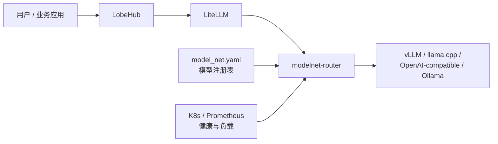
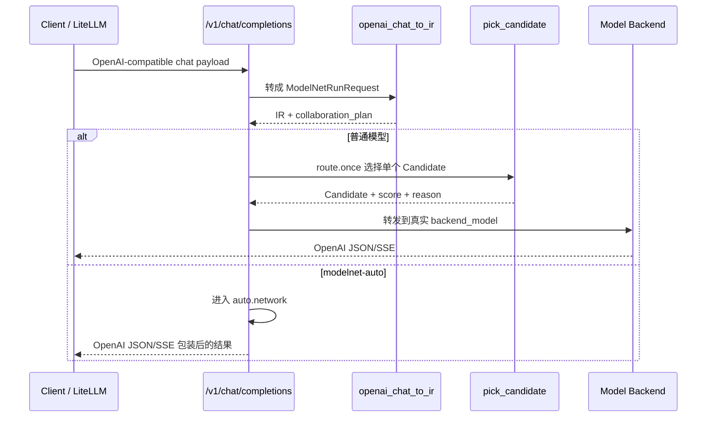
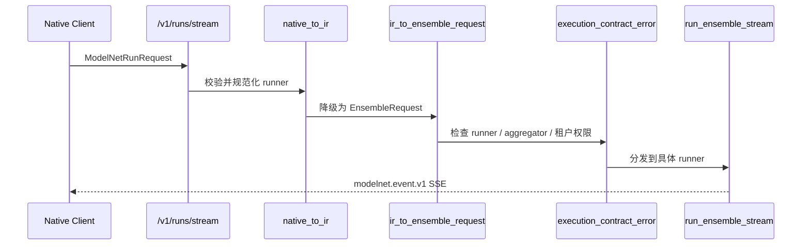
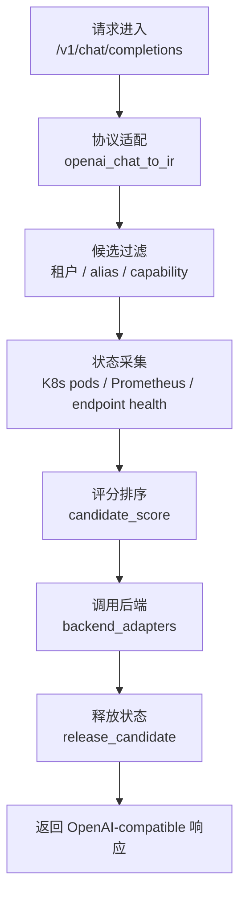
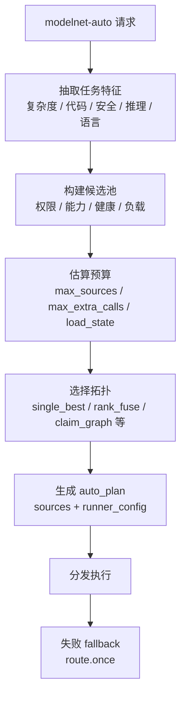

# ModelNet 路由介绍文档（汇报版）

> 面向第一次接触这套代码、需要听汇报或做交接的同事。本文聚焦 `modelnet-router` 的“路由”机制：请求从哪里进来，怎样变成统一内部格式，如何筛选模型，怎样选择执行策略，出问题时看哪里。

## 1. 先用一句话讲清楚

`modelnet-router` 是 ModelNet 的模型网关和路由器。它接收 LobeHub、LiteLLM 或 SDK 发来的 OpenAI-compatible 请求，也接收 ModelNet Native 请求；然后把它们统一成内部 IR，根据租户权限、模型能力、K8s 状态、Prometheus 负载、端点健康和协作策略，选择一个或多个模型后端执行。

它不是一个简单反向代理。反向代理主要回答“转发到哪里”，而这里还要回答：

- 这个租户能不能用这个模型？
- 请求需要 `tools`、`structured_output`、`token_step` 等能力吗？
- 哪些后端当前健康、ready pod 足够、负载更低？
- 是单模型回答，还是多模型并行、自动组网、Claim Graph 验证？
- 结果要按 OpenAI JSON/SSE 返回，还是按 ModelNet Native 事件流返回？

## 2. 系统位置

线上主链路可以简化成：



在当前仓库里，关键代码主要在：

- `modelnet_router/app.py`：FastAPI 入口、注册表加载、路由评分、runner 分发、SSE、指标。
- `modelnet_router/modelnet_gateway/adapters.py`：把 OpenAI-compatible / Native 请求转成内部 IR。
- `modelnet_router/modelnet_gateway/schemas.py`：内部请求、事件、候选路由请求等数据契约。
- `modelnet_router/modelnet_gateway/plugins.py`：runner、aggregator、backend adapter 的能力契约。
- `modelnet_router/modelnet_gateway/backend_adapters.py`：把统一后端调用转换成不同模型服务的 HTTP 请求。
- `modelnet_router/modelnet_gateway/auth.py`：API key、租户、权限限制。

## 3. 汇报时先讲的五个概念

| 概念 | 给新同事的解释 | 主要代码 |
|---|---|---|
| IR | 网关内部统一请求格式，避免执行层直接依赖 OpenAI 或 Native 原始 payload | `schemas.py` 的 `ModelNetRunRequest` |
| Candidate | 从模型注册表加载出来的可选模型后端 | `app.py` 的 `Candidate`、`load_candidates()` |
| Runner | 决定“怎么跑”：单模型、多模型逐 token、多模型完整回答、自动组网 | `plugins.py`、`run_ensemble_stream()` |
| Aggregator | 决定“怎么合”：按负载选择、概率求和、完整回答综合、自动选择 | `plugins.py` |
| Trace / Metadata | 路由与执行过程的可观察信息，便于解释和排障 | `app.py` 的 SSE、`call_ledger_metadata()`、`/metrics` |

## 4. 两类入口：普通路由和高级协作

### 4.1 OpenAI-compatible 入口

入口是：

- `GET /v1/models`
- `POST /v1/chat/completions`

这是 LobeHub、LiteLLM 和 OpenAI SDK 风格客户端最常用的路径。

普通模型请求默认走 `route.once`。如果请求的模型是 `modelnet-auto`，就进入 `auto.network` 自动组网路径。



代码入口：

- `app.py` 的 `chat_completions()`
- `adapters.py` 的 `openai_chat_to_ir()`
- `app.py` 的 `openai_ensemble_chat_response()` 和 `run_auto_ensemble()`

### 4.2 ModelNet Native 入口

入口是：

- `POST /v1/runs/stream`
- `GET /v1/capabilities`
- `GET /v1/topology`
- `POST /v1/routing/route`

Native 入口适合高级协作、调试、显式指定 runner/aggregator、请求 trace。



代码入口：

- `app.py` 的 `runs_stream()`
- `app.py` 的 `run_native_stream()`
- `app.py` 的 `run_ensemble_stream()`

## 5. 一次普通路由请求怎么走

普通 `route.once` 可以理解成四段：



更细一点：

1. `chat_completions()` 读取请求和 Bearer Token。
2. `assert_authorized()` 得到当前租户。
3. `openai_chat_to_ir()` 把请求转成 `ModelNetRunRequest`。
4. 如果有 `tools`，自动追加 `required_capabilities=["tools"]`。
5. 如果有 `response_format`，自动追加 `structured_output`。
6. 普通模型默认 `collaboration_plan.runner = "route.once"`。
7. `pick_candidate()` 先过滤候选，再评分。
8. 非流式请求用 `backend_chat_response()` 调后端；流式请求用 `backend_stream_chat()` 透传 SSE。
9. 请求结束后 `release_candidate()` 减少 in-flight；失败时增加 failure count 并进入 cooldown。

## 6. Candidate 从哪里来

Candidate 来自模型注册表 `MODELNET_REGISTRY_PATH`，当前 Docker 里通常挂载为 `/app/model_net.yaml`。

`load_candidates()` 做的事：

- 读取 YAML registry。
- 只保留真实支持 chat 的 backend type。
- 过滤 embedding、reranker、非 chat 模型。
- 规范化 `root_url` 和 `api_base`。
- 推导 K8s namespace 和 service names。
- 读取 backend model、API key、EOS、raw logits、metadata。
- 建立内存缓存，按 registry mtime 刷新。

当前执行层主要支持的 chat backend 在 `backend_adapters.py`：

- `vllm_chat`
- `llama_cpp`
- `openai_compatible`
- `ollama`

## 7. 路由选择的核心：过滤 + 打分

`pick_candidate()` 是普通路由的核心函数。它不是随机选模型，而是先过滤，再按“分数越低越优”排序。

### 7.1 过滤条件

候选模型会依次被这些条件过滤：

- 租户权限：`tenant.allows_model(candidate.model_id)`
- 显式模型或别名：请求的 `model`、`candidate_aliases`
- 能力要求：`required_capabilities` 必须是 `candidate_capabilities(candidate)` 的子集

如果过滤后没有候选，会返回 503，并尽量通过 `capability_diagnostics()` 给出可读诊断，包括：

- 请求要求的能力
- 当前可用能力
- 匹配的模型列表
- 候选数量

### 7.2 打分依据

`candidate_score()` 会综合：

- 模型是否处于 failure cooldown。
- K8s 是否有 ready pod。
- endpoint health 是否可用，尤其是非 K8s 直连 backend。
- llama.cpp 类后端是否有节点级设备指标。
- pod CPU / memory。
- Prometheus 里的 CPU、内存、GPU 利用率、GPU 显存。
- 当前 `in_flight` 请求数。
- 最近失败次数。

可以用一个近似公式帮助理解：

```text
route_score = live_load_score
            + in_flight * 1000
            + failure_count * 100
            + missing_metrics_or_endpoint_penalty
```

注意这不是所有 backend 的严格统一公式，而是帮助汇报理解的心智模型。实际实现会按 backend 类型分支：

- 有 ready pod：优先使用 pod 或设备负载指标。
- llama.cpp：更重视节点 CPU、内存、GPU 和显存。
- 无 ready pod 但 endpoint health 可用：允许按 endpoint-ready 走降级评分。
- cooldown、endpoint unhealthy、no-ready-pod：通常视为不可选。

## 8. 自动路由：`modelnet-auto` 和 `auto.network`

普通路由只选一个模型；自动路由会先判断任务特征，再决定是否需要多模型协作。

触发方式：

- OpenAI-compatible 请求中 `model = "modelnet-auto"`。
- Native 请求中 runner 显式为 `auto.network`。

核心函数：

- `extract_auto_features()`：从 messages 中抽取长度、复杂度、代码、安全、设计、推理、中英文等特征。
- `scored_candidate_pool()`：拿到当前租户可见、健康、满足能力约束的候选池。
- `estimate_runtime_budget()`：根据候选数量、负载和配置估算最多能调用几个模型。
- `choose_auto_topology()`：决定拓扑。
- `plan_auto_ensemble()`：把拓扑落实成 sources、runner_config 和 auto_plan。
- `run_auto_ensemble()`：执行计划，失败时可 fallback 到 `route.once`。



当前自动策略可以这样讲：

| 策略 | 适合场景 | 实际执行 |
|---|---|---|
| `single_best` | 明确要求只选一个、低复杂度或高负载 | `route.once` |
| `parallel_consensus` | 显式要求多个模型并行给答案 | `response.parallel` + `synthesize` |
| `role_graph` | 显式要求专家角色分工 | 专家并行 + critic/synthesizer |
| `cascade_verify` | 希望主答后再验证，预算允许 | primary answer + verifier + optional escalation |
| `claim_graph` | 高可靠、可拆 claim 的回答 | draft / extract / verify / assemble |
| `adaptive_sparse_graph` | 默认自动策略 | 低复杂度走 `route.once`，复杂或低置信走 `rank_fuse` |

一个实用的汇报说法是：

> `modelnet-auto` 不是固定开很多模型，而是先看问题是否值得协作。简单问题直接单模型，复杂问题才升级到 rank fuse、parallel synthesis 或 Claim Graph；负载高或预算不足时会主动收缩回单模型。

## 9. Runner 和 Aggregator 的当前状态

当前真实状态以 `plugins.py` 为准。

已实现 runner：

| Runner | legacy 名 | 用途 |
|---|---|---|
| `route.once` | `route` | 选一个后端完成普通 chat |
| `token.parallel` | `token_step` | 多模型逐 token 协作，需要 `token_step` 和 `top_probs` |
| `response.parallel` | `response_aggregate` | 多模型完整回答并行，再综合 |
| `auto.network` | `auto` | 根据请求特征和负载自动规划模型网络 |
| `auto.claim_graph` | `claim_graph` | claim 级 draft、抽取、验证、保守组装 |

需要特别说明：

- `token.serial` 和 `hybrid.graph` 是 `reserved`，表示契约占位，不应该默认调用。
- `response.serial` 和 `judge_refine` 是 `degraded`，需要显式允许 degraded fallback。
- `execution_contract_error()` 会统一拦截 unknown、reserved、未允许 degraded、runner/aggregator 不兼容、租户不允许等情况。

## 10. 后端调用层做了什么

路由选中 Candidate 后，`backend_adapters.py` 负责把统一请求变成后端理解的请求。

典型差异：

- `vllm_chat` 和 `openai_compatible`：走 `/chat/completions`。
- `llama_cpp`：过滤 body，只保留 llama.cpp 支持的字段。
- `ollama`：把 OpenAI chat payload 转成 Ollama `/api/chat`，再把响应转回 OpenAI 风格。

失败处理：

- 408、409、425、429、5xx 会触发 cooldown。
- 非流式请求在 `chat_completions()` 中释放 candidate。
- 流式请求在 `stream_backend()` 的 `finally` 中释放 candidate。

## 11. 对外可观察接口

给同事排障时，优先看这些接口：

| 接口 | 用途 |
|---|---|
| `GET /healthz` | 看 router 是否整体可用、ready candidate 数量、K8s/Prometheus 错误 |
| `GET /v1/models` | 看对当前租户暴露了哪些模型，包括 `modelnet` 和 `modelnet-auto` |
| `GET /v1/capabilities` | 看 runner、aggregator、backend adapter、模型能力和健康状态 |
| `POST /v1/routing/route` | 只做路由选择，不真正调用模型，适合调试为什么选某个模型 |
| `GET /v1/topology` | 看模型、pod、node 和负载快照 |
| `GET /metrics` | Prometheus 指标，包括 candidate 状态、in-flight、failure、cooldown |

响应里也有一些直接可用的信息：

- OpenAI-compatible 返回 header：
  - `X-ModelNet-Backend`
  - `X-ModelNet-Backend-Type`
  - `X-ModelNet-Request-ID`
- Native SSE 的 `done.metadata`：
  - runner / aggregator
  - auto_plan
  - trace_summary
  - internal usage / call ledger

## 12. 常见问题怎么定位

| 现象 | 第一反应 | 常看位置 |
|---|---|---|
| 401 | Bearer Token 不对或未配置 | `auth.py`、环境变量 `MODELNET_API_KEYS_JSON` / `MODELNET_API_KEYS` |
| 503 no candidate | 租户、模型 alias、required capabilities 不匹配 | `/v1/capabilities`、`capability_diagnostics()` |
| 503 no ready backend | K8s ready pod、endpoint health、cooldown | `/healthz`、`/v1/topology`、`/metrics` |
| 明明有模型但没选中 | 可能被能力过滤或租户过滤 | `candidate_capabilities()`、`visible_candidates()` |
| 请求突然变慢 | in-flight、Prometheus 负载、后端响应慢 | `candidate_score()`、`/metrics` |
| `modelnet-auto` 没有多模型 | 复杂度低、高置信、负载高或预算不足 | `auto_plan`、`choose_auto_topology()` |
| Native runner 报 reserved/degraded | 调用了还未完整实现的契约 | `plugins.py`、`execution_contract_error()` |

## 13. 汇报建议：10 分钟讲法

可以按这个顺序讲，不需要一开始就打开 5000 行的 `app.py`：

1. 先讲定位：它是 LobeHub / LiteLLM 和真实模型后端之间的 ModelNet 网关。
2. 再讲入口：OpenAI-compatible 负责兼容，Native 负责高级协作和 trace。
3. 讲核心对象：IR、Candidate、Runner、Aggregator。
4. 讲普通路由：注册表候选 -> 权限/能力过滤 -> K8s/Prometheus/health 打分 -> 调后端。
5. 讲自动路由：`modelnet-auto` 根据任务复杂度和负载决定是否升级成多模型。
6. 讲可观察性：`/v1/capabilities`、`/v1/routing/route`、`/v1/topology`、`/metrics`。
7. 最后讲接手开发：新增模型、backend、runner 各自改哪里。

## 14. 新同事读代码顺序

建议按这条线读：

1. `README.md`：先知道服务怎么部署、端口是什么、怎么验证。
2. `docs/modelnet-gateway-onboarding.md`：读完整网关接手说明。
3. `modelnet_gateway/schemas.py`：理解 `ModelNetRunRequest` 和 `ModelNetEvent`。
4. `modelnet_gateway/adapters.py`：理解 OpenAI / Native 如何进入 IR。
5. `modelnet_gateway/plugins.py`：理解当前 runner、aggregator、backend adapter 的契约状态。
6. `app.py` 的 `load_candidates()`：看候选模型如何从 registry 生成。
7. `app.py` 的 `pick_candidate()` 和 `candidate_score()`：看普通路由如何选后端。
8. `app.py` 的 `choose_auto_topology()` 和 `plan_auto_ensemble()`：看自动路由如何规划。
9. `app.py` 的 `run_ensemble_stream()`：看 runner 如何被统一分发。
10. `backend_adapters.py`：看选中模型后，HTTP 请求如何真正发给后端。

## 15. 接手开发的三条主线

### 新增模型

1. 在模型注册表里确认 `id`、`backend`、`model_name`、`model_url`、capabilities。
2. 运行同步或 reload 脚本。
3. 用 `/v1/models` 看模型是否暴露。
4. 用 `/v1/capabilities` 看能力是否正确。
5. 用 `/v1/routing/route` 看能否被选中。
6. 最后发一条最小 chat 请求验证真实后端。

### 新增 backend type

1. 先在 `plugins.py` 的 `BACKEND_ADAPTERS` 声明能力。
2. 再在 `backend_adapters.py` 实现 body 转换、URL 选择、非流式和流式调用。
3. 确认 `candidate_capabilities()` 能正确暴露能力。
4. 再做 `/v1/capabilities` 和最小 chat 验证。

### 新增 runner / aggregator

1. 先在 `plugins.py` 加契约，明确 `implemented`、`reserved` 或 `degraded`。
2. 如果有 runner 别名，补 `RUNNER_ALIASES` 和 legacy 映射。
3. 在 `app.py` 增加执行函数。
4. 在 `run_ensemble_stream()` 接入分发。
5. 在 `execution_contract_error()` 里确认权限和兼容性。
6. 用 Native `/v1/runs/stream` 验证 SSE 事件。

## 16. 一页总结

路由链路可以压缩成一句：

> 请求先被适配成统一 IR，再从 registry 中取 Candidate，经过租户、模型别名、能力约束过滤，然后结合 K8s、Prometheus、endpoint health、in-flight 和 failure cooldown 打分；普通请求选一个模型执行，`modelnet-auto` 会在同一候选池上进一步选择单模型或多模型协作拓扑，最终通过后端适配层调用真实模型并返回 OpenAI 或 ModelNet Native 格式。

这也是排障的主线：先看入口和 IR，再看候选是否存在，再看能力和租户过滤，再看健康负载评分，最后看 runner/aggregator 与后端调用。
